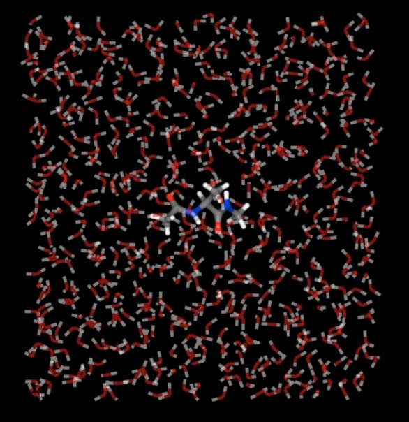
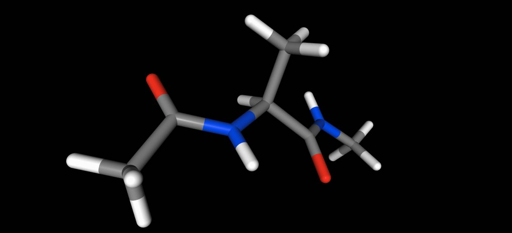

============
Trajectories
============

:mod:`sire` supports loading, editing and saving of trajectories via multiple
file formats. Trajectories are represented as a series of frames, with
each frame containing (optionally) coordinate, velocity, force, space,
time and generic property data.

Supported file formats
----------------------

:mod:`sire` natively supports the following trajectory formats:

+----------+------------------------------+----------------------------------+
| Format   | Parser                       | Description                      |
+==========+==============================+==================================+
| DCD      | :class:`sire.io.parser.DCD`  | DCD coordinate/velocity binary   |
|          |                              | trajectory files based           |
|          |                              | on charmm / namd / x-plor format.|
+----------+------------------------------+----------------------------------+
| RST      | :class:`sire.io.parser.RST`  | Amber coordinate/velocity binary |
|          |                              | (netcdf) restart/trajectory files|
|          |                              | supported since Amber 9, now     |
|          |                              | default since Amber 16.          |
+----------+------------------------------+----------------------------------+
| TRAJ     | :class:`sire.io.parser.TRAJ` | Amber trajectory (ascii)         |
|          |                              | coordinate or velocity files     |
|          |                              | supported from Amber 7 upwards.  |
+----------+------------------------------+----------------------------------+
| TRR      | :class:`sire.io.parser.TRR`  | Gromacs TRR (XDR file) coordinate|
|          |                              | / velocity / force trajectory    |
|          |                              | file                             |
+----------+------------------------------+----------------------------------+
| XTC      | :class:`sire.io.parser.XTC`  | Gromacs XTC (XDR file) compressed|
|          |                              | coordinate trajectory file       |
+----------+------------------------------+----------------------------------+

The :class:`~sire.io.parser.DCD`, :class:`~sire.io.parser.RST` and
:class:`~sire.io.parser.TRR` formats are binary, and so hold the trajectory
data at the highest precision and in the most compact format. They are
easily seekable, so give the best balance between speed and trajectory size.

The :class:`~sire.io.parser.TRAJ` format is text-based, and so takes up a
lot of space and stores data at a fixed (lower) precision. It is included
for completeness, but is not recommended as a format for saving new
trajectories.

The :class:`~sire.io.parser.XTC` is a compressed binary format that stores
trajectory data in binary in lower precision. This is very space efficient,
but at the cost of losing quite a bit of precision in the exact coordinate
data. It is only recommended if you want to save storage space and don't
need to recover, e.g. energies or other properties that depend
on exact coordinates.

Loading trajectories
--------------------

You load trajectories in the same way as loading any other file, e.g.
using :func:`sire.load`.

>>> import sire as sr
>>> mols = sr.load(sr.expand(sr.tutorial_url, "ala.top", "ala.traj"))
>>> print(mols.num_frames())
500

:mod:`sire` will automatically determine the format of the trajectory.
For example, here we have loaded the 500 frames from the file
``ala.traj``. This file is in :class:`~sire.io.parser.RST` format, not
:class:`~sire.io.parser.TRAJ` format, despite the file extension.

An exception will be raised if any errors are detected in the trajectory
files. These errors can sometimes be difficult to debug. To help, you can
try to directly load the trajectory file using the appropriate parser, e.g.

>>> t = sr.io.parser.TRAJ("ala.traj")
UserWarning: SireIO::parse_error: Disagreement over the number of read bytes... 128 vs -13.
This indicates a program bug or IO error. (call sire.error.get_last_error_details()
for more info)

Trying using the correct parser gives us

>>> t = sr.io.parser.RST("ala.traj")
>>> t
AmberRst( nAtoms() = 1912, nFrames() = 500 )

You can use the parsers to read frames individually into
:class:`sire.mol.Frame` objects, e.g.

>>> f = t.get_frame(0)
>>> print(f)

The :class:`~sire.mol.Frame` object has functions like ``.coordinates()``,
``.velocities()`` and ``.forces()``, which can be used to get the
raw coordinates, velocities and forces data from the frame.

Loading and joining multiple trajectories
-----------------------------------------

It is easy to load and join multiple trajectories together into a single
trajectory. You just load multiple files, in the order in which you
want the trajectory frames to be placed. Assuming you have trajectory
files ``block1.rst``, ``block2.rst``, ``block3.rst``, with the topology
in file ``topology.prm``, then you could load
them as a single trajectory via

>>> import sire as sr
>>> mols = sr.load("topology.prm", "block1.rst", "block2.rst", "block3.rst")

or, you could use file globbing, e.g.

>>> mols = sr.load("topology.prm", "block*.rst")

Note that you can load a combination of trajectories with different formats,
e.g.

>>> mols = sr.load("topology.prm", "block1.rst", "block2.dcd", "block3.trr")

would combine trajectories in :class:`~sire.io.parser.RST`,
:class:`~sire.io.parser.DCD` and :class:`~sire.io.parser.TRR` formats.

Saving trajectories
-------------------

You can save trajectories using the :func:`sire.save` function. For example

>>> import sire as sr
>>> mols = sr.load(sr.expand(sr.tutorial_url, "ala.top", "ala.traj"))
>>> f = sr.save(mols, "output", format=["RST"])
>>> print(f)
["output.rst"]
>>> print(sr.io.parser.RST(f[0]))
AmberRst( nAtoms() = 1912, nFrames() = 1 )

would save the first frame of the trajectory loaded from ``ala.traj`` to
a :class:`~sire.io.parser.RST` format file called ``output.rst``.

To save all the frames, you need to pass in a :class:`~sire.mol.TrajectoryIterator`
that specifies which frames to save. You can get the
:class:`~sire.mol.TrajectoryIterator` that specifies all frames just be
calling ``.trajectory()`` on the molecule(s) you want to save.

>>> f = sr.save(mols.trajectory(), "output", format=["RST"])
>>> print(sr.io.parser.RST(f[0]))
AmberRst( nAtoms() = 1912, nFrames() = 500 )

You can choose subsets of frames to save via the functions of the
:class:`~sire.mol.TrajectoryIterator` (typically using the indexing functions).
For example, here we can save frames 10-100 to :class:`~sire.io.parser.TRR` format.

>>> f = sr.save(mols.trajectory()[10:101], "output", format=["TRR"])
>>> print(sr.io.parser.TRR(f[0]))
TRR( nAtoms() = 1912, nFrames() = 91 )

or here we can save every 10th frame to :class:`~sire.io.parser.DCD` format.

>>> f = sr.save(mols.trajectory()[::10], "output", format=["DCD"])
>>> print(sr.io.parser.DCD(f[0]))
DCD( nAtoms() = 1912, nFrames() = 50 )

or here we will write all frames out in reverse order to
:class:`~sire.io.parser.XTC` format.

>>> f = sr.save(mols.trajectory()[::-1], "output", format=["XTC"])
>>> print(sr.io.parser.XTC(f[0]))
XTC( nAtoms() = 1912, nFrames() = 500 )

Saving trajectory for subsets of molecules
------------------------------------------

You can save trajectories for subsets of molecules, just be passing in
the :class:`~sire.mol.TrajectoryIterator` for that subset to
:func:`sire.save`. For example, here we will save every frame of the
first molecule in the system to :class:`~sire.io.parser.TRAJ` format.

>>> f = sr.save(mols[0].trajectory(), "output", format=["TRAJ"])
>>> print(sr.io.parser.TRAJ(f[0]))
AmberTraj( title() = TRAJ file create by sire, nAtoms() = 22, nFrames() = 500 )

Saving to multiple files in parallel
------------------------------------

You can save a trajectory to as many files as you wish. For example, you
could simultaneously write the trajectory to
:class:`~sire.io.parser.RST` and :class:`~sire.io.parser.DCD` format by passing
in both ``RST`` and ``DCD`` to the ``format`` argument.

>>> f = sr.save(mols.trajectory(), "output", format=["RST", "DCD"])
>>> print(f)
["output.rst", "output.dcd"]

It is also common to save the topology for the trajectory at the same time,
particular as this makes loading it in the future easier. Here we will
save the trajectory as a Gromacs topology and :class:`~sire.io.parser.DCD`
file.

>>> f = sr.save(mols.trajectory(), "output", format=["GroTop", "DCD"])
>>> print(f)
["output.grotop", "output.dcd"]
>>> mols = sr.load(f, silent=True)
>>> print(mols, mols.num_frames())
System( name=ACE num_molecules=631 num_residues=633 num_atoms=1912 ) 500

.. note::

   You can mix and match topology and trajectory formats, e.g. save
   Amber PRM topologies with Gromacs TRR trajectories. You don't need to
   choose "compatible" formats.

Saving to file trajectories
---------------------------

In addition to the standard trajectory formats, :mod:`sire` also supports
reading and writing coordinates to single-frame formats, e.g.
:class:`~sire.io.parser.PDB`, :class:`~sire.io.parser.SDF` etc.

These "single-frame" formats are not really designed to hold multiple
frames of a trajectory. To support these formats, :mod:`sire` will write
trajectories for these formats as a collection of individual frame files
within a directory named according to the output file. For example,
here we will write every 10th frame as a :class:`~sire.io.parser.PDB`` file,
and will also write the topology to a :class:`~sire.io.parser.PRM` file.

>>> f = sr.save(mols.trajectory()[::10], "output", format=["PRM", "PDB"])
>>> print(f)
["output.prm", "output.pdb"]

This ``output.pdb`` is actually a directory that contains individual PDB
files for each frame, e.g.

>>> import os
>>> os.listdir("output.pdb")
['frame_049_98.pdb',
 'frame_040_80.pdb',
 'frame_002_4.pdb',
 'frame_042_84.pdb',
 'frame_024_48.pdb',
...
 'frame_045_90.pdb',
 'frame_004_8.pdb',
 'frame_034_68.pdb']

Each frame's filename includes the frame number (e.g. ``49`` for the first
frame listed above) and the time in picoseconds (``98 ps``) of that frame.

You can load all of these frames by just passing in the name of the
directory (together with a topology file), e.g.

>>> mols = sr.load("output.prm", "output.pdb")
>>> print(mols, mols.num_frames())
System( name=ACE num_molecules=631 num_residues=633 num_atoms=1912 ) 50

Visualising trajectories
------------------------

Viewing trajectories is very simple - just call ``.view()`` on any
view of molecules that contains a trajectory.

>>> import sire as sr
>>> mols = sr.load(sr.expand(sr.tutorial_url, "ala.top", "ala.traj"))
>>> mols.view()

Use the "play" button or trajectory slider to move through the trajectory.

You can view sub-frames or sub-sets of the trajectory by calling
``.view()`` on those sub-sets, or by passing in
a :class:`~sire.mol.TrajectoryIterator` that contains the frames you
want to view. For example, this would view the trajectory of just
the first molecule.

>>> mols[0].view()

While this would view every 10 frames of the trajectory.

>>> mols.trajectory()[::10].view()

See the :doc:`view documentation <view>` for more information on
how you can control the view.

Smoothing and aligning frames
-----------------------------

:mod:`sire` has in-built support for processing trajectories. You can
re-wrap molecules into periodic boxes, align frames against a selection,
and also average (smooth) coordinates across multiple frames.

For example, here we will align all frames against the selection of
carbon atoms.

>>> import sire as sr
>>> mols = sr.load(sr.expand(sr.tutorial_url, "ala.top", "ala.traj"))
>>> mols.view(align="element C")

And here we will smooth trajectories by averaging over 20 frames

>>> mols.view(smooth=20)

Here we center the view on the first molecule

>>> mols.view(center="molidx 0")

and here we turn off automatic wrapping of molecules into the periodic box

>>> mols.view(wrap=False)

You can use similar arguments to save the results of this processing to
a trajectory file. So,

>>> f = sr.save(mols.trajectory(smooth=20), "smoothed", format=["RST"])

saves the results of smoothing the trajectory over 20 frames to the
file ``smoothed.rst``.

Similarly

>>> f = sr.save(mols.trajectory(align="element C"), "aligned", format=["DCD"])

saves the result of aligning every frame against carbon atoms to a
file ``aligned.dcd``,

while

>>> f = sr.save(mols.trajectory(wrap=False), "not_wrapped", format=["TRR"])

saves the trajectory without wrapping into the periodic space to the
file ``not_wrapped.trr``.

To automatically wrap the frames use

>>> f = sr.save(mols.trajectory(wrap=True), "wrapped", format=["TRR"])

.. note::

   Viewing molecules will automatically wrap into the periodic box
   (so for ``.view()``, the value of ``wrap`` defaults to ``True``).
   In contrast, saving molecules will not automatically wrap into the
   periodic box (so for ``sire.save``, the value of ``wrap`` defaults
   to ``False``). This is because you typically want to wrap
   coordinates when viewing trajectories, while you typically don't
   want the code to change the wrapping state of a trajectory when you
   save it (i.e. you don't want an unwrapped trajectory that was loaded
   to be automatically wrapped on save). Make sure that you set the
   value of ``wrap`` if you want to ensure a particular behaviour.

Calculating energies across frames
----------------------------------

You can perform lots of different types of analysis across trajectory frames.
A useful type of analysis is calculating the interaction energy between
molecules. For example, you could use the ``.energy()`` function to calculate
total energies of each frame,

>>> import sire as sr
>>> mols = sr.load(sr.expand(sr.tutorial_url, "ala.top", "ala.traj"))
>>> print(mols.trajectory().energy())
     frame        time    1-4_LJ  1-4_coulomb          LJ      angle      bond      coulomb   dihedral  improper  intra_LJ  intra_coulomb        total
0        0    0.200000  3.509838    44.810452  922.010757   7.570059  4.224970 -6794.775454   9.800343  0.485545 -1.311255     -37.520806 -5841.195551
1        1    0.400000  2.700506    47.698455  928.715959  12.470519  2.785875 -6861.966370  11.776295  1.131481 -1.617496     -40.126219 -5896.430994
2        2    0.600000  2.801076    43.486411  838.387490  11.607753  2.023439 -6724.278286  11.614774  0.124729 -1.103966     -36.633297 -5851.969876
3        3    0.800000  3.365638    47.483966  958.913012   6.524609  0.663455 -6828.029775  11.383852  0.339333 -0.983872     -40.197920 -5840.537702
4        4    1.000000  3.534830    48.596027  915.994574   6.517530  2.190370 -6838.160251  10.214994  0.255331 -1.699613     -40.355054 -5892.911262
..     ...         ...       ...          ...         ...        ...       ...          ...        ...       ...       ...            ...          ...
495    495   99.199997  2.665994    42.866319  899.586671  11.339087  4.172684 -6636.461269   9.875872  0.356887 -1.584092     -36.499764 -5703.681610
496    496   99.400002  3.062467    44.852774  916.416899   9.268408  1.878366 -6582.928689  10.548897  0.327064 -1.814718     -36.671683 -5635.060214
497    497   99.599998  3.530233    44.908117  895.229707  10.487378  4.454670 -6600.333270  10.223964  1.006034 -0.692972     -37.118048 -5668.304187
498    498   99.800003  3.511116    42.976288  851.153213   9.017446  0.809064 -6557.430299  10.841436  0.518190 -1.862433     -35.481467 -5675.947445
499    499  100.000000  3.768998    41.625135  825.743725  13.629923  1.089917 -6504.532783  11.889372  0.846805 -1.897328     -36.547672 -5644.383908
[500 rows x 13 columns]

Or you could calculate the interaction energy between the first molecule
and all of the water molecules.

>>> print(mols[0].trajectory().energy(mols["water"]))
     frame        time         LJ    coulomb      total
0        0    0.200000 -16.380889 -35.380162 -51.761051
1        1    0.400000  -8.945872 -36.624766 -45.570638
2        2    0.600000 -17.827446 -27.348159 -45.175605
3        3    0.800000 -17.448833 -34.799090 -52.247922
4        4    1.000000 -12.476675 -43.806890 -56.283565
..     ...         ...        ...        ...        ...
495    495   99.199997 -10.742225 -36.700127 -47.442352
496    496   99.400002 -14.539061 -29.326716 -43.865778
497    497   99.599998 -10.165851 -35.616962 -45.782813
498    498   99.800003 -12.226096 -35.170080 -47.396176
499    499  100.000000  -7.356142 -41.265345 -48.621487
[500 rows x 5 columns]
