=================
Viewing Molecules
=================

:mod:`sire` has integrations with
`NGLView <https://nglviewer.org>`__ and
`RDKit <https://www.rdkit.org>`__ to enable you to easily create
two dimensional and three dimensional views of molecules. These
are available via the :func:`~sire.mol.SelectorMol.view2d` and
:func:`~sire.mol.SelectorMol.view` functions that are available for
every molecule, molecule view, collection and system object.
Calling :func:`~sire.mol.SelectorMol.view2d` or
:func:`~sire.mol.SelectorMol.view` will view whatever molecular data
is contained within that object in either 2D or 3D.

2D Views
--------

Creating 2D structure views is very straightforward. Simply
call the :func:`~sire.mol.SelectorMol.view2d` member function
of the object that contains the molecular data you want to view.

For example, (in a Jupyter notebook or similar)
you can view individual molecules...

>>> import sire as sr
>>> mols = sr.load(sr.expand(sr.tutorial_url, "ala.top", "ala.crd"))
>>> mol = mols[0]
>>> mol.view2d()

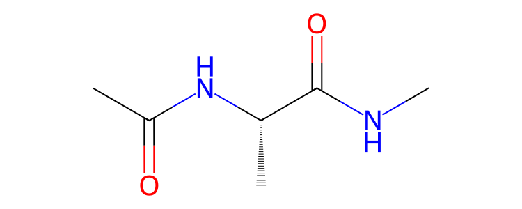

or parts of molecules.

>>> res = mol["residx 1"]
>>> res.view2d()

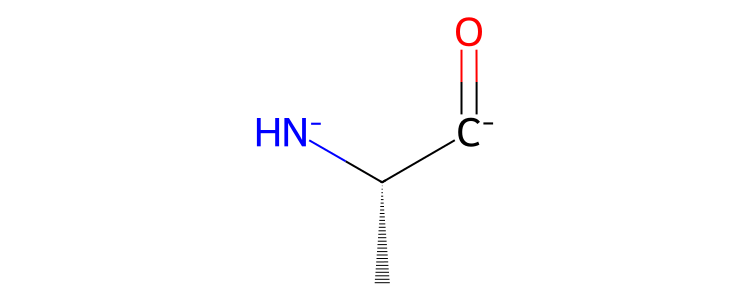

.. note::

   Note that the charge and bond state of partial molecules may be
   incorrect. This is because the algorithm that assigns charges
   and bonds will see that the atoms whose bonds have been broken
   are missing electrons in their valence shell. The algorithm will
   try to correct this by adding or removing extra bonds, or adding
   or removing electrons from those atoms.

You can even view collections of molecules. In this case, molecules are
grouped together by structure, and you see the number of each type of
molecules in the collection.

>>> mols.view2d()

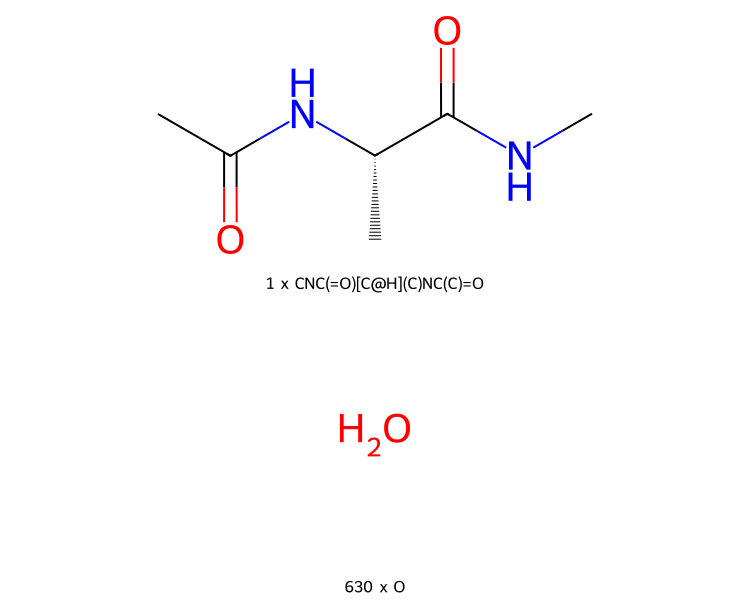

By default, the molecules are printed in a single column. You can
print the molecules across multiple columns by setting their number
via the ``num_columns`` argument, e.g.

>>> mols.view2d(num_columns=2)

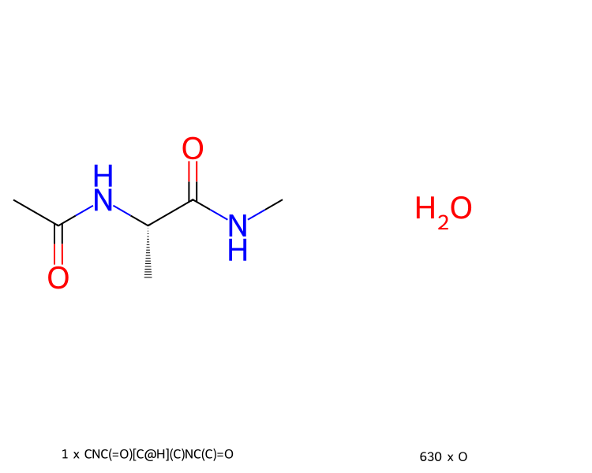

If you aren't working in a Jupyter notebook (or similar), or if you want
to save the images to a file, simply pass your desired filename as the
``filename`` argument, e.g.

>>> mols.view2d(filename="structure.png")
/path/to/structure.png'

This returns the full path to the image that was created. The image format
will be chosen based on the file extension. Supported formats are
SVG (``.svg``), PNG (``.png``) and PDF (``.pdf``). Note that you may need
to install the ``cairosvg`` library to save to PNG or PDF. If you don't
have this installed, then a warning will be printed and the image will
be saved in SVG format (with the file extension changed to ``.svg``).

By default, the image size for both displaying in a notebook and saving
to a file is 750x300 pixels for single-molecule views, and
750x600 pixels for multi-molecule views. You can control the image size
via the ``height`` and ``width`` options, e.g.

>>> mols.view2d(filename="structure.png", height=1000, width=1000)
/path/to/structure.png'

Also, by default, this structure view will only include hydrogens where
they are needed to resolve any ambiguities. Unambiguous hydrogens are
not shown. You can view them by passing ``include_hydrogens==True``, e.g.

>>> mol.view2d(include_hydrogens=True)

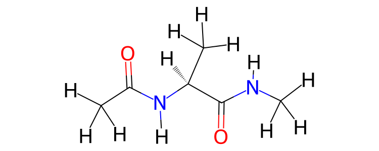

The bond state (single, double, aromatic etc.), formal charge and
stereochemistry of the atoms and bonds in the molecule(s) is determined
automatically if this information is not present within the
molecule(s)'s properties. A simple, yet effective algorithm
`described here <https://docs.mdanalysis.org/2.0.0/_modules/MDAnalysis/converters/RDKit.html#_infer_bo_and_charges>`__
has been copied into :mod:`sire`. This algorithm loops over atoms
and adds or removes bonds and electrons such until each atom has filled
its valence shell. The stereochemistry is determined using the
`AssignStereochemistryFrom3D <https://www.rdkit.org/docs/source/rdkit.Chem.rdmolops.html#rdkit.Chem.rdmolops.AssignStereochemistryFrom3D>`__
function from RDKit, based on the coordinates in the ``coordinates``
property. As with all of :mod:`sire`, you can change the properties
used to find information from a molecule by passing in a property
map via the ``map`` argument of :func:`~sire.mol.SelectorMol.view2d`.

3D Views
--------

Creating 3D views is similarly straightforward. Simply call
the :func:`~sire.mol.SelectorMol.view` function on the object
that contains the molecule data you want to view. This will start
an interactive 3D viewer that you can use to rotate, translate and
zoom around. If the molecule has multiple trajectory frames, then
you will also get video player controls to play, pause, stop and
scroll through an animation of each frame.

.. note::

   3D views can only be created within Jupyter notebooks (or similar).
   There is no option currently to let you save the image to a file.

You can view individual molecules...

>>> import sire as sr
>>> mols = sr.load(sr.expand(sr.tutorial_url, "ala.top", "ala.crd"))
>>> mol = mols[0]
>>> mol.view()

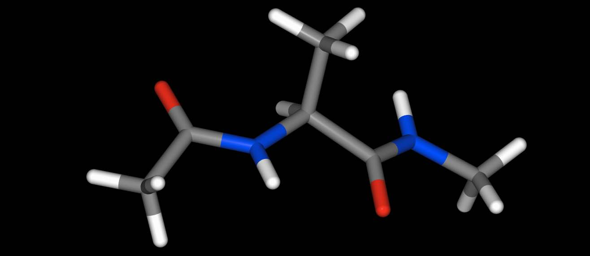

parts of molecules...

>>> res = mol["residx 1"]
>>> res.view()

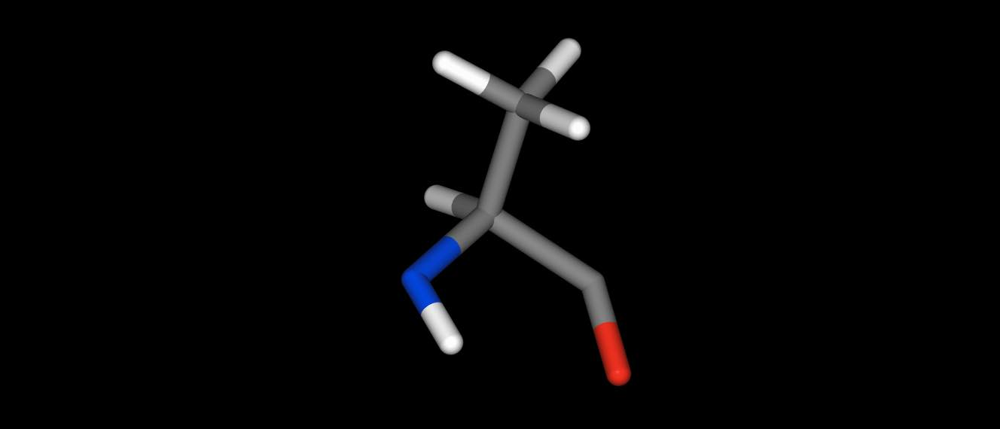

or even whole collections of molecules.

>>> mols.view()

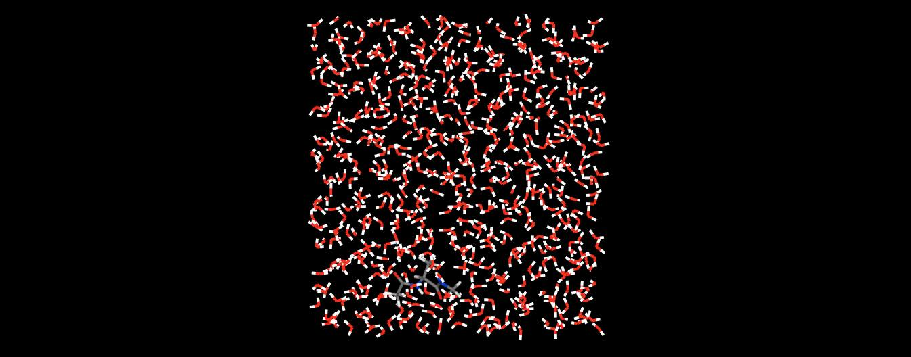

By default, the 3D view is orthographic. You can switch to a perspective
view by passing ``orthographic=False``, e.g.

>>> mol.view(orthographic=False)

.. image:: images/view_09.jpg
   :alt: 3D perspective view of aladip

Choosing the 3D representation
------------------------------

You can control the representation used for the view via the additional
arguments of the function.

* ``protein`` - set the representation used for protein molecules
* ``water`` - set the representation used for water molecules
* ``ion`` - set the representation used for single-atom ions
* ``rest`` - set the representation used for all other molecules (e.g. ligands)

You can also force all molecules to use the same representation by
setting the ``all`` option.

NGLView provides
`several representations that you can use <https://nglviewer.org/ngl/api/manual/usage/molecular-representations.html>`__.
These are:

* ``ball_and_stick`` - a ball and stick view
* ``base`` - simplified DNA/RNA base view
* ``cartoon`` - traditional "cartoon" view of a protein
* ``hyperball`` - smoothly-connected ball and stick view
* ``licorice`` - prettier line view
* ``line`` - simple line view
* ``point`` - simple point for each atom
* ``ribbon`` - show the protein backbone as a ribbon
* ``rocket`` - rocket view
* ``rope`` - show the backbone as a rope
* ``spacefill`` - Spacefilled spheres for each atom
* ``surface`` - Render the molecular surface only
* ``trace`` - trace view
* ``tube`` - show the backbone as a rope

So setting ``protein="tube"`` would render protein molecules with a
``tube`` representation. Setting ``all="spacefill"`` would render
all atoms using a ``spacefill`` representation etc.

The following default representations will be used:

* ``protein`` - ``cartoon``
* ``water`` - ``line``
* ``ion`` - ``spacefill``
* ``rest`` - ``licorice``

You can switch off the default representations by passing
``no_default=True``, e.g. ``mols.view(no_default=True, protein="surface")``
would show only the surface view of a protein.

You can also pass multiple representations per view by passing in a
list of representations, e.g.

>>> mols = sr.load("3NSS")
>>> mols.view(protein=["tube", "licorice"])

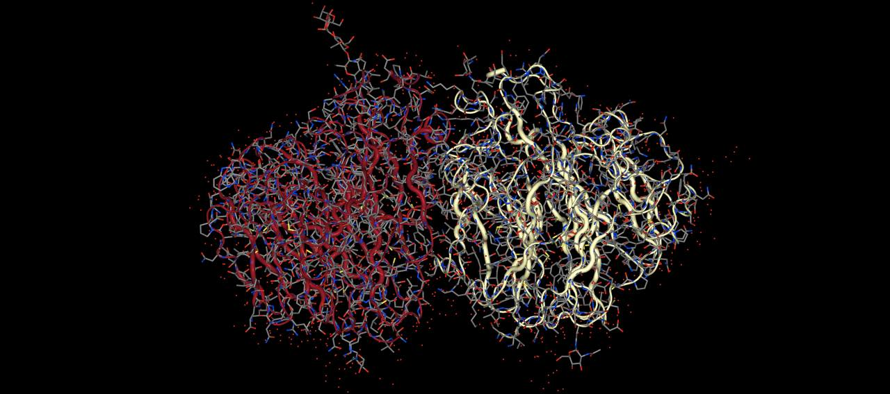

views the protein with both a ``licorice`` and a ``tube`` representation.

The terms ``protein``, ``water`` and ``ion`` are performing searches
of the molecule(s) for all atoms that match those search terms.
You can create your own selections by passing in search terms for
arguments that match the representation. For example

>>> mols.view(spacefill="resname ALA")

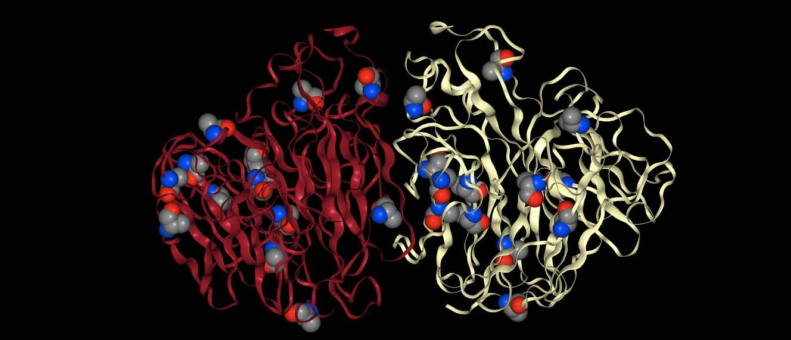

will render the protein in default view (``cartoon``) and will additionally
render every atom that matches ``resname ALA`` in ``spacefill``.

You can match multiple search terms by passing them in as a list, e.g.
``mols.view(spacefill=["resname ALA", "resname ASP"])`` would render
both ``ALA`` and ``ASP`` residues in ``spacefill``.

You can use :doc:`any search term <search>` against any of the representations.
For example, here we will do a more complex view of the ``aladip`` system
where we render water molecules that are close to ``aladip`` differently
to the rest of the water molecules in the box.

>>> mols = sr.load(sr.expand(sr.tutorial_url, "ala.top", "ala.crd"))
>>> mols.view(no_default=True,
...           surface="molidx 0",
...           spacefill="water within 5 of molidx 0",
...           ball_and_stick="water within 10 of molidx 0",
...           rest="line")

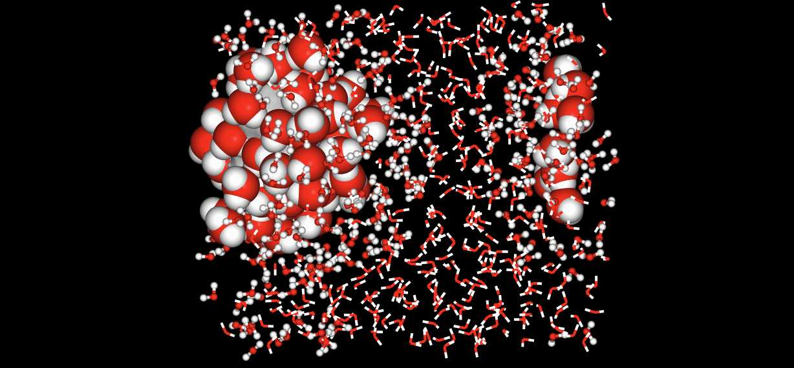

.. note::

   Note how the distance calculation takes into account the periodic
   boundaries of the system. Note also that you can mix representation
   based views (e.g. ``surface="molidx 0"``) with search based views
   (e.g. ``rest="line"``).

Choosing colors and opacities
-----------------------------

You can set the color and opacity used for a particular representation
by passing these as additional terms to the representation or search
term, separated by colons. For example, to set the color of a
representation to ``blue`` we could pass this as an addition ``:blue``
to the representation or search term argument.

>>> mol = mols[0]
>>> mol.view(all="licorice:blue")

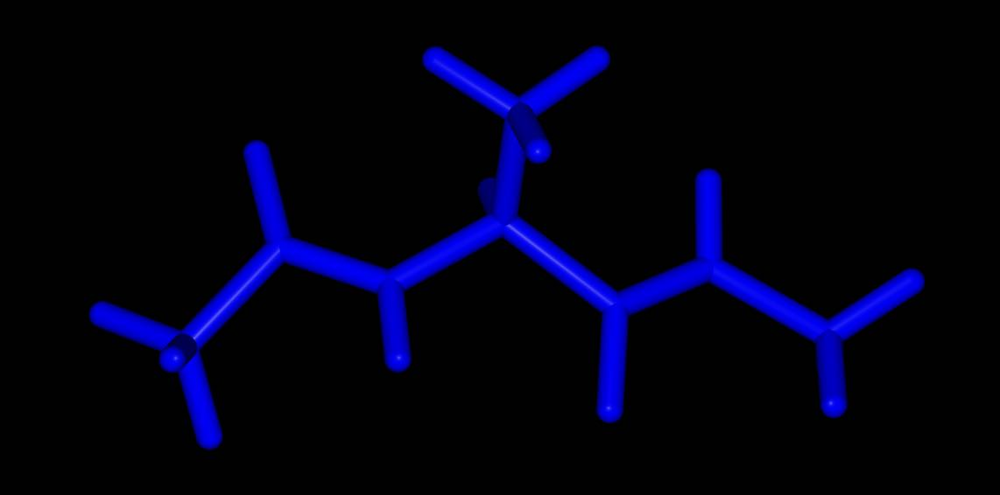

Here all of the atoms are rendered in blue licorice. Or...

>>> mol.view(all="licorice:blue", ball_and_stick="element C:red")

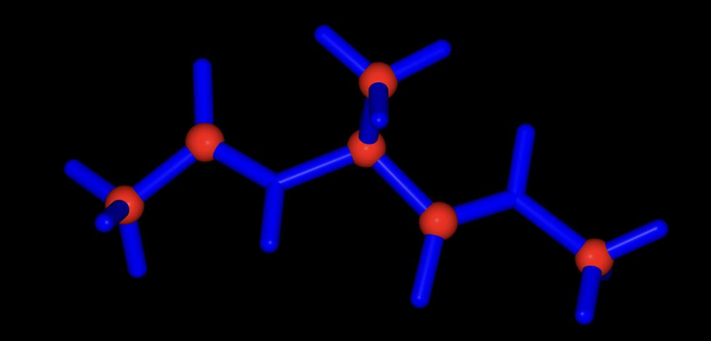

all of the atoms are rendered in blue licorice, but the carbon atoms are
represented as red balls and sticks.

You can use any color name supported by NGLView. These include named
colors (e.g. ``red``, ``green``, ``blue``, ``yellow``, including any
`CSS named color <https://www.w3schools.com/cssref/css_colors.php>`__ supported
by your browser, e.g. ``orchid``, ``sienna``, ``wheat`` etc.), colors
specified as a red-green-blue hex values (e.g. ``#FF0000``, ``#00FF00``,
``#0000FF`` etc.), colors specified as red-green-blue triples
(e.g. ``rgb(255,0,0)``, ``rgb(0,255,0)``, ``rgb(0,0,255)`` etc.) or any of the
`coloring schemes supported by NGLView <https://nglviewer.org/ngl/api/manual/usage/coloring.html>`__
(e.g. ``atomindex``, ``bfactor``, ``electrostatic``, ``element``,
``hydrophobicity``, ``random`` or ``sstruc``).

You also specify the opacity (transparency) of the representation
by adding a number between 0 (fully transparent) and 1 (fully opaque).
You can use any order of color and opacity, e.g.

>>> mol.view(all=["licorice", "spacefill:0.8", "surface:red:0.2"])

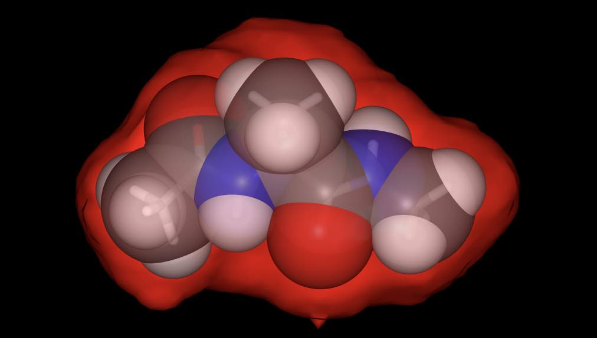

has rendered the molecule using three representations; a licorice in
default colors (colored by element), spacefill in default colors,
but with opacity 0.8, and a red-colored surface with opacity 0.2.

Or...

>>> mol.view(all=["ball_and_stick", "surface:0.9:electrostatic"])

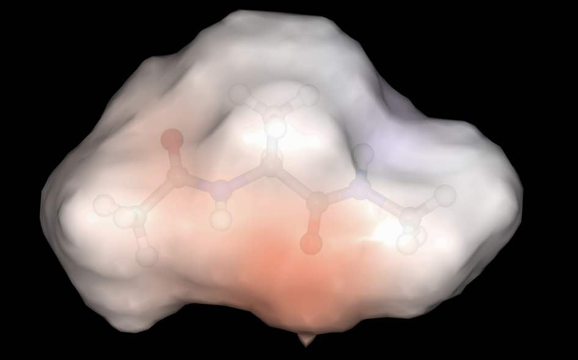

has rendered the molecule with two representations; a ball and stick with
default colors and a surface colored using electrostatic potential, with
opacity 0.9.

Closer integration with NGLView
-------------------------------

We don't yet properly expose the
`NGLView stage parameters <https://github.com/nglviewer/nglview/blob/master/README.md#properties>`__.
Currently you can pass in a dictionary of parameters via the
``stage_parameters`` argument, which are straight passed to the
``NGLView.NGLWidget.stage``.

If you want more control over the view, you can assign the result
of ``mols.view(...)`` to a variable. This variable is the actual
`NGLView.NGLWidget <https://nglviewer.org/nglview/latest/api.html#nglview.NGLWidget>`__,
which you can manipulate as if you had created it yourself, e.g.

>>> v = mols[0].view()
>>> v.stage.set_parameters(backgroundColor="white")
>>> v.display(gui=True)
>>> v.camera = "perspective"
>>> v

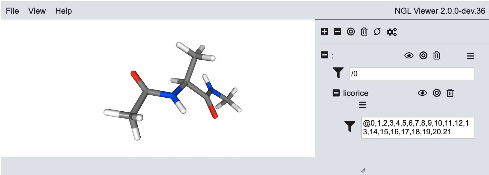
