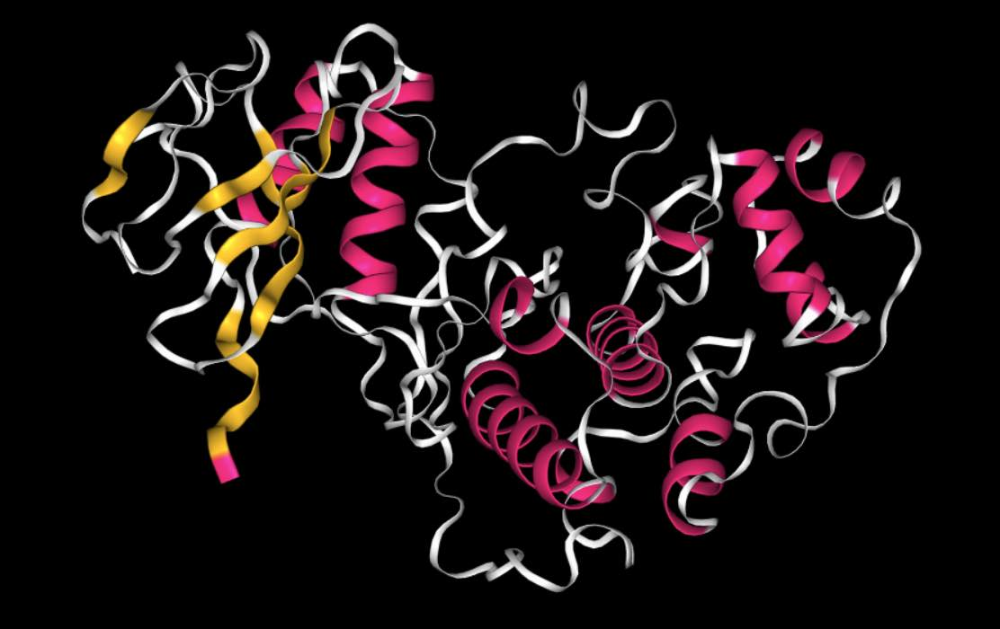
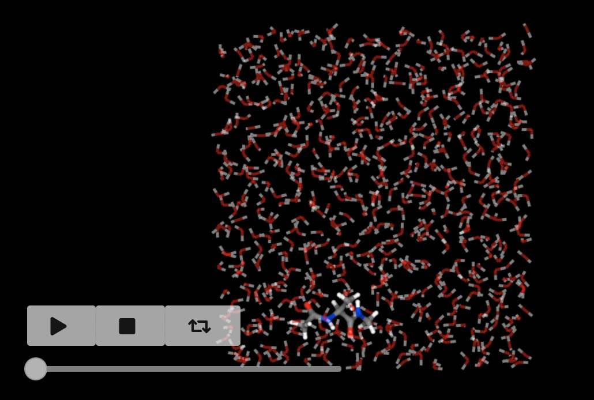
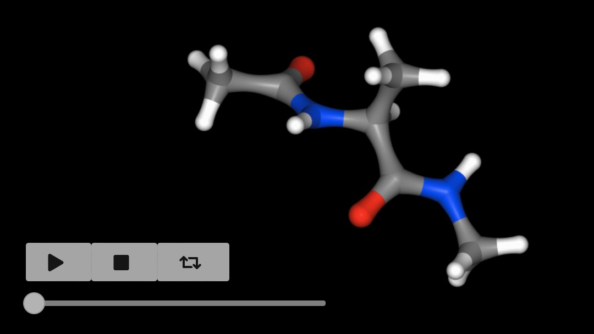
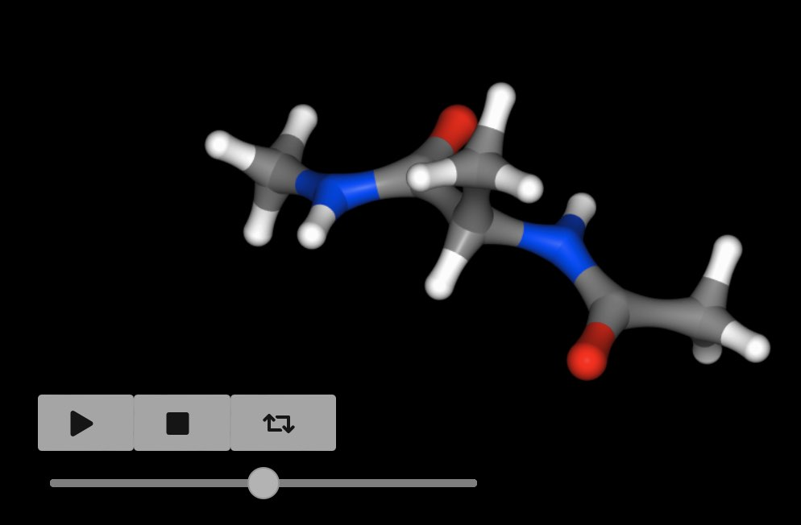
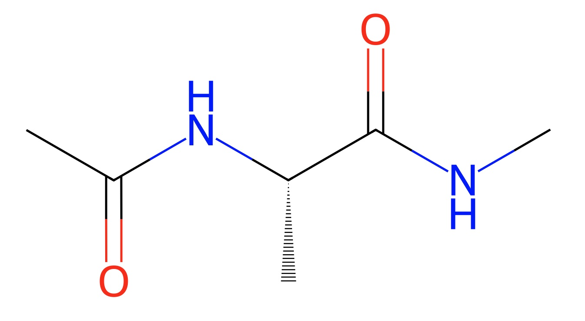
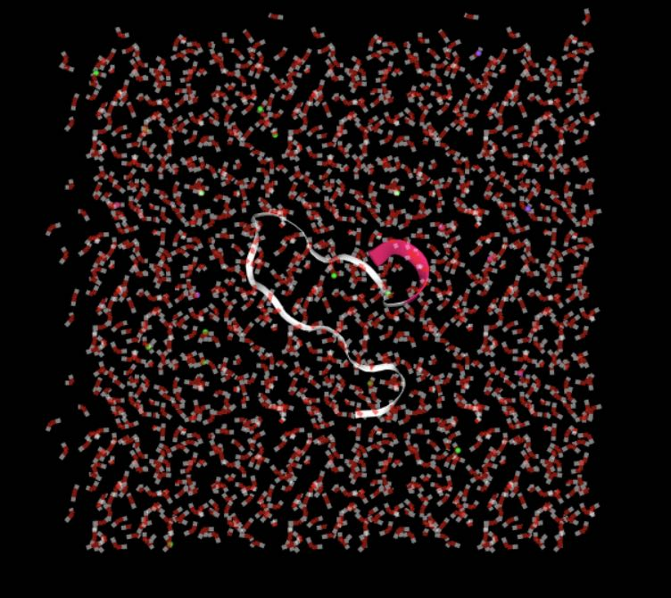

=================
Quick Start Guide
=================

Import :mod:`sire` using

>>> import sire as sr

Load a molecule from a URL, via :func:`sire.load`.

>>> mols = sr.load(f"{sr.tutorial_url}/p38.pdb")

.. note ::

   :data:`sire.tutorial_url` expands to the base URL that contains
   all tutorial files.

View molecules using :func:`~sire.mol.SelectorMol.view`.

>>> mols.view()

Or load molecules that need multiple input files by passing in
multiple files.

>>> mols = sr.load(f"{sr.tutorial_url}/ala.top", f"{sr.tutorial_url}/ala.traj")

.. note::

   You could use :func:`sire.expand` to put :data:`sire.tutorial_url` in front
   of ``ala.top`` and ``ala.crd``, e.g. via
   ``sr.expand(sr.tutorial_url, ["ala.top", "ala.traj"])``

There are lots of ways to search or index for molecules, e.g.

>>> mols[0]
Molecule( ACE:7   num_atoms=22 num_residues=3 )

has returned the first molecule in the system of molecules that were loaded.

>>> mols["water"]
SelectorMol( size=630
0: Molecule( WAT:4   num_atoms=3 num_residues=1 )
1: Molecule( WAT:5   num_atoms=3 num_residues=1 )
2: Molecule( WAT:6   num_atoms=3 num_residues=1 )
3: Molecule( WAT:7   num_atoms=3 num_residues=1 )
4: Molecule( WAT:8   num_atoms=3 num_residues=1 )
...
625: Molecule( WAT:629 num_atoms=3 num_residues=1 )
626: Molecule( WAT:630 num_atoms=3 num_residues=1 )
627: Molecule( WAT:631 num_atoms=3 num_residues=1 )
628: Molecule( WAT:632 num_atoms=3 num_residues=1 )
629: Molecule( WAT:633 num_atoms=3 num_residues=1 )
)

has returned all of the water molecules,

while

>>> mols[0]["element C"]
Selector<SireMol::Atom>( size=6
0:  Atom( CH3:2   [  18.98,    3.45,   13.39] )
1:  Atom( C:5     [  18.48,    4.55,   14.35] )
2:  Atom( CA:9    [  16.54,    5.03,   15.81] )
3:  Atom( CB:11   [  16.05,    6.39,   15.26] )
4:  Atom( C:15    [  15.37,    4.19,   16.43] )
5:  Atom( CH3:19  [  13.83,    3.94,   18.35] )
)

has returned all of the carbon atoms in the first molecule.

Smarts searchs are supported too! For example, here are three matches
for a smarts string that finds aliphatic carbons.

>>> mols["smarts [#6]!:[#6]"]
AtomMatch( size=3
0: [2] CH3:2,C:5
1: [2] CA:9,CB:11
2: [2] CA:9,C:15
)

You can also search for bonds, e.g.

>>> mols[0].bonds()
SelectorBond( size=21
0: Bond( HH31:1 => CH3:2 )
1: Bond( CH3:2 => HH32:3 )
2: Bond( CH3:2 => HH33:4 )
3: Bond( CH3:2 => C:5 )
4: Bond( C:5 => O:6 )
...
16: Bond( N:17 => H:18 )
17: Bond( N:17 => CH3:19 )
18: Bond( CH3:19 => HH31:20 )
19: Bond( CH3:19 => HH32:21 )
20: Bond( CH3:19 => HH33:22 )
)

has returned all of the bonds in the first molecule, while

>>> mols.bonds("element O", "element H")
SelectorMBond( size=1260
0: MolNum(4) Bond( O:23 => H1:24 )
1: MolNum(4) Bond( O:23 => H2:25 )
2: MolNum(5) Bond( O:26 => H1:27 )
3: MolNum(5) Bond( O:26 => H2:28 )
4: MolNum(6) Bond( O:29 => H1:30 )
...
1255: MolNum(631) Bond( O:1904 => H2:1906 )
1256: MolNum(632) Bond( O:1907 => H1:1908 )
1257: MolNum(632) Bond( O:1907 => H2:1909 )
1258: MolNum(633) Bond( O:1910 => H1:1911 )
1259: MolNum(633) Bond( O:1910 => H2:1912 )
)

has returned all of the oxygen-hydrogen bonds in all molecules.

If a trajectory has been loaded (as is the case here) then
you can get the number of frames using

>>> mols.num_frames()
500

and can view the movie using

>>> mols.view()

The :func:`~sire.mol.SelectorMol.view` function can be called on any
selection, so you can view the movie of the first molecule using

>>> mols[0].view()

You can extract a subset of trajectory frames by indexing, e.g.

>>> mols[0].trajectory()[0::100].view()

views every 100 frames of the trajectory.

If the molecule was loaded with forcefield parameters, then you can
calculate its energy using the :func:`~sire.mol.SelectorMol.energy`
function.

>>> mols[0].energy()
31.5691 kcal mol-1

You can get all of the components via

>>> mols[0].energy().components()
{'bond': 4.22497 kcal mol-1,
 '1-4_LJ': 3.50984 kcal mol-1,
 'angle': 7.57006 kcal mol-1,
 'dihedral': 9.80034 kcal mol-1,
 '1-4_coulomb': 44.8105 kcal mol-1,
 'intra_LJ': -1.31125 kcal mol-1,
 'improper': 0.485545 kcal mol-1,
 'intra_coulomb': -37.5208 kcal mol-1}

You can calculate the energy across a trajectory, with the results
returned as a pandas dataframe!

>>> mols[0].trajectory().energy()
     frame        time    1-4_LJ  1-4_coulomb      angle      bond   dihedral  improper  intra_LJ  intra_coulomb      total
0        0    0.200000  3.509838    44.810452   7.570059  4.224970   9.800343  0.485545 -1.311255     -37.520806  31.569147
1        1    0.400000  2.700506    47.698455  12.470519  2.785874  11.776295  1.131481 -1.617496     -40.126219  36.819417
2        2    0.600000  2.801076    43.486411  11.607753  2.023439  11.614774  0.124729 -1.103966     -36.633297  33.920920
3        3    0.800000  3.365638    47.483966   6.524609  0.663454  11.383852  0.339333 -0.983872     -40.197920  28.579061
4        4    1.000000  3.534830    48.596027   6.517530  2.190370  10.214994  0.255331 -1.699613     -40.355054  29.254415
..     ...         ...       ...          ...        ...       ...        ...       ...       ...            ...        ...
495    495   99.199997  2.665994    42.866319  11.339087  4.172684   9.875872  0.356887 -1.584092     -36.499764  33.192988
496    496   99.400002  3.062467    44.852774   9.268408  1.878366  10.548897  0.327064 -1.814718     -36.671683  31.451575
497    497   99.599998  3.530233    44.908117  10.487378  4.454670  10.223964  1.006034 -0.692972     -37.118048  36.799376
498    498   99.800003  3.511116    42.976288   9.017446  0.809064  10.841436  0.518190 -1.862433     -35.481467  30.329641
499    499  100.000000  3.768998    41.625135  13.629923  1.089916  11.889372  0.846805 -1.897328     -36.547672  34.405149

You can do more with the molecule, for example viewing it's 2D structure

>>> mols[0].view2d()

or generating its smiles string.

>>> mols[0].smiles()
'CNC(=O)C(C)NC(C)=O'

You can also convert it to an RDKit molecule!

>>> rdmol = sr.convert.to(mols[0], "rdkit")

And you can even run molecular dynamics using the integration with OpenMM.

>>> mols = sr.load(sr.expand(sr.tutorial_url, "kigaki.gro", "kigaki.top"),
...                silent=True)
>>> mols.view()

>>> mols = mols.minimisation().run().commit()
>>> d = mols.dynamics(timestep="4fs")
>>> d.run("20ps", save_frequency="1ps")
>>> mols = d.commit()
>>> mols.trajectory().energy()
    frame    time     1-4_LJ  1-4_coulomb            LJ      angle          bond       coulomb    dihedral   intra_LJ  intra_coulomb         total
0       0   0.996  59.651307  1360.146653   9568.382472  33.153180  1.151441e-07 -58711.221324  143.169277 -59.838144    -836.554566 -48443.111145
1       1   1.992  58.522026  1358.383061   9709.484127  32.446263  1.036101e-07 -58940.741532  140.184666 -60.142002    -834.744464 -48536.607855
2       2   2.988  59.141041  1356.744201   9789.292865  30.082938  9.731729e-08 -59076.583618  140.224040 -62.954998    -824.815552 -48588.869082
3       3   3.984  59.059150  1354.893646   9935.465877  31.720621  1.024596e-07 -59275.805993  141.718669 -64.139697    -823.853960 -48640.941686
4       4   4.980  60.224984  1357.848260  10006.322861  31.083502  3.367367e-07 -59376.304130  140.345431 -63.814002    -829.057114 -48673.350206
5       5   5.976  59.373650  1363.851808  10105.994888  30.894446  2.845356e-07 -59513.368937  143.115980 -63.957015    -836.418112 -48710.513292
6       6   6.972  59.459285  1360.917679  10081.162094  30.369804  9.727925e-08 -59508.624215  140.357718 -64.516933    -832.704201 -48733.578770
7       7   7.968  59.240024  1359.991753  10094.332433  29.832203  2.732835e-07 -59530.650142  141.043057 -64.531486    -830.125450 -48740.867608
8       8   8.964  60.475206  1361.501917  10094.941141  29.249724  2.836084e-07 -59544.162592  143.007459 -63.031514    -833.561293 -48751.579951
9       9   9.960  60.203116  1361.601338  10092.121915  31.394211  9.757362e-08 -59570.729306  143.093169 -62.144179    -833.194426 -48777.654161
10     10  10.956  58.831351  1357.327185  10191.985573  32.680589  3.194916e-07 -59677.026718  140.841337 -63.021877    -829.708822 -48788.091383
11     11  11.952  59.419448  1361.222606  10194.483188  30.112070  3.026331e-07 -59692.380139  139.802831 -63.141443    -832.297506 -48802.778944
12     12  12.948  59.722312  1362.951521  10230.588769  29.720451  3.238261e-07 -59745.405198  143.709119 -65.402825    -834.898851 -48819.014702
13     13  13.944  59.406402  1364.013291  10237.368802  31.261586  3.890764e-07 -59756.580879  142.995229 -67.006933    -835.112977 -48823.655478
14     14  14.940  58.247288  1359.532537  10279.392623  33.504504  1.121418e-07 -59810.225442  143.336565 -66.864237    -829.694256 -48832.770418
15     15  15.936  58.999250  1361.789447  10284.921171  30.674858  3.374465e-07 -59817.202679  144.282364 -65.559806    -831.215362 -48833.310756
16     16  16.932  58.830437  1361.513060  10269.831813  32.368016  9.568387e-08 -59811.276132  143.987302 -66.658701    -831.161298 -48842.565503
17     17  17.928  58.360627  1359.437296  10286.491539  35.513556  1.125676e-07 -59837.200063  144.749678 -67.550421    -828.077402 -48848.275189
18     18  18.924  58.870211  1362.986999  10299.138695  34.114634  1.103502e-07 -59844.519973  145.086558 -67.252851    -834.098424 -48845.674151
19     19  19.920  58.744146  1360.811594  10310.723946  33.499015  3.417039e-07 -59863.238313  143.427697 -66.018567    -830.469582 -48852.520064
20     20  20.000  58.956968  1362.597488  10270.289256  33.601886  1.085790e-07 -59831.592365  142.924165 -67.901720    -829.151397 -48860.275719

This is just the beginning of what :mod:`sire` can do! To learn more,
please take a look at :doc:`the detailed guides <../cheatsheet/index>`
or :doc:`the tutorial <../tutorial/index>`.
