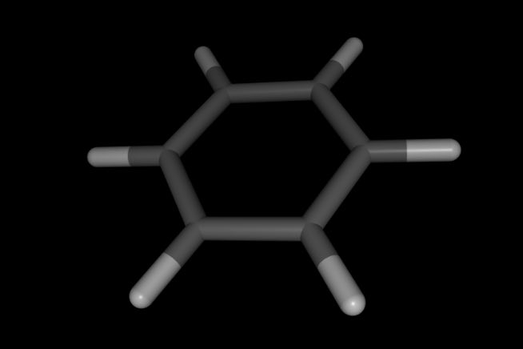

======================================
Creating Molecules from Smiles Strings
======================================

`Smiles strings <https://en.wikipedia.org/wiki/Simplified_molecular-input_line-entry_system>`__
provide a convenient way to represent a molecule as text.

You can create a molecule from a smile string using the
:func:`sire.smiles` function.

>>> import sire as sr
>>> mol = sr.smiles("C1:C:C:C:C:C1")
>>> print(mol.atoms())
Selector<SireMol::Atom>( size=12
0:  Atom( C1:1    [  -0.92,   -1.05,    0.02] )
1:  Atom( C2:2    [  -1.37,    0.27,   -0.04] )
2:  Atom( C3:3    [  -0.45,    1.32,   -0.06] )
3:  Atom( C4:4    [   0.92,    1.05,   -0.02] )
4:  Atom( C5:5    [   1.37,   -0.27,    0.04] )
...
7:  Atom( H8:8    [  -2.43,    0.48,   -0.07] )
8:  Atom( H9:9    [  -0.80,    2.35,   -0.11] )
9:  Atom( H10:10  [   1.63,    1.87,   -0.04] )
10:  Atom( H11:11  [   2.43,   -0.48,    0.07] )
11:  Atom( H12:12  [   0.80,   -2.35,    0.11] )
)
>>> mol.view()

Note how hydrogen atoms and coordinates of all atoms have
been generated automatically. You can control this using
the ``add_hydrogens`` and ``generate_coordinates`` options, e.g.

>>> mol = sr.smiles("C1:C:C:C:C:C1", add_hydrogens=False,
...                 generate_coordinates=False)
>>> print(mol.atoms())
Selector<SireMol::Atom>( size=6
0:  Atom( C1:1 )
1:  Atom( C2:2 )
2:  Atom( C3:3 )
3:  Atom( C4:4 )
4:  Atom( C5:5 )
5:  Atom( C6:6 )
)

.. note::

    Note that hydrogens will automatically be added if
    ``generate_coordinates`` is ``True`` (which is the default)

