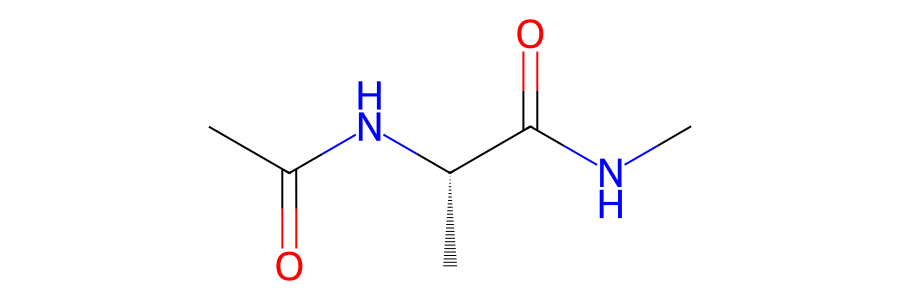
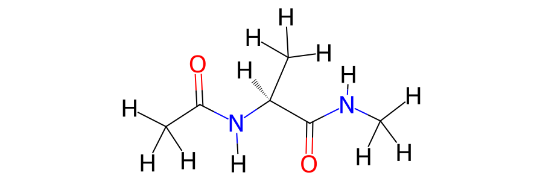
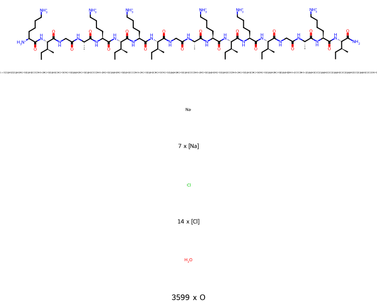

=======================
Viewing Molecules in 2D
=======================

The ability to convert :mod:`sire` objects to native objects of other
molecular packages makes it easy to create convenience functions that
leverage the capabilities of those packages under the hood.

For example, RDKit can be used to create 2D views of molecules.
This functionality is used by the :func:`~sire.mol.view2d` function to
create a two-dimensional view of any :class:`~sire.mol.Molecule`,
molecule sub-view or collections of molecules.

In a jupyter notebook you can run;

>>> import sire as sr
>>> mols = sr.load(sr.expand(sr.tutorial_url, "ala.crd", "ala.top"))
>>> mols[0].view2d()

This will render the image to the screen. You can save this to a PNG,
PDF or SVG file using the ``filename`` argument, e.g.

>>> mols[0].view2d(filename="aladip.png")
'/path/to/aladip.png'

This returns the full path to the image file created.

The choice of format is based on the extension used for the filename,
e.g. ``.png`` for PNG, ``.pdf`` for PDF and ``.svg`` for SVG.

.. note::

   You may need to have the ``cairosvg`` package installed to save
   to PNG or PDF format. You will see a warning printed to the screen
   if this package is needed, and the image will instead be saved
   in SVG format. You can install ``cairosvg`` using
   ``conda install cairosvg``.

You can control the height and width of the image using the ``height``
and ``width`` arguments (measured in pixels), e.g.

>>> mols[0].view2d(filename="small.pdf", height=200, width=200)
'/path/to/small.pdf'

By default, this will not show unambiguous hydrogens (e.g. those that
are not implied by the 2D structure). You can view all hydrogens
using the ``include_hydrogens`` option.

>>> mols[0].view2d(include_hydrogens=True)

Notice how the stereochemistry, formal charges and bonding are determined
automatically for the molecule. This is based on a simple algorithm that
add and removes bonds and charges until the valence shell of each atom
is full. The stereochemistry is derived based on the 3D structure of
the molecule, using functionality built into RDKit.

You can view whole molecules or parts of molecules in 2D. For example,
this will view the second residue of the first molecule.

>>> mols[0]["residx 1"].view2d(include_hydrogens=True)

.. note::

   The formal charge and bonding around the atoms that are missing
   bonds is likely to be incorrect. Here you can see that the nitrogen
   and carbon have gained negative charges as they have lost their bonds
   to the neighbouring residues.

You can also view lots of molecules at once in 2D. In this case, molecules
are grouped, with only the different molecules contained in the collection
shown, with their counts and smiles strings.

>>> mols = sr.load(sr.expand(sr.tutorial_url, "kigaki.gro", "kigaki.top"),
...                show_warnings=False)
>>> mols.view2d()

From this you can see that there was one short peptide, with 7 sodium
ions, 14 chloride ions and 3599 water molecules.

.. note::

   We do not recommend that you try to create 2D views of large molecules
   (e.g. proteins). We plan to add functionality to detect proteins and
   instead print out their sequences when viewed via the ``view2d()``
   function. Do get in touch if you want to discuss alternative ideas,
   or if you want to help contribute to the code.
