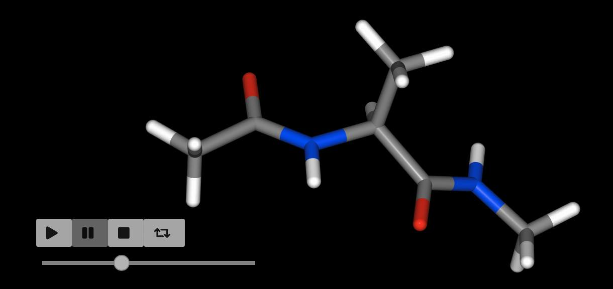
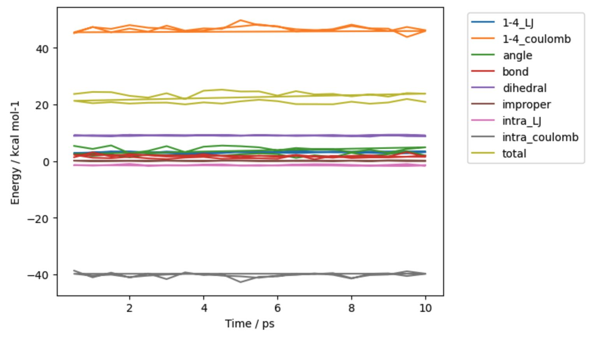
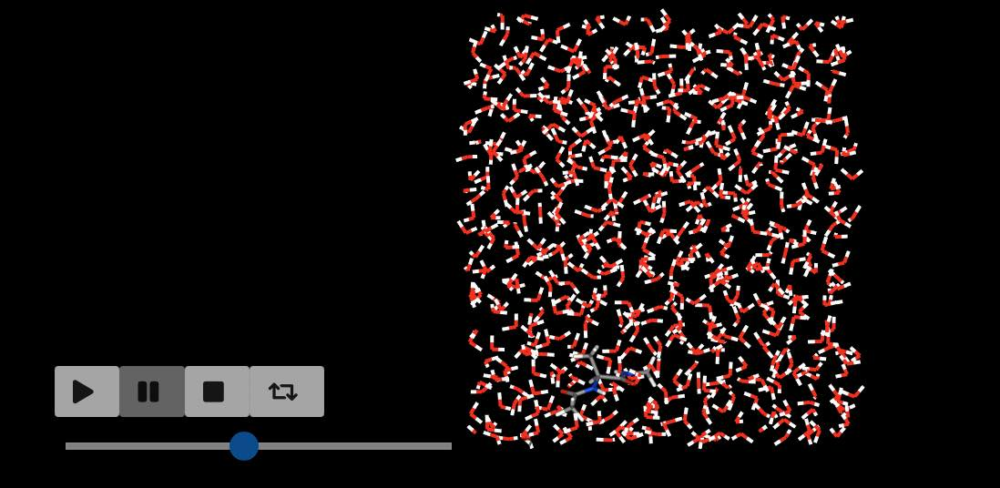

===================================
Molecular Dynamics and Minimisation
===================================

`OpenMM <https://openmm.org>`__ is an excellent package that provides
a framework for running GPU-accelerated molecular dynamics (and related)
simulations.

The :class:`~sire.mol.Molecule`, molecule view and container objects
provide convenience functions that make it easier to use OpenMM
to perform minimisation and molecular dynamics simulations.

Minimisation
------------

You can perform minimisation on a molecule or collection of molecules
using the :func:`~sire.mol.SelectorMol.minimisation` function.
This returns a :class:`~sire.mol.Minimisation` object that can be used
to control minimisation.

>>> import sire as sr
>>> mols = sr.load(sr.expand(sr.tutorial_url, "ala.top", "ala.crd"))
>>> mol = mols[0]
>>> print(mol.energy())
29.3786 kcal mol-1
>>> m = mol.minimisation()

You perform minimisation itself by calling the :func:`~sire.mol.Minimisation.run`
function.

>>> m.run()
minimisation ✔
Minimisation()

You can extract the results of minimisation, converted back into the
original view object by calling :func:`~sire.mol.Minimisation.commit`

>>> mol = m.commit()
>>> print(mol.energy())
17.7799 kcal mol-1

You could run all of these steps on a single line, e.g.

>>> mol = mols[0].minimisation().run().commit()
>>> print(mol.energy())
minimisation ✔
17.7799 kcal mol-1

In the above case we minimised just the first molecule that was loaded.
We can minimise all molecules by calling ``minimisation`` on the whole
collection.

>>> print(mols.energy())
-5855.24 kcal mol-1
>>> mols = mols.minimisation().run().commit()
>>> print(mols.energy())
minimisation ✔
-7971.79 kcal mol-1

Molecular Dynamics
------------------

You can perform molecular dynamics on a molecule or collection of molecules
using the :func:`~sire.mol.SelectorMol.dynamics` function. This returns
a :class:`~sire.mol.Dynamics` object that can be used to control dynamics.

>>> import sire as sr
>>> mols = sr.load(sr.expand(sr.tutorial_url, "ala.top", "ala.crd"))
>>> mol = mols[0]
>>> d = mol.dynamics()

You run dynamics by calling the :func:`~sire.mol.Dynamics.run` function.
You pass in the amount of time you want to simulate, and (optionally)
the amount of time between saved coordinate/velocity snapshots.

For example, here we will run 10 picoseconds of dynamics, saving a
frame every 0.5 picoseconds

>>> d.run(10*sr.units.picosecond, 0.5*sr.units.picosecond)
Dynamics(completed=10 ps, energy=-8.82722 kcal mol-1, speed=119.2 ns day-1)

.. note::

   The speed of the simulation will depend on whether or not you have a
   GPU, and how fast it is. Reduce the simulation time if you find the
   above example takes too long.

You can extract the results of dynamics by calling
:func:`~sire.mol.Dynamics.commit`.

>>> mol = d.commit()
>>> mol.view()

In this case, we performed molecular dynamics on just the first molecule
of the loaded system. We can perform dynamics on all the molecules by
calling :func:`~sire.mol.SelectorMol.dynamics` on the complete collection.

>>> d = mols.dynamics()
>>> d.run(10*sr.units.picosecond, 0.5*sr.units.picosecond)
Dynamics(completed=6010 ps, energy=-5974.09 kcal mol-1, speed=80.5 ns day-1)
>>> mols = d.commit()
>>> mols.trajectory().energy().pretty_plot()

.. note::

   The input file was the end-point of 6 ns of dynamics. We've now just
   run an additional 10 ps of dynamics, hence why it list that
   6010 ps have been completed.

The frames from dynamics are stored as a trajectory in the molecules.
They can be processed using the
:doc:`trajectory functions introduced previously <../part04/02_trajectory>`.
In this case we called ``pretty_plot`` on the ``energy`` to get a
nice graph of the component energies versus time.

You can continue running more dynamics by calling the
:func:`~sire.mol.Dynamics.run` function again. You can choose different
intervals to save frames for each run. For example, you could have a long
"equilibration" run that doesn't save frames at all by setting
``save_frequency`` to ``0``.

>>> d.run(10*sr.units.picosecond, save_frequency=0)
Dynamics(completed=6020 ps, energy=-5974.9 kcal mol-1, speed=89.2 ns day-1)

You can run as many blocks as you like, e.g.

>>> d.run(1*sr.units.picosecond, save_frequency=0.01*sr.units.picosecond)
Dynamics(completed=6021 ps, energy=-5974.61 kcal mol-1, speed=84.4 ns day-1)
>>> d.run(50*sr.units.picosecond, save_frequency=1*sr.units.picosecond)
Dynamics(completed=6071 ps, energy=-5976.05 kcal mol-1, speed=58.3 ns day-1)
>>> mols = d.commit()
>>> mols.view()

When you play the movie of the trajectory you should see the slow-motion
section when 100 frames were saved over a 1 ps period, and then the
fast-motion when 50 frames were saved over a 50 ps period.

Controlling Dynamics
--------------------

There are several parameters that are needed to control the molecular
dynamics simulation. By default, :mod:`sire` will do a good job trying
to guess them based on what it can find in the molecules being simulated.

You can manually override this choice via a number of methods.

The easiest is to pass additional options to the
:func:`~sire.mol.SelectorMol.dynamics` function when you first create
the :class:`~sire.mol.Dynamics` object. Available options are;

* ``cutoff`` - set the cutoff distance for non-bonded interactions. By
  default this is 7.5 Å.
* ``cutoff_type`` - set the method used for the non-bonded cutoff. By
  default this is particle mesh Ewald (PME).
* ``timestep`` - set the timestep used for the integrator. By default
  this is 1 femtosecond (fs).
* ``save_frequency`` - the default value of ``save_frequency`` if this is
  not specified in :func:`~sire.mol.Dynamics.run`. By default this is
  25 picoseconds (ps).
* ``constraint`` - the level of constraints to apply to the molecules,
  e.g. constraining bonds, angles etc. By default this is inferred from
  the value of ``timestep``. It defaults to no constraints. But timesteps
  greater than 1 femtoseconds will constrain all bonds involving hydrogen
  and all angles involving hydrogen. Timesteps greater than 2 femtoseconds will
  constrain all bonds, and all angles involving hydrogen.

For example

>>> d = mols.dynamics(cutoff_type="reaction_field",
...                   timestep=4*sr.units.femtosecond,
...                   save_frequency=1*sr.units.picosecond)
>>> d.run(10*sr.units.picosecond)
Dynamics(completed=6081 ps, energy=-6601.59 kcal mol-1, speed=432.2 ns day-1)

will perform 10 picoseconds of dynamics saving a frame every 1 picosecond.
The reaction field cutoff scheme will be used, with an integration timestep
of 4 femtoseconds. Since a larger timestep was used, constraints were
automatically applied to all bonds, and all angles involving hydrogen.
This simpler cutoff scheme plus larger timestep has lead to a much
faster simulation (in this case, >400 nanoseconds per day, compared to
~60-80 nanoseconds per day above).

Another way to pass in options is to use the ``map`` option. This lets
you pass in a dictionary of key-value pairs that provide extra
configuration options for the :class:`~sire.mol.Dynamics` object.

This can be useful as a way of creating a dictionary of parameters
that can be re-used between multiple dynamics runs.

>>> m = {"cutoff_type": "reaction_field",
...      "timestep": 4*sr.units.femtosecond,
...      "save_frequency": 1*sr.units.picosecond}
>>> d = mols.dynamics(map=m)
>>> d.run(10*sr.units.picosecond)
Dynamics(completed=6081 ps, energy=-6601.01 kcal mol-1, speed=439.8 ns day-1)
>>> d2 = mols.dynamics(map=m)
>>> d2.run(10*sr.units.picosecond)
Dynamics(completed=6081 ps, energy=-6601.01 kcal mol-1, speed=440.6 ns day-1)

The parameter map approach can be used to set other properties of the
simulation. More details on what properties can be set, and how to
query the value of set properties
:doc:`can be found here <../../cheatsheet/openmm>`.
