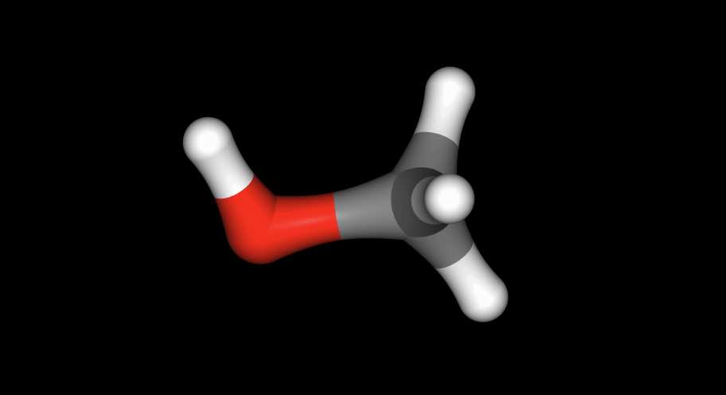

================
Merged Molecules
================

The concept of a "merged molecule" is central to the way that free energy
calculations are implemented in sire. A merged molecule is one that
represents both a "reference" state and a "perturbed" state. These are
the two states that the free energy simulation will morph between, and
for which the free energy difference will be calculated.

For example, here we have pre-prepared a merged molecule that represents
the perturbation from ethane to methanol.

>>> import sire as sr
>>> mols = sr.load(sr.expand(sr.tutorial_url, "merged_molecule.s3"))
>>> print(mols)
System( name=BioSimSpace_System num_molecules=4054 num_residues=4054 num_atoms=12167 )

.. note::

   The ``.s3`` file format is an internal binary format used by sire to
   store any object. You can create ``.s3`` files using the
   :func:`sire.stream.save` function, and load them using the
   :func:`sire.stream.load` function. These files have the ``.s3``
   suffix when created by sire, and the ``.bss`` suffix when created
   by BioSimSpace. The ``.s3`` format is designed to
   be portable and backwards compatible, but standard file formats,
   e.g. ``.pdb``, ``.mol2``, ``.sdf``, etc. should be preferred for
   long-term storage of data.

.. note::

   This merged molecule was created using `BioSimSpace <https://biosimspace.openbiosim.org>`__,
   and then saved using :func:`sire.stream.save`.
   You should use BioSimSpace if you want to create merged molecules
   yourself.

This system contains a single merged molecule in a box of water. Merged
molecules are idenfitied by the molecule property ``is_perturbable``, which
will be ``True``. We can extract the merged molecule from this system using

>>> mol = mols["molecule property is_perturbable"]
>>> print(mol)
Molecule( Merged_Molecule:6 num_atoms=8 num_residues=1 )

A merged molecule is exactly the same as all other molecules in sire. The
difference is that it contains two set of the molecular properties;
one that represents the reference state, and one that represents the
perturbed state. These are identified by the ``0`` and ``1`` suffixes.

For example, the reference state coordinates are in the ``coordinates0``
property;

>>> print(mol.property("coordinates0"))
AtomCoords( size=8
0: (25.71278789630378, 24.93752746353058, 25.253932968775896)
1: (24.28721210369622, 25.062578848992636, 24.746067031224108)
2: (25.911542134040474, 23.88985958968847, 25.56394874111798)
3: (26.425045597240814, 25.22062162179178, 24.45094936681738)
4: (25.86160072175123, 25.60943815695771, 26.125882372721225)
5: (24.13839927824877, 24.3906681555655, 23.87411762727878)
6: (24.088796970412663, 26.110140410311534, 24.43511653656108)
7: (23.574954402759186, 24.779484690731437, 25.549050633182624)
)

while the perturbed state coordinates are in the ``coordinates1`` property;

>>> print(mol.property("coordinates1"))
AtomCoords( size=8
0: (25.65553270521631, 24.945670198487242, 25.22503902796385)
1: (24.34753270521631, 25.064670198487246, 24.744039027963847)
2: (25.911542134040474, 23.88985958968847, 25.56394874111798)
3: (26.247532705216308, 25.207670198487243, 24.474039027963848)
4: (25.86160072175123, 25.60943815695771, 26.125882372721225)
5: (24.194532705216307, 24.386670198487245, 23.877039027963846)
6: (24.14453270521631, 26.114670198487243, 24.441039027963846)
7: (23.63753270521631, 24.781670198487245, 25.548039027963846)
)

Similarly the reference state atomic charges are in the ``charge0`` property;

>>> print(mol.property("charge0"))
SireMol::AtomCharges( size=8
0: -0.09435 |e|
1: -0.09435 |e|
2: 0.03145 |e|
3: 0.03145 |e|
4: 0.03145 |e|
5: 0.03145 |e|
6: 0.03145 |e|
7: 0.03145 |e|
)

while the perturbed state atomic charges are in the ``charge1`` property;

>>> print(mol.property("charge1"))
SireMol::AtomCharges( size=8
0: -0.5988 |e|
1: 0.1167 |e|
2: 0 |e|
3: 0.396 |e|
4: 0 |e|
5: 0.0287 |e|
6: 0.0287 |e|
7: 0.0287 |e|
)

The atomic elements are in the ``element0`` and ``element1`` properties;

>>> print(mol.property("element0"))
SireMol::AtomElements( size=8
0: Carbon (C, 6)
1: Carbon (C, 6)
2: Hydrogen (H, 1)
3: Hydrogen (H, 1)
4: Hydrogen (H, 1)
5: Hydrogen (H, 1)
6: Hydrogen (H, 1)
7: Hydrogen (H, 1)
)
>>> print(mol.property("element1"))
SireMol::AtomElements( size=8
0: Oxygen (O, 8)
1: Carbon (C, 6)
2: dummy (Xx, 0)
3: Hydrogen (H, 1)
4: dummy (Xx, 0)
5: Hydrogen (H, 1)
6: Hydrogen (H, 1)
7: Hydrogen (H, 1)
)

Here we can see that the atoms at indexes 2 and 4 go from being hydrogens
in the reference state (with charges of 0.03145 |e|) to being ghost
(or dummy) atoms in the perturbed state, with charges of zero.

Viewing merged molecules
------------------------

The standard :func:`~sire.mol.SelectorMol.view` function uses the standard
``coordinates``, ``element`` and other properties to view molecules. These
properties don't exist in our merged molecule, as instead we have
``coordinates0``, ``coordinates1``, ``element0``, ``element1``, etc.

To view the molecule, we need to choose which of the reference or perturbed
states we want to view. We do this by linking the standard properties to
either the reference or perturbed versions, e.g. linking ``coordinates``
to ``coordinates0`` if we want to view the reference state.

We could do this manually, but it would be a bit tedious. To save typing,
sire provides a :class:`sire.morph.Perturbation` class that makes it easier
to work with merged molecules. You can access this via the
:meth:`~sire.mol.Molecule.perturbation` method.

>>> pert = mol.perturbation()
>>> print(pert)
Perturbation( Molecule( Merged_Molecule:6 num_atoms=8 num_residues=1 ) )

.. note::

   Calling the :meth:`~sire.mol.Molecule.perturbation` method on a molecule
   that is not a merged molecule will raise an exception.

The :class:`~sire.morph.Perturbation` class provides the
:meth:`~sire.morph.Perturbation.link_to_reference` and
:meth:`~sire.morph.Perturbation.link_to_perturbed` methods. These can
be used to link all of the standard properties to either the reference
or perturbed values.

>>> mol = pert.link_to_reference()
>>> mol.view()

.. image:: images/06_01_01.jpg
   :alt: View of the reference state (ethane)

has viewed the reference state (ethane), while

>>> mol = pert.link_to_perturbed()
>>> mol["not element Xx"].view()

has viewed the perturbed state (methanol).

.. note::

   The perturbed state includes two ghost (dummy) atoms, which should
   normally be invisible. However, the ``view`` function will show all
   atoms, including ghosts. To hide the ghost atoms, we have chosen
   to view all non-ghost atoms, i.e. all atoms that are not element
   ``Xx``.

Viewing merged molecules in their environment
---------------------------------------------

So far we have just viewed the merged molecule in isolation. However, the
molecule exists in a system, in this case, a box of water. We can view the
merged molecule in its environment by updating the system with the result
of linking the molecule to either the reference or perturbed states,
e.g.

>>> mols = mols.update(pert.link_to_reference())

has updated the system with a copy of the merged molecule where all of
its standard properties are linked to the reference state. While

>>> mols = mols.update(pert.link_to_perturbed())

updates the system with a copy of the merged molecule where all of its
standard properties are linked to the perturbed state.

In general, a system could contain many merged molecules. To link all of them
to the reference state you could use

>>> for mol in mols.molecules("molecule property is_perturbable"):
...     mols.update(mol.perturbation().link_to_reference())

or to link all of them to the perturbed state you could use

>>> for mol in mols.molecules("molecule property is_perturbable"):
...     mols.update(mol.perturbation().link_to_perturbed())

The :func:`sire.morph.link_to_reference` and
:func:`sire.morph.link_to_perturbed` convenience function can do this
for you, e.g.

>>> mols = sr.morph.link_to_reference(mols)

or

>>> mols = sr.morph.link_to_perturbed(mols)

Now you could view and manipulate them as normal, e.g. using
``mols.view()`` etc.
