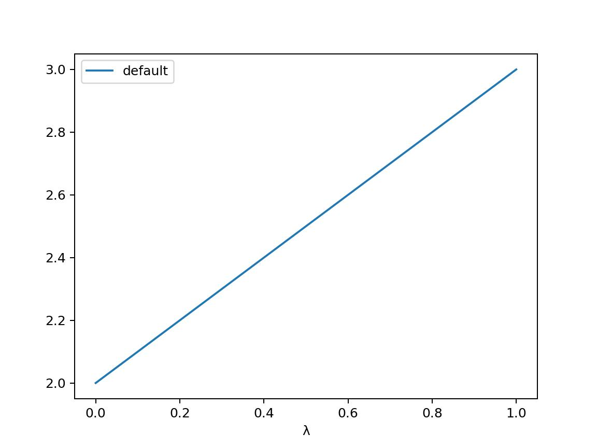
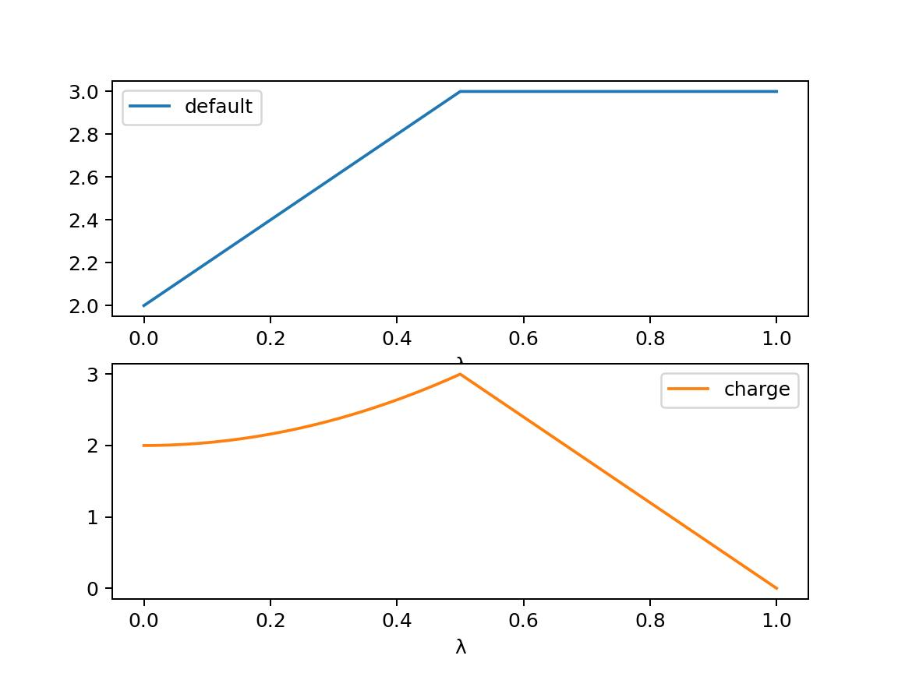
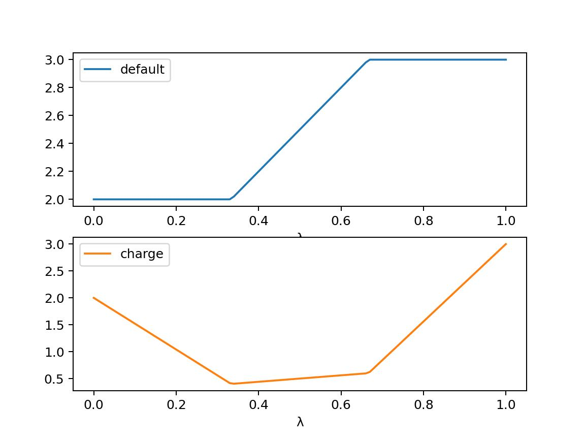

===================
Alchemical Dynamics
===================

You can create an alchemical molecular dynamics simulation in exactly the
same way as you would a normal molecular dynamics simulation. There
are two options:

* Use the high-level interface based on the :func:`~sire.system.System.minimisation` and :func:`~sire.system.System.dynamics` functions.
* Use the low-level interface that works directly with native OpenMM objects.

High level interface
--------------------

The simplest route is to use the high-level interface. Calling
:func:`~sire.system.System.minimisation` or
:func:`~sire.system.System.dynamics` on any collection of molecules (or
view) that contains one or more merged molecules will automatically create
an alchemical simulation. There are extra options that you can pass to
the simulation that will control how it is run:

* ``lambda_value`` - this sets the global λ-value for the simulation.
  λ is a parameter that controls the morph from the reference state
  (at λ=0) to the perturbed state (at λ=1).

* ``swap_end_states`` - if set to ``True``, this will swap the end states
  of the perturbation. The morph will run from the perturbed state
  (at λ=0) to the reference state (at λ=1). Note that the coordinates
  of the perturbed molecule will be used in this case to start the
  simulation. This can be useful to calculate the reverse of the free
  energy potential of mean force (PMF), to check that the reverse
  free energy equals to forwards free energy.

* ``ignore_perturbations`` - if set to ``True``, this will ignore any
  perturbations, and will run the dynamics without a λ-coordinate, using
  the properties from the reference state (or from the perturbed state
  if ``swap_end_states`` is ``True``). This is useful if you want to
  run a standard dynamics simulation of the reference or perturbed states,
  without the machinery of alchemical dynamics.

For example, we could minimise our alchemical system at λ=0.5 using

>>> import sire as sr
>>> mols = sr.load(sr.expand(sr.tutorial_url, "merged_molecule.s3"))
>>> for mol in mols.molecules("molecule property is_perturbable"):
...     mols.update(mol.perturbation().link_to_reference().commit())
>>> mols = mols.minimisation(lambda_value=0.5).run().commit()

We can then run some dynamics at this λ-value using

>>> d = mols.dynamics(lambda_value=0.5, timestep="4fs", temperature="25oC")
>>> d.run("10ps", save_frequency="1ps")
>>> mols = d.commit()
>>> print(d)
Dynamics(completed=10 ps, energy=-33741.4 kcal mol-1, speed=90.7 ns day-1)

The result of dynamics is a trajectory run at this λ-value. You can view the
trajectory as you would any other, using ``mols.view()``.

Energy Trajectories
-------------------

In addition to a coordinates trajectory, dynamics also produces an
energy trajectory. This is the history of kinetic and potential energies
sampled by the molecules during the trajectory. You can access this
energy trajectory via the :func:`~sire.system.System.energy_trajectory`
function, e.g.

>>> t = mols.energy_trajectory()
>>> print(t)
EnergyTrajectory( size=10
time	lambda	0.5	kinetic	potential
1	0.5	-45509.8	4402.32	-45509.8
2	0.5	-43644.2	6105.82	-43644.2
3	0.5	-42466.9	6635.76	-42466.9
4	0.5	-41678.9	7006.96	-41678.9
5	0.5	-41306.2	7019.09	-41306.2
6	0.5	-41201.9	7098.73	-41201.9
7	0.5	-41046.8	7229.69	-41046.8
8	0.5	-40949.4	7172.58	-40949.4
9	0.5	-40928.5	7234.13	-40928.5
10	0.5	-40855.4	7226.52	-40855.4
)

.. note::

   Dynamics uses a random number generator for the initial velocities
   and temperature control. The exact energies you get from dynamics will
   be different to what is shown here.

The result is a :class:`sire.maths.EnergyTrajectory` object. If you want,
you can also ask for the energy trajetory to be returned as a
`pandas DataFrame <https://pandas.pydata.org/pandas-docs/stable/reference/frame.html>`__,
by using the ``to_pandas`` argument, e.g.

>>> df = mols.energy_trajectory(to_pandas=True)
>>> print(df)
      lambda           0.5      kinetic     potential
time
1.0      0.5 -45509.784041  4402.317703 -45509.784041
2.0      0.5 -43644.165016  6105.819473 -43644.165016
3.0      0.5 -42466.942263  6635.760728 -42466.942263
4.0      0.5 -41678.910475  7006.955030 -41678.910475
5.0      0.5 -41306.210905  7019.094675 -41306.210905
6.0      0.5 -41201.944653  7098.727370 -41201.944653
7.0      0.5 -41046.829930  7229.685671 -41046.829930
8.0      0.5 -40949.435093  7172.578640 -40949.435093
9.0      0.5 -40928.462340  7234.130710 -40928.462340
10.0     0.5 -40855.386336  7226.516672 -40855.386336

.. note::

   You could also have obtained a DataFrame by calling the
   :meth:`~sire.maths.EnergyTrajectory.to_pandas` function of
   the :class:`~sire.maths.EnergyTrajectory` object.

You calculate free energies by evaluating the potential energy for different
values of λ during dynamics. You can control which values of λ are used
(the so-called "λ-windows") by setting the ``lambda_windows`` argument, e.g.

>>> d = mols.dynamics(lambda_value=0.5, timestep="4fs", temperature="25oC")
>>> d.run("10ps", save_frequency="1ps", lambda_windows=[0.4, 0.6])
>>> mols = d.commit()
>>> print(mols.energy_trajectory().to_pandas())
      lambda           0.4           0.5           0.6      kinetic     potential
time
1.0      0.5           NaN -45509.784041           NaN  4402.317703 -45509.784041
2.0      0.5           NaN -43644.165016           NaN  6105.819473 -43644.165016
3.0      0.5           NaN -42466.942263           NaN  6635.760728 -42466.942263
4.0      0.5           NaN -41678.910475           NaN  7006.955030 -41678.910475
5.0      0.5           NaN -41306.210905           NaN  7019.094675 -41306.210905
6.0      0.5           NaN -41201.944653           NaN  7098.727370 -41201.944653
7.0      0.5           NaN -41046.829930           NaN  7229.685671 -41046.829930
8.0      0.5           NaN -40949.435093           NaN  7172.578640 -40949.435093
9.0      0.5           NaN -40928.462340           NaN  7234.130710 -40928.462340
10.0     0.5           NaN -40855.386336           NaN  7226.516672 -40855.386336
11.0     0.5 -43210.778752 -43211.624385 -43211.937516  6219.582732 -43211.624385
12.0     0.5 -42405.359296 -42405.219032 -42404.934648  6807.796036 -42405.219032
13.0     0.5 -41724.163073 -41724.470944 -41724.664572  6942.723457 -41724.470944
14.0     0.5 -41282.749354 -41282.638965 -41282.324706  7174.870863 -41282.638965
15.0     0.5 -41091.395386 -41090.926489 -41090.283597  7121.938171 -41090.926489
16.0     0.5 -41020.530186 -41020.300294 -41019.896407  7243.171748 -41020.300294
17.0     0.5 -41027.939363 -41027.739347 -41027.365337  7112.568694 -41027.739347
18.0     0.5 -40947.962069 -40948.210188 -40948.254438  7086.990231 -40948.210188
19.0     0.5 -41063.162834 -41064.038343 -41064.470977  7173.505327 -41064.038343
20.0     0.5 -40997.466132 -40997.774003 -40997.907880  7211.324644 -40997.774003

This has run a new trajectory, evaluating the potential energy at the
simulation λ-value (0.5) as well as at λ-windows 0.4 and 0.6. You can pass in
as many or as few λ-windows as you want.

.. note::

   Notice how the potential energy is evaluated at λ=0.4, λ=0.5 and λ=0.6
   only from 11ps onwards. The first 10ps was the first block of dynamics
   where we only evaluted the energy at the simulated λ-value. The second
   block of 10ps also evaluated the energy at λ=0.4 and λ=0.6.

Controlling the trajectory frequency
------------------------------------

The ``save_frequency`` parameter controls the frequency at which both
coordinate frames and potential energies are saved to the trajectory.

Typically you want to evaluate the energies at a much higher frequency than
you want to save frames to the coordinate trajectory. You can choose
a different frequency by either using the ``frame_frequency`` option to
choose a different coordinate frame frequency, and/or using the
``energy_frequency`` option to choose a different energy frequency.

For example, here we will run dynamics saving coordinates every picosecond,
but saving energies every 20 femtoseconds.

>>> d = mols.dynamics(lambda_value=0.5, timestep="4fs", temperature="25oC")
>>> d.run("10ps", frame_frequency="1ps", energy_frequency="20fs",
...       lambda_windows=[0.4, 0.6])
>>> mols = d.commit()
>>> print(mols.energy_trajectory().to_pandas())
       lambda           0.4           0.5           0.6      kinetic     potential
time
1.00      0.5           NaN -45509.784041           NaN  4402.317703 -45509.784041
2.00      0.5           NaN -43644.165016           NaN  6105.819473 -43644.165016
3.00      0.5           NaN -42466.942263           NaN  6635.760728 -42466.942263
4.00      0.5           NaN -41678.910475           NaN  7006.955030 -41678.910475
5.00      0.5           NaN -41306.210905           NaN  7019.094675 -41306.210905
...       ...           ...           ...           ...          ...           ...
29.92     0.5 -40892.930998 -40892.850485 -40892.506350  7306.237779 -40892.850485
29.94     0.5 -40890.720195 -40891.326823 -40891.729581  7314.180669 -40891.326823
29.96     0.5 -40869.209679 -40868.920036 -40868.426522  7305.782760 -40868.920036
29.98     0.5 -40828.250071 -40828.378688 -40828.243683  7270.175960 -40828.378688
30.00     0.5 -40764.913551 -40764.504405 -40763.921264  7140.896560 -40764.504405

Controlling perturbations with a λ-schedule
-------------------------------------------

So far the perturbation from the reference to the perturbed state has been
linear. λ has acted on each of the perturbable properties of the molecule
by scaling the ``initial`` value from the reference state to the ``final``
value in the perturbed state using the equation

.. math::

   (1 - \lambda) \times \mathrm{initial} + \lambda \times \mathrm{final}

This shows that at λ=0, the perturbable properties are set to the
``initial`` value, and at λ=1, the perturbable properties are set to the
``final`` value. At intermediate values of λ, the perturbable properties
are linearly interpolated between the ``initial`` and ``final`` values,
e.g. at λ=0.5, the perturbable properties are set to half-way between the
``initial`` and ``final`` values.

The perturbation of the parameters is controlled in the code using
a :class:`sire.cas.LambdaSchedule`.

You can get the λ-schedule used by the dynamics simulation using the
:func:`~sire.mol.Dynamics.lambda_schedule` function, e.g.

>>> s = d.lambda_schedule()
>>> print(s)
LambdaSchedule(
  morph: λ * final + initial * (-λ + 1)
)

You can plot how this schedule would morph the perturbable properties
using the :func:`~sire.cas.LambdaSchedule.plot` function, e.g.

>>> df = get_lever_values(initial=2.0, final=3.0)
>>> df.plot()

This shows how the different levers available in this schedule would morph
a hyperthetical parameter that has an ``initial`` value of ``2.0`` and a
``final`` value of ``3.0``.

In this case the levers are all identical, so would change the parameter
in the same way. You can choose your own equation for the λ-schedule.
For example, maybe we want to scale the charge by the square of λ.

>>> s.set_equation("morph", "charge",
...                s.lam()**2 * s.final() + s.initial() * (1 - s.lam()**2))
>>> print(s)
LambdaSchedule(
  morph: λ * final + initial * (-λ + 1)
    charge: λ^2 * final + initial * (-λ^2 + 1)
)

This shows that in the default ``morph`` stage of this schedule, we will
scale the ``charge`` parameters by λ^2, while all other parameters (the
default) will scale using λ. We can plot the result of this using;

>>> s.get_lever_values(initial=2.0, final=3.0).plot()

The above affected the default ``morph`` stage of the schedule. You can
append or prepend additional stages to the schedule using the
:meth:`~sire.cas.LambdaSchedule.append_stage` or
:meth:`~sire.cas.LambdaSchedule.prepend_stage` functions, e.g.

>>> s.append_stage("scale", s.final())
>>> print(s)

would append a second stage, called ``scale``, which by default would
use the ``final`` value of the parameter. We could then add a lever to
this stage that scales down the charge to 0,

>>> s.set_equation("scale", "charge", (1-s.lam()) * s.final())
>>> print(s)
LambdaSchedule(
  morph: λ * final + initial * (-λ + 1)
    charge: λ^2 * final + initial * (-λ^2 + 1)
  scale: final
    charge: final * (-λ + 1)
)

Again, it is worth plotting the impact of this schedule on a hyperthetical
parameter.

>>> s.get_lever_values(initial=2.0, final=3.0).plot()

.. note::

   The value of the stage-local λ in each stage moves from 0 to 1.
   This is different to the global λ, which moves from 0 to 1 evenly
   over all stages. For example, in this 2-stage schedule, values of
   global λ between 0 and 0.5 will be in the ``morph`` stage, while
   values of global λ between 0.5 and 1 will be in the ``scale`` stage.
   Within the ``morph`` stage, the local λ will move from 0 to 1
   (corresponding to global λ values of 0 to 0.5), while
   within the ``scale`` stage, the local λ will move from 0 to 1
   (corresponding to gloabl λ values of 0.5 to 1).

Through the combination of adding stages and specifyig different equations
for levers, you can have a lot of control over how the perturbable properties
are morphed from the reference to the perturbed states.

To make things easier, there are some simple functions that let you add
some common stages.

>>> s = sr.cas.LambdaSchedule()
>>> print(s)
LambdaSchedule::null
>>> s.add_morph_stage("morph")
>>> print(s)
LambdaSchedule(
  morph: final * λ + initial * (-λ + 1)
)
>>> s.add_charge_scale_stages("decharge", "recharge", scale=0.2)
>>> print(s)
LambdaSchedule(
  decharge: initial
    charge: initial * (-λ * (-γ + 1) + 1)
  morph: final * λ + initial * (-λ + 1)
    charge: γ * (final * λ + initial * (-λ + 1))
  recharge: final
    charge: final * (-(-γ + 1) * (-λ + 1) + 1)
  γ == 0.2
)

has created a null schedule, and then added a ``morph`` stage using the
default perturbation equation. This is then sandwiched by two stages;
a ``decharge`` stage that scales the charge lever from the ``initial``
value to γ times that value, and a ``recharge`` stage that scales
the charge lever from γ times the ``final`` value to the full
``final`` value. It also scales the charge lever in the ``morph`` stage
by γ, which is set to 0.2 for all stages.

We can see how this would affect a hyperthetical parameter that goes
from an ``initial`` value of 2.0 to a ``final`` value of 3.0 via

>>> s.get_lever_values(initial=2.0, final=3.0).plot()

          between two stages that scale the charge lever.

.. note::

   Schedules constructed outside of the dynamics simulation do not have
   the full set of levers (e.g. torsion_k, dih_scale etc) as
   levers are only added as they are needed (hence why only
   ``default`` and ``charge`` are shown here). The additional levers
   are added when the schedule is added to the simulation.

Once you have created your schedule you can add it via the
:meth:`~sire.mol.Dynamics.set_schedule` function of the
:class:`~sire.mol.Dynamics` object, e.g.

>>> d.set_schedule(s)

Alternatively, you can set the schedule when you call the
:meth:`~sire.mol.SelectorMol.dynamics` function, e.g.

>>> d = mols.dynamics(lambda_value=0.5, timestep="4fs", temperature="25oC",
...                   schedule=s)
>>> print(d.get_schedule())
LambdaSchedule(
  decharge: initial
    charge: (-(-γ + 1) * λ + 1) * initial
  morph: final * λ + (-λ + 1) * initial
    charge: γ * (final * λ + (-λ + 1) * initial)
  recharge: final
    charge: (-(-γ + 1) * (-λ + 1) + 1) * final
  γ == 0.2
)

Ghost Atoms and Softening potentials
------------------------------------

Internally the alchemical dynamics simulation works by calculating morphed
forcefield parameters whenever λ is changed, and then calling the
OpenMM `updateParametersInContext function <http://docs.openmm.org/latest/api-c++/generated/NonbondedForce.html#classOpenMM_1_1NonbondedForce_1abc68b57ace47dafd3bf2e601b3cfa6eb>`__
function to update those parameters in all of the OpenMM Force objects that
are used to calculate atomic forces. This is a very efficient way of
performing a perturbation, as it allows vanilla (standard) OpenMM forces
to be used for the dynamics. However, there are challenges with how
we handle atoms which are created or deleted during the perturbation.

These atoms, which we call "ghost atoms", provide either a space into which
a new atom is grown, or a space from which an atom is deleted. To ensure
these ghost atoms don't cause dynamics instabilities, we use a softening
potential to model their interactions with all other atoms. These
softening potentials (also called "soft-core" potentials) soften the
charge and Lennard-Jones interactions between the ghost atoms and all
other atoms using an α (alpha) parameter. This is a perturbable parameter
of the atoms, which is equal to 1 when the atom is in a ghost state,
and 0 when it is not. For example, an atom which exists in the reference
state but becomes a ghost in the perturbed state would have an α value
that would go from 0 to 1. Alternatively, an atom which does not exist
in the reference state, and that appears in the perturbed state, would
have an α value that would go from 1 to 0.

.. note::

   You can have as many or few ghost atoms as you want in your merged
   molecule. If all atoms become ghosts, then this is the same as
   completely decoupling the molecule, as you would do in an
   absolute binding free energy calculation. Equally, you could
   run a "dual topology" calculation by two sets of atoms in your
   merged molecule - the first set start as the reference state atoms,
   and all become ghosts, while the second set start all as ghosts
   and become the perturbed state atoms. In "single topology" calculations
   you would only use ghost atoms for those which don't exist in either
   of the end states.

There are two parameters that control the softening potential:

* ``shift_delta`` - set the ``shift_delta`` parameter which is used to
  control the electrostatic and van der Waals softening potential that
  smooths the creation or deletion of ghost atoms. This is a floating
  point number that defaults to ``1.0``, which should be good for
  most perturbations.

* ``coulomb_power`` - set the ``coulomb_power`` parameter which is used
  to control the electrostatic softening potential that smooths the
  creation and deletion of ghost atoms. This is an integer that defaults
  to ``0``, which should be good for most perturbations.

Low level interface
-------------------

The high-level interface is just a set of convienient wrappers around the
OpenMM objects which are used to run the simulation. If you convert
any set of views (or view) that contains merged molecules, then an
alchemical OpenMM context will be returned.

>>> context = sr.convert.to(mols, "openmm")
>>> print(context)
openmm::Context( num_atoms=12167 integrator=VerletIntegrator timestep=1.0 fs platform=HIP )

The context is held in a low-level class,
:class:`~sire.Convert.SireOpenMM.SOMMContext`, which inherits from the
standard `OpenMM Context <https://docs.openmm.org/latest/api-python/generated/openmm.openmm.Context.html#openmm.openmm.Context>`__
class.

The class adds some additional metadata and control functions that are needed
to update the atomic parameters in the OpenMM Context to represent the
molecular system at different values of λ.

The key additional functions provided by :class:`~sire.Convert.SireOpenMM.SOMMContext`
are;

* :func:`~sire.Convert.SireOpenMM.SOMMContext.get_lambda` - return the
  current value of λ for the context.
* :func:`~sire.Convert.SireOpenMM.SOMMContext.set_lambda` - set the
  new value of λ for the context. Note that this should only really
  be used to change λ to evaluate energies at different λ-windows.
  It is better to re-create the context if you want to simulate
  at a different λ-value.
* :func:`~sire.Convert.SireOpenMM.SOMMContext.get_lambda_schedule` - return the
  λ-schedule used to control the morph.
* :func:`~sire.Convert.SireOpenMM.SOMMContext.set_lambda_schedule` - set the
  λ-schedule used to control the morph.
* :func:`~sire.Convert.SireOpenMM.SOMMContext.get_energy` - return the
  current potential energy of the context. This will be in :mod:`sire`
  units if ``to_sire_units`` is ``True`` (the default).

Note that you can also set the ``lambda_value`` and ``lambda_schedule``
when you create the context using the ``map``, e.g.

>>> context = sr.convert.to(mols, "openmm",
...                         map={"lambda_value": 0.5, "schedule": s})
>>> print(context)
openmm::Context( num_atoms=12167 integrator=VerletIntegrator timestep=1.0 fs platform=HIP )
>>> print(context.get_lambda())
0.5
>>> print(context.get_lambda_schedule())
LambdaSchedule(
  decharge: initial
    charge: (-(-γ + 1) * λ + 1) * initial
  morph: final * λ + (-λ + 1) * initial
    charge: γ * (final * λ + (-λ + 1) * initial)
  recharge: final
    charge: (-(-γ + 1) * (-λ + 1) + 1) * final
  γ == 0.2
)

You can then run dynamics as you would do normally using the standard
OpenMM python API, e.g.

>>> integrator = context.getIntegrator()
>>> integrator.step(100)

You can then call ``get_potential_energy()`` and ``set_lambda()`` to
get the energy during dynamics for different values of λ, e.g.

>>> context.set_lambda(0.0)
>>> print(context.get_lambda(), context.get_potential_energy())
0.0 -38727.2 kcal mol-1
>>> context.set_lambda(0.5)
>>> print(context.get_lambda(), context.get_potential_energy())
0.5 -38743.8 kcal mol-1

