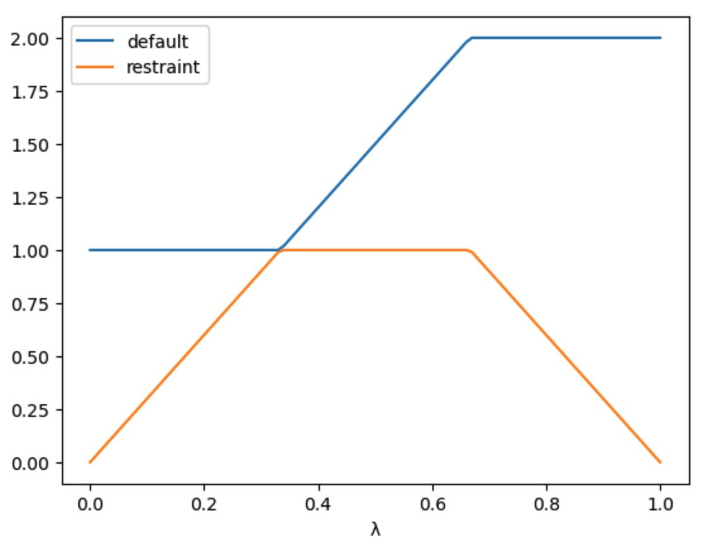

=====================
Alchemical Restraints
=====================

You can perturb restraints as part of an alchemical free energy simulation.
This is useful for computing free energy differences between two systems
where you want to turn on or off restraints that are used to keep part of
the molecules in place while you are performing the mutation.

You can perturb restraints by adding them to the
:class:`~sire.cas.LambdaSchedule` used to control the perturbation.

By default, restraints are called ``restraint``, and so are perturbed
using the ``restraint`` lever.

>>> import sire as sr
>>> l = sr.cas.LambdaSchedule()
>>> l.add_stage("restraints_on", l.initial())
>>> l.add_stage("morph", (1-l.lam()) * l.initial() + l.lam() * l.final())
>>> l.add_stage("restraints_off", l.final())
>>> print(l)
LambdaSchedule(
  restraints_on: initial
  morph: initial * (-λ + 1) + λ * final
  restraints_off: final
)

This has created a schedule with three stages, ``restraints_on``, ``morph``
and ``restraints_off``. The ``morph`` stage is the one that will be used
to peturb the molecule from the initial state to the perturbed state.

The ``restraints_on`` and ``restraints_off`` stages will be used to
switch on and off the restraints. To actually switch them on and off,
we need to set the equation that will be used to scale the restraints.

>>> l.set_equation("restraints_on", "restraint", l.lam() * l.initial())
>>> l.set_equation("restraints_off", "restraint", (1-l.lam()) * l.initial())

This will scale the restraints by λ in the ``restraints_on`` stage. This
means that the restraints start at λ=0 scaled to 0, and are then fully
switched on by λ=1.

The restraints are scaled off by (1-λ) in the ``restraints_off`` stage.
This means that the restraints are fully switched on at λ=0, but then
scaled down so that they are scaled to 0 at λ=1.

The value of ``initial`` and ``final`` for a restraint is the same, being
100% of the restraint. Thus ``(1-l.lam()) * l.initial() + l.lam() * l.final()``
will always evaluate to 100% of the restraint for all values of λ during
the ``morph`` stage. You can make sure that the restraint is kept at
100% during this stage by setting this value explicitly;

>>> l.set_equation("morph", "restraint", l.initial())
>>> print(l)
LambdaSchedule(
  restraints_on: initial
    restraint: λ * initial
  morph: initial * (-λ + 1) + λ * final
    restraint: initial
  restraints_off: final
    restraint: final * (-λ + 1)
)

You can view the effect of this schedule by plotting the perturbation
assuming an initial value of ``1.0`` and a final value of ``2.0`` using

>>> l.get_lever_values(initial=1.0, final=2.0).plot()

Here we can see the three stages of the schedule. The ``restraints_on``
stage keeps the ``default`` value of the restraint at the initial value
(``1.0``) while it scales the restraint from ``0`` to ``1.0``. The ``morph``
stage keeps the restraint at ``1.0``, while scaling the parameter from
``1.0`` to ``2.0``. Finally, the ``restraints_off`` stage scales the
restraint from ``1.0`` to ``0`` while keeping the parameter at ``2.0``.

We can now use this schedule to perturb the restraints during an alchemical
simulation e.g.

>>> mols = sr.load(sr.expand(sr.tutorial_url, "perturbable_ligand.s3"))
>>> restraints = sr.restraints.positional(mols, "molidx 0")
>>> mols = mols.minimisation().run(restraints=restraints,
...                                lambda_value=0).commit()
>>> d = mols.dynamics(timestep="4fs", temperature="25oC",
...                   restraints=restraints, schedule=l,
...                   lambda_value=0.0)
>>> d.run("10ps")
>>> mols = d.commit()
