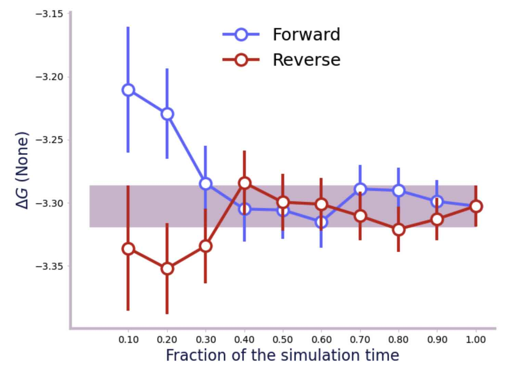
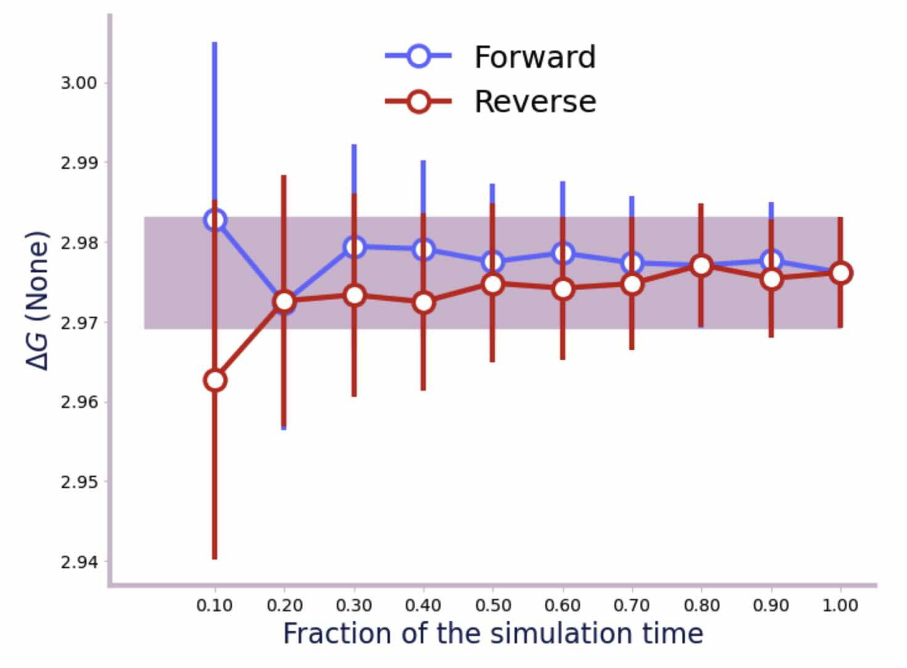

======================================
Running Faster Free Energy Simulations
======================================

The previous section showed how to calculate the relative hydration free
energy of ethane and methanol using alchemical dynamics. Short dynamics
simulation were run for each λ-value, with the energy differences
between neighbouring λ-values used to calculate the free energy differences.

The simulations used a timestep of 1 fs, and calculated energy differences
every 0.1 ps (100 steps). This calculated a free energy that should be
accurate, but the simulation took a long time to run. In this section, we
will show how to calculate the same result, but with a much faster
simulation.

Timesteps and Constraints
-------------------------

The easiest way to speed up a simulation is to increase the dynamic
timestep. This is the amount of time between each step of the simulation,
i.e. the amount of time between each calculation of the forces. The longer
the timestep, the faster the simulation will run, but at the cost of
more unstable dynamics. At an extreme, the simulation will become
totally unstable and an
`OpenMM Particle Exception <https://github.com/openmm/openmm/wiki/Frequently-Asked-Questions#nan>`__
will be raised.

As a rule of thumb, the timestep should be less than the fastest vibrational
motion in the simulation. Since the fastest vibrations will likely involve
bonds with hydrogen atoms, we can make the simulation more stable by
contraining the bonds that involve hydrogen atoms.

We can choose the constraint to use via the ``constraint`` keyword, e.g.
after loading the molecules and minimising,

>>> import sire as sr
>>> mols = sr.load(sr.expand(sr.tutorial_url, "merged_molecule.s3"))
>>> for mol in mols.molecules("molecule property is_perturbable"):
...     mols.update(mol.perturbation().link_to_reference().commit())
>>> mols = mols.minimisation().run().commit()

...we can turn on constraints of the bonds involving hydrogen atoms by
setting ``constraint`` to ``h-bonds``.

>>> d = mols.dynamics(timestep="2fs", temperature="25oC", constraint="h-bonds")
>>> d.run("5ps")
>>> print(d)
Dynamics(completed=5 ps, energy=-32140.6 kcal mol-1, speed=51.2 ns day-1)

We would hope that this is faster than running a simulation with no constraints
and a 1 fs timestep...

>>> d = mols.dynamics(timestep="1fs", temperature="25oC", constraint="none")
>>> d.run("5ps")
>>> print(d)
Dynamics(completed=5 ps, energy=-27197.8 kcal mol-1, speed=67.3 ns day-1)

...but this is not the case. We can see here that the cost of the constraints
has out-weighed the benefit of having half the simulation steps.

The simulation can go a lot faster with a 4 fs timestep...

>>> d = mols.dynamics(timestep="4fs", temperature="25oC", constraint="h-bonds")
>>> d.run("4ps")
>>> print(d)
Dynamics(completed=4 ps, energy=-32807 kcal mol-1, speed=100.9 ns day-1)

However, turning on ``h-bonds`` constraints would not be enough to keep the
simulation stable for larger timesteps. For example, if we use a timestep
of 5 fs...

>>> d = mols.dynamics(timestep="5fs", temperature="25oC", constraint="h-bonds")
>>> d.run("5ps")
OpenMMException: Particle coordinate is NaN.  For more information, see
https://github.com/openmm/openmm/wiki/Frequently-Asked-Questions#nan

For such timesteps, we would need to constrain all bonds and angles
involving hydrogen, using the ``h-bonds-h-angles`` constraint.

>>> d = mols.dynamics(timestep="5fs", temperature="25oC",
...                   constraint="h-bonds-h-angles")
>>> d.run("5ps")
>>> print(d)
Dynamics(completed=5 ps, energy=-34450.6 kcal mol-1, speed=116.2 ns day-1)

You can go even further by constraining all bonds, and all angles involving
hydrogen using the ``bonds-h-angles`` constraint...

>>> d = mols.dynamics(timestep="8fs", temperature="25oC",
...                   constraint="bonds-h-angles")
>>> d.run("5ps")
>>> print(d)
Dynamics(completed=5 ps, energy=-34130.9 kcal mol-1, speed=152.6 ns day-1)

.. note::

   There is also the ``bonds`` constraint which constrains
   all chemical bonds, but this doesn't really help unless
   angles involving hydrogen aren't also constrained.

.. note::

   Different molecular systems will behave differently, and may produce
   more, or less stable dynamics than that shown above. As a rule of thumb,
   start using a 4 fs timestep with ``h-bonds-h-angles`` constraints, and
   then either increase the timestep and dial up the constraints if you can,
   or reduce the timestep and reduce the timestep if the simulation becomes
   unstable.

To make things easy, :mod:`sire` automatically chooses a suitable constraint
based on the timestep. You can see the constraint chosen using the
:meth:`~sire.mol.Dynamics.constraint` function.

>>> d = mols.dynamics(timestep="8fs", temperature="25oC")
>>> print(d.constraint())
bonds-h-angles

You can disable all constraints by setting ``constraint`` equal to ``none``,
e.g.

>>> d = mols.dynamics(timestep="4fs", temperature="25oC", constraint="none")
>>> print(d.constraint())
none
>>> d.run("5ps")
RuntimeError: The kinetic energy has exceeded 1000 kcal mol-1 per atom (it is 2.2202087996265908e+16 kcal mol-1 atom-1, and
2.701328046505673e+20 kcal mol-1 total). This suggests that the simulation has become unstable. Try reducing the timestep and/or minimising
the system and run again.

but do expect to see a ``ParticleException`` or other ``RuntimeError``
exceptions raised at some point!

.. note::

   Setting ``constraint`` to the Python ``None`` type indicates that you
   don't have a preference, and so :mod:`sire` will choose a suitable
   constraint for you. Use the string ``"none"`` to explicitly disable
   constraints.

Constraints and Perturbable Molecules
-------------------------------------

While constraints are useful for speeding up simulations, they can cause
problems when used with perturbable (merged) molecules. This is because the
constraints hold the bonds and/or angles at fixed values based on the
starting coordinates of the simulation. Changes in λ, which may change the
equilibrium bond and angle parameters, will not be reflected in the
free energy. This is because the constraints will stop dynamics from sampling
these perturbing bonds and angles.

For example, changing the value of λ to 1.0, and sampling with bond and angle
constraints on would force methanol to adopt ethane's internal geometry.

>>> print(mols[0].bond("element C", "element C").length())
1.53625 Å
>>> d = mols.dynamics(timestep="1fs", temperature="25oC", lambda_value=1.0)
>>> d.run("5ps")
>>> print(d.commit()[0].bond("element C", "element C").length())
1.48737 Å
>>> d = mols.dynamics(timestep="2fs", constraint="bonds-h-angles",
...                   temperature="25oC", lambda_value=1.0)
>>> d.run("5ps")
>>> print(d.commit()[0].bond("element C", "element C").length())
1.53625 Å

As seen here, the C-C bond length for ethane is 1.54 Å, while the C-O
bond length for methanol is 1.49 Å. Using ``bonds-h-angles`` constrains
this bond, meaning that the simulation at λ=1 uses ethane's bond length
(1.54 Å) rather than methanol's (1.49 Å).

.. note::

   The C-C bond morphs into the C-O bond during the perturbation from ethane
   to methanol. Earlier, we mapped the default parameters to those of
   ethane, meaning that the elements property of ethane is used by
   default. This is why we searched for ``bond("element C", "element C")``
   rather than ``bond("element C", "element O")``. We would use
   ``bond("element C", "element O")`` if we had used
   :meth:`~sire.mol.Perturbation.link_to_perturbed` to set the
   default properties.

One solution is to choose a different constraint for perturbable molecules
than for the rest of the system. You can do this using the
``perturbable_constraint`` keyword, e.g.

>>> d = mols.dynamics(timestep="2fs",
...                   constraint="bonds-h-angles",
...                   perturbable_constraint="none",
...                   temperature="25oC",
...                   lambda_value=1.0)
>>> d.run("5ps")
>>> print(d.commit()[0].bond("element C", "element C").length())
1.42569 Å

has run dynamics using no constraints on the perturbable molecules,
and ``bonds-h-angles`` constraints on all other molecules. This has
allowed sampling of the C-O bond in methanol, so that it was able to
vibrate around its equilibrium bond length (1.42 Å).

The ``perturbable_constraint`` argument accepts the same values as
``constraint``, i.e. ``none``, ``h-bonds``, ``h-bond-h-angles`` etc.

.. note::

   By default, ``perturbable_constraint`` will have the same value
   as ``constraint``.

.. note::

   You must set ``perturbable_constraint`` to the string ``none`` if you want
   to disable constraints. Setting ``perturbable_constraint`` to the Python
   ``None`` indicates you are providing no preference for any constraint,
   and so the code automatically assigns ``perturbable_constraint`` as
   equal to ``constraint``.

Unfortunately, not constraining the bonds and/or angles of the perturbable
molecules will impact the stability of dynamics, and thus the size of
timestep that will be achievable. For example,

>>> d = mols.dynamics(timestep="4fs",
...                   constraint="h-bonds-h-angles",
...                   perturbable_constraint="none",
...                   temperature="25oC",
...                   lambda_value=1.0)
>>> d.run("5ps")
OpenMMException: Particle coordinate is NaN.  For more information, see
https://github.com/openmm/openmm/wiki/Frequently-Asked-Questions#nan

.. note::

   You can still use constraints on perturbable molecules. Just be careful
   to minimise and then equilibrate the molecule(s) at the desired value
   of λ without using constraints, so that the perturbable bonds and angles
   have the right size for that value of λ. You can then run longer simulations
   with constraints applied, as they will use the bond / angle sizes
   measured from these starting coordinates as the constrained values.

Hydrogen Mass Repartitioning
----------------------------

Bonds involving hydrogen atoms vibrate quickly because vibrational frequency
is related to atomic mass - the lighter the atom, the faster it will
vibrate. We can reduce the frequency of these vibrations by increasing the
mass of the hydrogens. Fortunately, free energy is derived from the
potential energy of the molecules, which is independent of their mass.
So, we are free to magically move mass from heavy atoms such as carbon to
their bonded hydrogen atoms without affecting the free energy.

This method, called "hydrogen mass repartitioning", is implemented in
the :func:`sire.morph.repartition_hydrogen_masses` function. It takes a
molecule as argument, and returns that same molecule with its hydrogen
masses repartitioned.

>>> mol = mols.molecule("molecule property is_perturbable")
>>> repartitioned_mol = sr.morph.repartition_hydrogen_masses(mol)
>>> for atom0, atom1 in zip(mol.atoms(), repartitioned_mol.atoms()):
...    print(atom0, atom0.property("mass"), atom1.property("mass"))
Atom( C1:1    [  25.71,   24.94,   25.25] ) 12.01 g mol-1 10.498 g mol-1
Atom( C2:2    [  24.29,   25.06,   24.75] ) 12.01 g mol-1 10.498 g mol-1
Atom( H3:3    [  25.91,   23.89,   25.56] ) 1.008 g mol-1 1.512 g mol-1
Atom( H4:4    [  26.43,   25.22,   24.45] ) 1.008 g mol-1 1.512 g mol-1
Atom( H5:5    [  25.86,   25.61,   26.13] ) 1.008 g mol-1 1.512 g mol-1
Atom( H6:6    [  24.14,   24.39,   23.87] ) 1.008 g mol-1 1.512 g mol-1
Atom( H7:7    [  24.09,   26.11,   24.44] ) 1.008 g mol-1 1.512 g mol-1
Atom( H8:8    [  23.57,   24.78,   25.55] ) 1.008 g mol-1 1.512 g mol-1

This has repartioned the hydrogen masses using a ``mass_factor`` of 1.5.
This factor is known to be good for using the (default)
``LangevinMiddleIntegrator`` with a timestep of 4 fs. You may need to use
a different factor for a different integrator or timestep, e.g.

>>> rep4_mol = sr.morph.repartition_hydrogen_masses(mol, mass_factor=4)
>>> for atom0, atom1 in zip(mol.atoms(), rep4_mol.atoms()):
...    print(atom0, atom0.property("mass"), atom1.property("mass"))
Atom( C1:1    [  25.71,   24.94,   25.25] ) 12.01 g mol-1 2.938 g mol-1
Atom( C2:2    [  24.29,   25.06,   24.75] ) 12.01 g mol-1 2.938 g mol-1
Atom( H3:3    [  25.91,   23.89,   25.56] ) 1.008 g mol-1 4.032 g mol-1
Atom( H4:4    [  26.43,   25.22,   24.45] ) 1.008 g mol-1 4.032 g mol-1
Atom( H5:5    [  25.86,   25.61,   26.13] ) 1.008 g mol-1 4.032 g mol-1
Atom( H6:6    [  24.14,   24.39,   23.87] ) 1.008 g mol-1 4.032 g mol-1
Atom( H7:7    [  24.09,   26.11,   24.44] ) 1.008 g mol-1 4.032 g mol-1
Atom( H8:8    [  23.57,   24.78,   25.55] ) 1.008 g mol-1 4.032 g mol-1

would multiply the hydrogen masses by a factor of 4.

.. note::

   By default, this function will repartition the masses of the hydrogens
   in both the standard mass property (``mass``) and also for the end-state
   mass properties (``mass0`` and ``mass1`` if they exist). You can disable
   repartitioning of the end-state masses by setting ``include_end_states``
   to ``False``. You can choose to repartition specific mass properties by
   passing in a property map, e.g. ``map={"mass": "mass0"}``.

The repartitioned molecule has the same mass as the original molecule, but
the hydrogens have been made heavier. The mass of the carbon atoms has been
reduced to compensate.

>>> print(mol.mass(), repartitioned_mol.mass())
30.068 g mol-1 30.068 g mol-1

It is normal to only repartition the hydrogen masses of perturbable molecules.
This lets us disable the constraints on the perturbable molecules, but
still use a large timestep (e.g. 3 fs or 4 fs). This is because
the hydrogens on the perturbable molecules would become heavier,
and so the vibrations of those atoms should have a lower frequency.

To aid this, we can use the ``h-bonds-not-perturbed`` constraint. This will
constrain all bonds involving hydrogen atoms, except for those involving
atoms that are directly perturbed. This means that all of the non-perturbing
bonds in the perturbable molecule will be constrained, which should aid
simulation stability for large timesteps.

>>> mols.update(repartitioned_mol)
>>> d = mols.dynamics(timestep="4fs", temperature="25oC",
...                   constraint="h-bonds-not-perturbed",
...                   perturbable_constraint="none")
>>> d.run("5ps")
>>> print(d)
Dynamics(completed=5 ps, energy=-31950.1 kcal mol-1, speed=100.8 ns day-1)

This has given us the best of both worlds - a fast simulation with a larger
timestep, plus no constraints on the bonds that perturb
in the perturbable molecules.

Using this protocol, we can now recalculate the relative free energy of
ethane and methanol.

>>> for l in range(0, 105, 5):
...     # turn l into the lambda value by dividing by 100
...     lambda_value = l / 100.0
...     print(f"Simulating lambda={lambda_value:.2f}")
...     # minimise the system at this lambda value
...     min_mols = mols.minimisation(lambda_value=lambda_value,
...                                  constraint="h-bonds-not-perturbed").run().commit()
...     # create a dynamics object for the system
...     d = min_mols.dynamics(timestep="4fs", temperature="25oC",
...                           lambda_value=lambda_value,
...                           constraint="h-bonds-not-perturbed")
...     # generate random velocities
...     d.randomise_velocities()
...     # equilibrate, not saving anything
...     d.run("2ps", save_frequency=0)
...     print("Equilibration complete")
...     print(d)
...     # get the values of lambda for neighbouring windows
...     lambda_windows = [lambda_value]
...     if lambda_value > 0:
...         lambda_windows.insert(0, (l-5)/100.0)
...     if lambda_value < 1:
...         lambda_windows.append((l+5)/100.0)
...     # run the dynamics, saving the energy every 0.1 ps
...     d.run("25ps", energy_frequency="0.1ps", frame_frequency=0,
...           lambda_windows=lambda_windows)
...     print("Dynamics complete")
...     print(d)
...     # stream the EnergyTrajectory to a sire save stream object
...     sr.stream.save(d.commit().energy_trajectory(),
...                    f"energy_fast_{lambda_value:.2f}.s3")

The simulation runs 33% faster than before, taking about 30 seconds per
λ-window.

We can now calculate the free energy using alchemlyb as before;

>>> df = sr.morph.to_alchemlyb("energy_fast_*.s3")
>>> from alchemlyb.estimators import BAR
>>> b = BAR()
>>> b.fit(df)
>>> print(b.delta_f_.loc[0.00, 1.00])
-2.9972763590251836

Within error, this is the same free energy as before, but calculated in
a little less time.

.. note::

   The random error on these calculations can be seen in ``b.d_delta_f``,
   which shows the error per λ-window is about 0.02 kcal mol-1. Summed over
   the whole λ-coordinate suggest an error of about 0.4 kcal mol-1. You
   could reduce this error by running the simulation for longer
   (e.g. 250 ps per λ-window) or by running multiple repeats and taking
   and average.

Switching to Reaction Field from PME
------------------------------------

By default, the dynamics simulation uses the particle mesh Ewald (PME)
method to calculate long-range electrostatics. This is a very accurate,
but comes with a high computational cost. We can switch to the faster
reaction field method by setting the ``cutoff_type`` option to
``RF``. This cutoff type works well for perturbations that don't involve
a change in net charge (as most perturbations). Switching to RF can
improve the simulation speed by 25-50%.

.. _ExampleFEPScript:

Complete Example Script
-----------------------

Putting everything together, here is a simple script that does all of the
work of calculating the relative hydration free energy of ethane
and methanol. The key parameters (e.g. timestep, constraint, run time,
cutoff type, λ-values etc) are pulled out as variables at the top. The script
then runs a dynamics simulation for each λ-window for the water leg, then
a dynamics simulation using the same parameters and λ-windows for the
vacuum leg. The free energies are collected and then calculated using BAR
from alchemlyb. This is a good starting point for you to adapt for your
own simulations. Or take a look at
`BioSimSpace <https://biosimspace.openbiosim.org>`__ or the upcoming
`somd2 software <https://github.com/openbiosim/somd2>`__ if you are
interested in higher-level interfaces to this functionality that
automatically run more complex protocols.

.. literalinclude:: scripts/run_md.py

The relative hydration free energy calculated using the above script is:

::

   Water phase:  -3.2587718667371606 kcal mol-1
   Vacuum phase: 2.980451221216327 kcal mol-1
   Hydration free energy: -6.239223087953487 kcal mol-1

This is in good agreement with
`published results from other codes <https://www.pure.ed.ac.uk/ws/portalfiles/portal/75900057/20181010_Michel_reprod.pdf>`__
which are typically -5.99 kcal mol-1 to -6.26 kcal mol-1.

.. note::

   There will be some variation between different codes and different
   protocols, as the convergence of the free energy estimate is sensitive
   to the length of the dynamics simulation at each λ-value. In this case,
   we used very short simulations. Edit the script to increase the amount
   of simulation time per λ-value to get a more accurate result.

This script can be edited to run a longer, more statistically accurate
by setting ``run_time`` to a larger value, e.g. 250 ps. On my machine,
this results in a simulation that takes 5 minutes per λ-window for the
water phase at 100 ns day-1, and 45 seconds per λ-window for the vacuum
phase, at 950 ns day-1 (total run time about 120 minutes). The resulting
free energy is in remarkable agreement with that from the shorter
simulation.

::

   Water phase:  -3.3027026336540715 kcal mol-1
   Vacuum phase: 2.9761399609273567 kcal mol-1
   Hydration free energy: -6.278842594581429 kcal mol-1

We can check the convergence and get an error estimate as before. First
the water phase;

>>> import sire as sr
>>> from glob import glob
>>> from alchemlyb.convergence import forward_backward_convergence
>>> from alchemlyb.visualisation import plot_convergence
>>> dfs = []
>>> s3files = glob("energy_water*.s3")
>>> s3files.sort()
>>> for s3 in s3files:
...    dfs.append(sr.stream.load(s3).to_alchemlyb())
>>> f = forward_backward_convergence(dfs, "bar")
>>> plot_convergence(f)

.. note::

   It is important that the dataframes are passed to alchemlyb in
   ascending order of λ-value, or else it will calculate the wrong
   free energy. This is why we had to sort the result of globbing
   the files, and why a file naming scheme was chosen that names
   the files in ascending λ order.

And now the vacuum phase;

>>> dfs = []
>>> s3files = glob("energy_vacuum*.s3")
>>> s3files.sort()
>>> for s3 in s3files:
...    dfs.append(sr.stream.load(s3).to_alchemlyb())
>>> f = forward_backward_convergence(dfs, "bar")
>>> plot_convergence(f)

From the convergence plots and the output printed by alchemlyb, we can
see that the error on the water leg is 0.02 kcal mol-1, and the error
on the vacuum leg is 0.01 kcal mol-1. Summed in quadrature, this gives
an error of 0.022 kcal mol-1 on the hydration free energy. This gives
a final result of -6.279 ± 0.022 kcal mol-1, which is in good agreement with
`published results from other codes <https://www.pure.ed.ac.uk/ws/portalfiles/portal/75900057/20181010_Michel_reprod.pdf>`__
which are in the range of -5.99 kcal mol-1 to -6.26 kcal mol-1.
