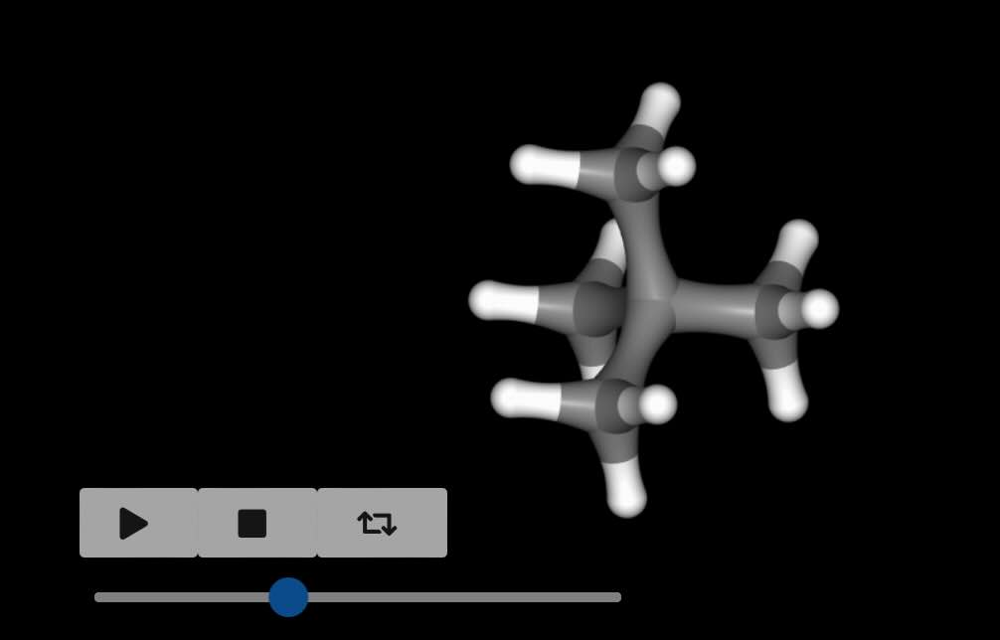

============
Perturbation
============

As seen in :doc:`chapter 6 <../part06/01_merge>`, the concept of a
"merged molecule" is central to how :mod:`sire` implements the
perturbations (morphing) needed for free energy calculations.

A merged molecule is one that has been created with a single set of atoms,
but with properties that represent either a "reference" (λ=0) or "perturbed"
(λ=1) state.

For example, let's load a merged molecule that represents
neopentane in the reference state, and methane in the perturbed state.

>>> import sire as sr
>>> mols = sr.load_test_files("neo_meth_scratch.bss")
>>> print(mols)
System( name=BioSimSpace_System num_molecules=1 num_residues=1 num_atoms=17 )
>>> print(mols[0])
Molecule( Merged_Molecule:6 num_atoms=17 num_residues=1 )

.. note::

   This molecule was created using `BioSimSpace <https://biosimspace.org>`_.
   We will cover how to create merged molecules in a later section
   in this tutorial.

Examining the perturbation
--------------------------

Normally, a :mod:`sire` molecule will have one set of forcefield parameters.
For example, the atomic charges would be stored in the ``charge`` property,
the Lennard-Jones parameters in the ``LJ`` property, the bond parameters in
the ``bond`` property, etc.

However, a merged molecule has two sets of parameters, one for the reference
state (representing λ=0) and one for the perturbed state (representing λ=1).
The reference state parameters are stored in the ``0`` properties, e.g.
``charge0``, ``LJ0``, ``bond0``, etc. The perturbed state parameters are
stored in the ``1`` properties, e.g. ``charge1``, ``LJ1``, ``bond1``, etc.

We can see this for our merged molecule above by printing out all of the
property keys.

>>> print(mols[0].property_keys())
['gb_radii0', 'gb_radii1', 'atomtype0', 'element0', 'atomtype1', 'element1',
 'time', 'intrascale0', 'intrascale1', 'improper0', 'mass0', 'improper1',
 'mass1', 'ambertype0', 'ambertype1', 'treechain0', 'treechain1',
 'parameters0', 'parameters1', 'space', 'charge0', 'charge1',
 'connectivity', 'dihedral0', 'forcefield0', 'dihedral1', 'coordinates0',
 'forcefield1', 'coordinates1', 'LJ0', 'name0', 'LJ1', 'name1', 'angle0',
 'angle1', 'bond0', 'bond1', 'molecule0', 'molecule1', 'gb_screening0',
 'gb_screening1', 'is_perturbable']

Notice how there is a ``0`` and ``1`` version of nearly every property.
These represent the molecule at the reference and perturbed end states, e.g.

>>> print(mols[0].property("charge0"))
SireMol::AtomCharges( size=17
0: -0.0853353 |e|
1: -0.0602353 |e|
2: -0.0853353 |e|
3: -0.0853353 |e|
4: -0.0853353 |e|
...
12: 0.0334647 |e|
13: 0.0334647 |e|
14: 0.0334647 |e|
15: 0.0334647 |e|
16: 0.0334647 |e|
)
>>> print(mols[0].property("charge1"))
SireMol::AtomCharges( size=17
0: 0 |e|
1: 0.0271 |e|
2: 0 |e|
3: -0.1084 |e|
4: 0 |e|
...
12: 0.0271 |e|
13: 0.0271 |e|
14: 0 |e|
15: 0 |e|
16: 0 |e|
)

prints the charges for neopentane, and then methane. Note how many of the
atom charges for methane are zero. This is because methane has fewer
atoms than neopentane, and so the charges (and other parameters) for the
extra atoms are "switched off" for the perturbed state. These extra atoms
are often called "dummy atoms". In :mod:`sire`, we prefer to call them
"ghost atoms". They are "ghosts" because they fade away to nothing as
λ increases from 0 to 1.

In addition to the ``0`` and ``1`` properties, a perturbable molecule must
also contain the ``is_perturbable`` property. This is a boolean that signals
whether or not a molecule is perturbable. It should be ``True`` if the molecule
can be perturbed.

>>> print(mols[0].property("is_perturbable"))
True

Perturbation objects
--------------------

Examining the perturbable properties directly can be a little cumbersome.
To make things easier, there are a number of helper classes and functions.
These are accessed via the :mod:`sire.morph` module, and the
:func:`~sire.mol.Molecule.perturbation` function of a :class:`~sire.mol.Molecule`.

Let's create the :class:`~sire.morph.Perturbation` object for our molecule.

>>> pert = mols[0].perturbation()
>>> print(pert)
Perturbation( Molecule( Merged_Molecule:6 num_atoms=17 num_residues=1 ) )

We can extract a molecule that contains only the reference or perturbed
parameters using the :func:`~sire.morph.Perturbation.extract_reference` and
:func:`~sire.morph.Perturbation.extract_perturbed` functions.

>>> ref = pert.extract_reference()
>>> print(ref.property_keys())
['bond', 'atomtype', 'time', 'intrascale', 'element', 'dihedral',
 'parameters', 'ambertype', 'angle', 'gb_radii', 'treechain', 'space',
 'forcefield', 'name', 'connectivity', 'gb_screening', 'molecule',
 'coordinates', 'LJ', 'charge', 'mass', 'improper']
>>> print(ref.property("charge"))
SireMol::AtomCharges( size=17
0: -0.0853353 |e|
1: -0.0602353 |e|
2: -0.0853353 |e|
3: -0.0853353 |e|
4: -0.0853353 |e|
...
12: 0.0334647 |e|
13: 0.0334647 |e|
14: 0.0334647 |e|
15: 0.0334647 |e|
16: 0.0334647 |e|
)

.. note::

   You can extract the reference and perturbed molecules in a collection
   using the :func:`sire.morph.extract_reference` and
   :func:`sire.morph.extract_perturbed` functions. For example,
   ``mols = sire.morph.extract_reference(mols)`` would extract the
   reference state of all molecules in ``mols``.

.. note::

   By default, ghost atoms will be removed when you extract an end state.
   You can retain ghost atoms by passing ``remove_ghosts=False`` to the
   above ``extract_reference`` and ``extract_perturbed`` functions.

Extracting the reference or perturbed states can be useful if you want to
go back to the unmerged molecule, e.g. for visualisation via the
:func:`~sire.mol.SelectorMol.view` function. However, normally we would want to
keep the properties of the two end states, and then choose one end state
as the "current" state. We can do this by creating links from the
"standard" property names (e.g. ``charge``, ``LJ`` etc.) to the equivalent
properties of the chosen end state. You could do this manually, but it is
much easier to use the :func:`~sire.morph.Perturbation.link_to_reference`
and :func:`~sire.morph.Perturbation.link_to_perturbed` functions.

For example, here we will link to the perturbed state.

>>> mol = pert.link_to_perturbed()
>>> print(mol.get_links())
{'improper': 'improper1', 'gb_screening': 'gb_screening1',
 'mass': 'mass1', 'dihedral': 'dihedral1', 'parameters': 'parameters1',
 'treechain': 'treechain1', 'bond': 'bond1', 'ambertype': 'ambertype1',
 'molecule': 'molecule1', 'atomtype': 'atomtype1', 'charge': 'charge1',
 'angle': 'angle1', 'forcefield': 'forcefield1',
 'coordinates': 'coordinates1', 'intrascale': 'intrascale1',
 'name': 'name1', 'LJ': 'LJ1', 'element': 'element1',
 'gb_radii': 'gb_radii1'}
>>> print(mol.property("charge"))
SireMol::AtomCharges( size=17
0: 0 |e|
1: 0.0271 |e|
2: 0 |e|
3: -0.1084 |e|
4: 0 |e|
...
12: 0.0271 |e|
13: 0.0271 |e|
14: 0 |e|
15: 0 |e|
16: 0 |e|
)

.. note::

   You can link the reference or perturbed states in a collection of
   molecules using the :func:`sire.morph.link_to_reference` and
   :func:`sire.morph.link_to_perturbed` functions. For example,
   ``mols = sire.morph.link_to_perturbed(mols)`` would link all molecules
   in ``mols`` to the perturbed state.

.. note::

   It is a good idea when loading a system containing one or more merged
   molecules to decide on which end state you want to use as the "current".
   After loading, simply call either
   ``mols = sire.morph.link_to_reference(mols)`` or
   ``mols = sire.morph.link_to_perturbed(mols)`` to update the molecules
   with your chosen state.

Inspecting the changing parameters
----------------------------------

Under the hood, the properties of the two end states are converted into
parameters for the underlying OpenMM system used for the
free energy simulations. You can access these parameters by converting
the above perturbation into a
:class:`~sire.convert.openmm.PerturbableOpenMMMolecule`.

>>> pert_omm = pert.to_openmm()
>>> print(pert_omm)
PerturbableOpenMMMolecule()

This object contains all of the parameters needed to represent both
end states of this molecule in the OpenMM forces. For example,
:func:`~sire.convert.openmm.PerturbableOpenMMMolecule.get_charges0`
returns a list of the charges for the reference
state, while
:func:`~sire.convert.openmm.PerturbableOpenMMMolecule.get_charges0`
returns a list of the charges for the perturbed state.

>>> print(pert_omm.get_charges0())
[-0.08533529411764705, -0.06023529411764705, -0.08533529411764705,
 -0.08533529411764705, -0.08533529411764705, 0.03346470588235294,
  0.03346470588235294, 0.03346470588235294, 0.03346470588235294,
  0.03346470588235294, 0.03346470588235294, 0.03346470588235294,
  0.03346470588235294, 0.03346470588235294, 0.03346470588235294,
  0.03346470588235294, 0.03346470588235294]

At this level, we are most interested in the parameters that change as
we morph from the reference to the perturbed state (i.e. as we move
from λ=0 to λ=1). You can access these via the
:func:`~sire.convert.openmm.PerturbableOpenMMMolecule.changed_atoms`,
:func:`~sire.convert.openmm.PerturbableOpenMMMolecule.changed_bonds`,
:func:`~sire.convert.openmm.PerturbableOpenMMMolecule.changed_angles`,
:func:`~sire.convert.openmm.PerturbableOpenMMMolecule.changed_torsions`,
:func:`~sire.convert.openmm.PerturbableOpenMMMolecule.changed_exceptions` and
:func:`~sire.convert.openmm.PerturbableOpenMMMolecule.changed_constraints`
functions.

>>> print(pert_omm.changed_bonds())
        bond  length0  length1         k0         k1
0  C2:2-C4:4  0.15375  0.10969  251793.12  276646.08
>>> print(pert_omm.changed_angles())
              angle     size0     size1        k0        k1
0  C2:2-C4:4-H12:12  1.916372  1.877626  387.4384  329.6992
1  C2:2-C4:4-H14:14  1.916372  1.877626  387.4384  329.6992
2  C2:2-C4:4-H13:13  1.916372  1.877626  387.4384  329.6992

.. note::

   The parameters are directly as would be used in an OpenMM force,
   i.e. in OpenMM default units.

Here we see that the perturbation involves the C2-C4 bond changing
from 0.15375 nm to 0.10969 nm, with an associated change in the
force constant from 251793.12 kJ mol^-1 nm^-2 to 276646.08 kJ mol^-1 nm^-2.

Similarly, the C2-C4-H12 angle changes from 1.916372 radians to 1.877626 radians,
with an associated change in the force constant from 387.4384 kJ mol^-1 rad^-2
to 329.6992 kJ mol^-1 rad^-2.

These functions return their output as pandas dataframes. You can get a raw
output by passing in ``to_pandas=False``.

>>> print(pert_omm.changed_bonds(to_pandas=False))
[(Bond( C2:2 => C4:4 ), 0.15375000000000003, 0.10969000000000001, 251793.11999999997, 276646.08)]

As well as forcefield parameters, you can also access any changes in
constraint parameters caused by constraining perturbable bonds. For example,
here we can create the :class:`~sire.convert.openmm.PerturbableOpenMMMolecule`
used when the ``bonds`` constraint algorithm is used.

>>> pert_omm = pert.to_openmm(constraint="bonds")

Now, we can see how the constraint parameters will change across λ using
the :func:`~sire.convert.openmm.PerturbableOpenMMMolecule.changed_constraints`
function.

>>> print(pert_omm.changed_constraints())
    atompair  length0  length1
0  C2:2-C4:4  0.15375  0.10969

In this case, we see that the perturbing C2-C4 bond is constrained, with a
constraint length of 0.15375 nm in the reference state, and 0.10969 nm in the
perturbed state.

Visualising the perturbation
----------------------------

Perturbations can involve changes in bond lengths, or angle / torsion sizes.
These can be difficult to visualise from the raw numbers. To help with this,
the :func:`~sire.morph.Perturbation.view_reference` and
:func:`~sire.morph.Perturbation.view_perturbed` functions can be used to
view a 3D movie of the perturbation from either the reference or perturbed
states.

>>> pert.view_reference()

.. note::

   The movie loops from λ=0 to λ=1, and then back to λ=0. You can pass in
   any of the visualisation options as used in the standard
   :func:`~sire.mol.SelectorMol.view` function. The viewer may show some
   bonds as broken - this is just because they are too long to be shown
   when calculated at λ=0.
