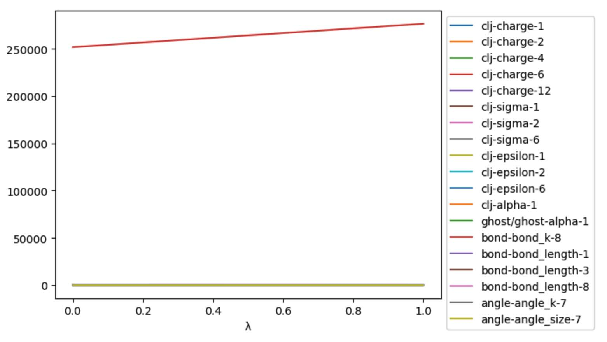
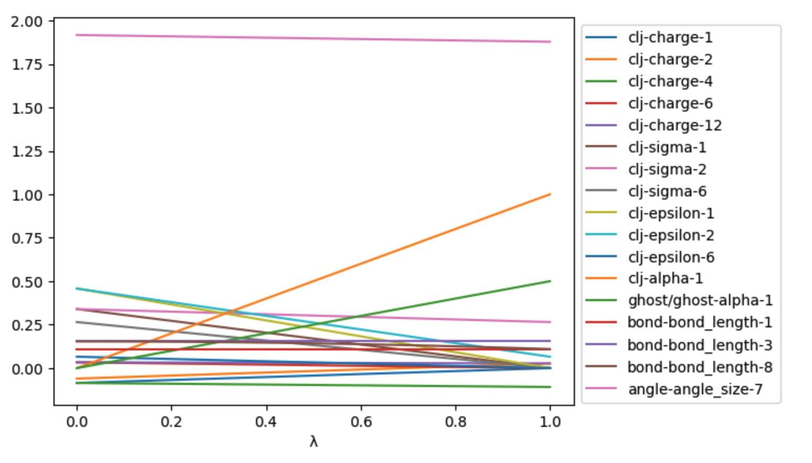

===========================
Lambda schedules and levers
===========================

In :doc:`the last chapter <../part06/02_alchemical_dynamics>` we saw how
we could use a :class:`~sire.cas.LambdaSchedule` to control how the
forcefield parameters of perturbable molecules are morphed as a function
of λ.

For example, let's load up a merged molecule system that represents
neopentane to methane in water, and then explore the
:class:`~sire.cas.LambdaSchedule` that is associated with this system.

>>> import sire as sr
>>> mols = sr.load_test_files("neo_meth_solv.bss")
>>> mols = sr.morph.link_to_reference(mols)
>>> print(mols)
System( name=BioSimSpace_System num_molecules=879 num_residues=879 num_atoms=2651 )
>>> d = mols.dynamics()
>>> s = d.get_schedule()
>>> print(s)
LambdaSchedule(
  morph: (-λ + 1) * initial + λ * final
)

This shows that all perturbable parameters of all perturbable molecules in this
system will be morphed in a single stage (called "morph"), using a linear
interpolation between the initial and final values of the parameters.

As we saw in the :doc:`last section <01_perturbation>`, we can find the exact
values of all of the perturbable parameters of a perturbable molecule via
the perturbation object.

>>> p = mols[0].perturbation()
>>> print(p)
Perturbation( Molecule( Merged_Molecule:6 num_atoms=17 num_residues=1 ) )
>>> p_omm = p.to_openmm()
>>> print(p_omm.changed_bonds())
        bond  length0  length1         k0         k1
0  C2:2-C4:4  0.15375  0.10969  251793.12  276646.08

.. note::

   In this case, we know that only the first molecule is perturbable,
   hence why it is safe to use ``mols[0].perturbation()``. In general,
   you would need to find perturbable molecule(s), e.g. using
   ``pert_mols = mols.molecules("property is_perturbable")``.

From this, we can see that the bond between atoms C2 and C4 is perturbable,
and the above schedule will morph the bond length from 0.15375 nm to 0.10969 nm,
and the force constant from 251793.12 kJ mol-1 nm-2 to 276646.08 kJ mol-1 nm-2,
linearly with respect to λ.

.. note::

   The parameters are directly as would be used in an OpenMM force,
   i.e. in OpenMM default units of nanometers and kilojoules per mole.

Controlling individual levers
-----------------------------

We can also control how individual parameters in individual forces are
morphed. We call these individual morphing controls "levers".
So, the bond potential has two levers, its bond length, and its force constant.

We can list the levers that are available in the OpenMM context using the
:meth:`~sire.cas.LambdaSchedule.get_levers` function.

>>> print(s.get_levers())
['charge', 'sigma', 'epsilon', 'charge_scale', 'lj_scale',
 'bond_length', 'bond_k', 'angle_size', 'angle_k', 'torsion_phase',
 'torsion_k', 'alpha', 'kappa']

The parameter representing bond length is connected to the ``bond_length`` lever,
while the parameter representing the bond force constant is
connected to the ``bond_k`` lever.

We can set the morphing equation for individual levers by naming the lever
in the :meth:`~sire.cas.LambdaSchedule.set_equation` function.

>>> l = s.lam()
>>> init = s.initial()
>>> fin = s.final()
>>> s.set_equation(stage="morph", lever="bond_length",
...                equation=(1-l**2)*init + l**2*fin)
>>> print(s)
LambdaSchedule(
  morph: initial * (-λ + 1) + final * λ
    bond_length: initial * (-λ^2 + 1) + final * λ^2
)

.. note::

   We extracted the symbols representing λ and the initial and final
   states to ``l``, ``init`` and ``fin``, just to make it easier to
   write the equations.

We can see that the ``bond_length`` lever in the ``morph`` stage is now
interpolated from the initial to final value by λ^2, rather than λ.

All of the other levers continue to use the default equation for this stage,
which is the linear interpolation between the initial and final values.

You can change the default equation used for a stage using the
:meth:`~sire.cas.LambdaSchedule.set_default_equation` function, e.g.

>>> s.set_default_equation(stage="morph", equation=(1-l)*init + l*fin)
>>> print(s)
LambdaSchedule(
  morph: initial * (-λ + 1) + final * λ
    bond_length: initial * (-λ^2 + 1) + final * λ^2
)

Controlling individual levers in individual forces
--------------------------------------------------

Multiple OpenMM Force objects are combined in the OpenMM context to
model the total force acting on each atom in the system. OpenMM is very
flexible, and supports the arbitrary combination of lots of different
Force objects. In :mod:`sire`, we use a simple collection of Force objects
that, when combined, model perturbable systems. You can list the names
of the Force objects used via the :meth:`~sire.cas.LambdaSchedule.get_forces`
function.

>>> print(s.get_forces())
['clj', 'bond', 'angle', 'torsion', 'ghost/ghost',
 'ghost/non-ghost', 'ghost-14']

In this case, as we have a perturbable system, the Force objects used are;

* ``bond``: `OpenMM::HarmonicBondForce <http://docs.openmm.org/latest/api-c++/generated/HarmonicBondForce.html>`__.
  This models all of the bonds between atoms in the system. It uses
  parameters that are controlled by the ``bond_length`` and ``bond_k`` levers.
* ``angle``: `OpenMM::HarmonicAngleForce <http://docs.openmm.org/latest/api-c++/generated/HarmonicAngleForce.html>`__.
  This models all of the angles between atoms in the system. It uses
  parameters that are controlled by the ``angle_size`` and ``angle_k`` levers.
* ``torsion``: `OpenMM::PeriodicTorsionForce <http://docs.openmm.org/latest/api-c++/generated/PeriodicTorsionForce.html>`__.
  This models all of the torsions (dihedrals and impropers) in the system.
  It uses parameters that are controlled by the ``torsion_phase``
  and ``torsion_k`` levers.
* ``clj``: `OpenMM::NonbondedForce <http://docs.openmm.org/latest/api-c++/generated/NonbondedForce.html>`__.
  This models all of the electrostatic (coulomb) and van der Waals (Lennard-Jones)
  interactions between non-ghost atoms in the system. Non-ghost atoms are
  any atoms that are not ghosts in either end state. It uses parameters that
  are controlled by the ``charge``, ``sigma``, ``epsilon``, ``charge_scale``
  and ``lj_scale`` levers.
* ``ghost/ghost``: `OpenMM::CustomNonbondedForce <http://docs.openmm.org/latest/api-c++/generated/CustomNonbondedForce.html>`__.
  This models all of the electrostatic (coulomb) and van der Waals (Lennard-Jones)
  interactions between ghost atoms in the system. Ghost atoms are any atoms
  that are ghosts in either end state. It uses parameters that are controlled
  by the ``charge``, ``sigma``, ``epsilon``, ``alpha`` and ``kappa`` levers.
* ``ghost/non-ghost``: `OpenMM::CustomNonbondedForce <http://docs.openmm.org/latest/api-c++/generated/CustomNonbondedForce.html>`__.
  This models all of the electrostatic (coulomb) and van der Waals (Lennard-Jones)
  interactions between the ghost atoms and the non-ghost atoms in the system.
  It uses parameters that are controlled
  by the ``charge``, ``sigma``, ``epsilon``, ``alpha`` and ``kappa`` levers.
* ``ghost-14``: `OpenMM::CustomBondForce <http://docs.openmm.org/latest/api-c++/generated/CustomBondForce.html>`__.
  This models all of the 1-4 non-bonded interactions involving ghost atoms.
  It uses parameters that are controlled by the ``charge``, ``sigma``, ``epsilon``,
  ``alpha``, ``kappa``, ``charge_scale`` and ``lj_scale`` levers.

Some levers, like ``bond_length``, are used only by a single Force object.
However, others, like ``charge``, are used by multiple Force objects.

By default, setting a lever will affect the parameters in all of the Force
objects that use that lever. However, you can limit which Force objects
are affected by specifying the force in the :meth:`~sire.cas.LambdaSchedule.set_equation`
function.

>>> s.set_equation(stage="morph", force="ghost/ghost", lever="alpha",
                   equation=0.5*s.get_equation("morph"))
>>> print(s)
LambdaSchedule(
  morph: initial * (-λ + 1) + final * λ
    bond_length: (-λ^2 + 1) * initial + final * λ^2
    ghost/ghost::alpha: 0.5 * (initial * (-λ + 1) + final * λ)
)

Here, we have set the ``alpha`` lever in the ``ghost/ghost`` Force object
to set the ``alpha`` parameter to equal half of its linearly interpolated
value.

.. note::

   The ``alpha`` parameter controls the amount of softening used in the
   soft-core potential for modelling ghost atoms. An ``alpha`` value of
   0.0 means that the soft-core potential is not used, while an ``alpha``
   value of 1.0 means that the soft-core potential is on and strong.
   Scaling up ``alpha`` will gradually soften any ghost atoms.

Controlling individual levers for individual molecules
------------------------------------------------------

We can also control how individual levers for individual forces are
morphed for individual perturbable molecules in the system. This is useful
if you have multiple perturbable molecules, and you want to control
how each one perturbs separately.

To do this, we use the :meth:`~sire.cas.LambdaSchedule.set_molecule_schedule` function
to set the schedule for a specific perturbable molecule.

First, let's get the original schedule for our simulation...

>>> orig_s = d.get_schedule()
>>> print(orig_s)
LambdaSchedule(
  morph: initial * (-λ + 1) + final * λ
)

Now, let's set the schedule to be used *only* for the first perturbable
molecule in the system to the custom one we created earlier.

>>> orig_s.set_molecule_schedule(0, s)
>>> print(orig_s)
LambdaSchedule(
  morph: initial * (-λ + 1) + final * λ
  Molecule schedules:
    0: LambdaSchedule(
  morph: initial * (-λ + 1) + final * λ
    bond_length: (-λ^2 + 1) * initial + final * λ^2
    ghost/ghost::alpha: 0.5 * (initial * (-λ + 1) + final * λ)
)
)

This shows that the default for all perturbable molecules except the first
is to use the default morph equation for all levers in all forces.

However, for the first perturbable molecule (which has index ``0``),
this uses our custom equation for the ``bond_length`` lever in the
``morph`` stage, and our custom equation for the ``alpha`` lever in
the ``ghost/ghost`` force in the ``morph`` stage.

Once you are happy, we can set the schedule to be used for the simulaton
via the :meth:`~sire.mol.Dynamics.set_schedule` function.

>>> d.set_schedule(orig_s)
>>> print(d.get_schedule())
LambdaSchedule(
  morph: initial * (-λ + 1) + final * λ
  Molecule schedules:
    0: LambdaSchedule(
  morph: initial * (-λ + 1) + final * λ
    bond_length: (-λ^2 + 1) * initial + final * λ^2
    ghost/ghost::alpha: 0.5 * (initial * (-λ + 1) + final * λ)
)
)

Viewing the effect of levers on a merged molecule
-------------------------------------------------

You can view the effect of the :class:`~sire.cas.LambdaSchedule` on a
the :class:`~sire.legacy.Convert.PerturbableOpenMMMolecule` using
the :meth:`~sire.legacy.Convert.PerturbableOpenMMMolecule.get_lever_values`
function.

>>> df = p_omm.get_lever_values(schedule=orig_s)
>>> print(df)
      clj-charge-1  clj-charge-2  clj-charge-4  ...  bond-bond_length-3  angle-angle_k-19  angle-angle_size-19
λ                                               ...
0.00     -0.085335     -0.060235     -0.085335  ...             0.10969        387.438400             1.916372
0.01     -0.084482     -0.059362     -0.085566  ...             0.10969        386.861008             1.915985
0.02     -0.083629     -0.058489     -0.085797  ...             0.10969        386.283616             1.915597
0.03     -0.082775     -0.057615     -0.086027  ...             0.10969        385.706224             1.915210
0.04     -0.081922     -0.056742     -0.086258  ...             0.10969        385.128832             1.914822
...            ...           ...           ...  ...                 ...               ...                  ...
0.96     -0.003413      0.023607     -0.107477  ...             0.10969        332.008768             1.879176
0.97     -0.002560      0.024480     -0.107708  ...             0.10969        331.431376             1.878788
0.98     -0.001707      0.025353     -0.107939  ...             0.10969        330.853984             1.878401
0.99     -0.000853      0.026227     -0.108169  ...             0.10969        330.276592             1.878013
1.00      0.000000      0.027100     -0.108400  ...             0.10969        329.699200             1.877626
[101 rows x 19 columns]

It can be useful to plot these, to check that the morphing is as expected.

>>> ax = df.plot()
>>> ax.legend(bbox_to_anchor=(1.0, 1.0))

.. note::

   The line ``ax.legend(bbox_to_anchor=(1.0, 1.0))`` is used to move the
   legend outside of the plot area, so that it doesn't obscure the data.

Unfortunately, the large values of the bond force constant make it very
difficult to see the effect of the :class:`~sire.cas.LambdaSchedule` on the
other parameters. To fix this, lets filter out any columns that contain
values that have an absolute value greater than 5.

>>> skip_columns = df.abs().gt(5).apply(lambda x: x.index[x].tolist(), axis=1)[0]
>>> ax = df.loc[:, ~df.columns.isin(skip_columns)].plot()
>>> ax.legend(bbox_to_anchor=(1.0, 1.0))

         levers with parameters with values less than 5.
