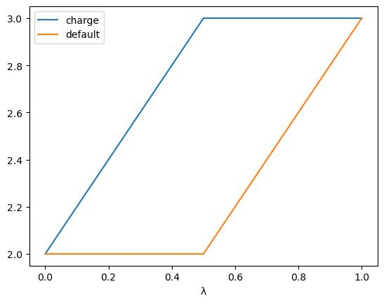

====================================
Ghost Atoms and Softening Potentials
====================================

Ghost atoms are used by the sire/OpenMM interface
to represent atoms that either appear or disappear during a
perturbation. They are used as part of the implementation of a
soft-core potential in OpenMM, to avoid singularities / crashes
when atoms are annihilated or created.

A ghost atom is one which has zero charge **and** zero LJ parameters in
either the reference or perturbed end states.

.. note::

   In this case, "zero LJ parameters" means either the sigma or epsilon
   parameter is zero (or both).

Only atoms that have a zero charge **and** zero LJ parameters at either
end state are ghost atoms. These atoms are treated differently to the
rest of the atoms in the system.

All normal atoms (called "non-ghost atoms") are treated as standard atoms
in the sire to OpenMM conversion, and added to standard OpenMM Force objects
(e.g. NonBondedForce, HarmonicBondForce, etc).

Ghost atoms are treated differently. They are added to the OpenMM Force objects
as other atoms, but with the following key difference:

*  Ghost atoms are added to the NonBondedForce with their standard charge,
   but with zero LJ parameters. This means that only the electrostatic
   energy and force from ghost atoms is evaluated here.

Ghost atoms are then added to three custom OpenMM Forces:

1. A CustomNonbondedForce called the "ghost/ghost" force. This uses a
   custom energy function to calculate the soft-core electrostatic and
   LJ interactions between all ghost atoms. It also calculates the
   "hard" electrostatic interaction and subtracts this from the
   total (to remove the real-space contribution that was calculated
   in the standard OpenMM NonBondedForce).

2. A CustomNonbondedForce called the "ghost/non-ghost" force. This uses a
   custom energy function to calculate the soft-core electrostatic and
   LJ interactions between all ghost atoms and all non-ghost atoms.
   It also calculates the "hard" electrostatic interaction and subtracts
   this from the total (to remove the real-space contribution that was
   calculated in the standard OpenMM NonBondedForce).

3. A CustomBondForce called the "ghost-14" force. This uses a custom
   energy function to calculate the soft-core electrostatic and LJ
   interactions between all 1-4 non-bonded interactions involving
   ghost atoms. It also calculates the "hard" electrostatic
   interaction and subtracts this from the total (to remove the real-space
   contribution that was calculated in the standard OpenMM NonBondedForce).

There are two different soft-core potentials available. The default is
the Zacharias potential, while the second is the Taylor potential.

Zacharias softening
-------------------

This is the default soft-core potential. You can also use it by
setting the map option ``use_zacharias_softening`` to True.

It is based on the following electrostatic and Lennard-Jones potentials:

.. math::

   V_{\text{elec}}(r) = q_i q_j \left[ \frac{(1 - \alpha)^n}{\sqrt{r^2 + \delta_\text{coulomb}}} - \frac{\kappa}{r} \right]

   V_{\text{LJ}}(r) = 4\epsilon \left[ \frac{\sigma^{12}}{(\delta_\text{LJ} \sigma + r^2)^6} - \frac{\sigma^6}{(\delta_\text{LJ} \sigma + r^2)^3} \right]

where

.. math::

    \delta_\text{coulomb} = \alpha \times \text{shift_coulomb}^2

    \delta_\text{LJ} = \alpha \times \text{shift_LJ}

and

.. math::

   \alpha = \max(\alpha_i, \alpha_j)

   \kappa = \max(\kappa_i, \kappa_j)

The parameters ``r``, ``q_i``, ``q_j``, ``\epsilon``, and ``\sigma``
are the standard parameters for the electrostatic and Lennard-Jones
potentials.

The soft-core parameters are:

* ``α_i`` and ``α_j`` control the amount of "softening" of the
  electrostatic and LJ interactions. A value of 0 means no softening
  (fully hard), while a value of 1 means fully soft. Ghost atoms which
  disappear as a function of λ have a value of α of 1 in the
  reference state, and 0 in the perturbed state. Ghost atoms which appear
  as a function of λ have a value of α of 0 in the reference
  state, and 1 in the perturbed state. These values can be perturbed
  via the ``alpha`` lever in the λ-schedule.

* ``n`` is the "coulomb power", and is set to 0 by default. It can be
  any integer between 0 and 4. It is set via ``coulomb_power`` map
  parameter.

* ``shift_coulomb`` and ``shift_LJ`` are the so-called "shift delta"
  parameters, which are specified individually for the coulomb and LJ\
  potentials. They are set via the ``shift_coulomb`` and ``shift_delta``
  map parameters. They default to 1 Å and 2.5 Å respectively.

* ``κ_i`` and ``κ_j`` are the "hard" electrostatic parameters,
  which control whether or not to calculate the "hard" electrostatic
  interaction to subtract from the total energy and force (thus cancelling
  out the double-counting of this interaction from the NonbondedForce).
  By default, these are always equal to 1. You can perturb these via the
  ``kappa`` lever in the λ-schedule, e.g. if you want to decouple the
  intramolecular electrostatic interactions, when the "hard" interaction
  would not be calculated in the NonbondedForce.

Taylor softening
----------------

This is the second soft-core potential. You can use it by setting the
map option ``use_taylor_softening`` to True.

It is based on the following electrostatic and Lennard-Jones potentials:

.. math::

   V_{\text{elec}}(r) = q_i q_j \left[ \frac{(1 - \alpha)^n}{\sqrt{r^2 + \delta^2}} - \frac{\kappa}{r} \right]

   V_{\text{LJ}}(r) = 4\epsilon \left[ \frac{\sigma^{12}}{(\alpha^m \sigma^6 + r^6)^2} - \frac{\sigma^6}{\alpha^m \sigma^6 + r^6} \right]

where

.. math::

    \delta = \alpha \times \text{shift_coulomb}

and

.. math::

   \alpha = \max(\alpha_i, \alpha_j)

   \kappa = \max(\kappa_i, \kappa_j)

The parameters ``r``, ``q_i``, ``q_j``, ``\epsilon``, and ``\sigma``
are the standard parameters for the electrostatic and Lennard-Jones
potentials.

The soft-core parameters are:

* ``α_i`` and ``α_j`` control the amount of "softening" of the
  electrostatic and LJ interactions. A value of 0 means no softening
  (fully hard), while a value of 1 means fully soft. Ghost atoms which
  disappear as a function of λ have a value of α of 1 in the
  reference state, and 0 in the perturbed state. Ghost atoms which appear
  as a function of λ have a value of α of 0 in the reference
  state, and 1 in the perturbed state. These values can be perturbed
  via the ``alpha`` lever in the λ-schedule.

* ``m`` is the "taylor power", and is set to 1 by default. It can be
  any integer between 0 and 4. It is set via ``taylor_power`` map
  parameter.

* ``n`` is the "coulomb power", and is set to 0 by default. It can be
  any integer between 0 and 4. It is set via ``coulomb_power`` map
  parameter.

* ``shift_coulomb`` is the so-called "shift delta"
  parameters, which are specified only for the coulomb
  potential. This is set via the ``shift_coulomb``
  map parameters. This defaults to 1 Å.

* ``κ_i`` and ``κ_j`` are the "hard" electrostatic parameters,
  which control whether or not to calculate the "hard" electrostatic
  interaction to subtract from the total energy and force (thus cancelling
  out the double-counting of this interaction from the NonbondedForce).
  By default, these are always equal to 1. You can perturb these via the
  ``kappa`` lever in the λ-schedule, e.g. if you want to decouple the
  intramolecular electrostatic interactions, when the "hard" interaction
  would not be calculated in the NonbondedForce.

Good practice
-------------

Softening potentials can help to avoid singularities and crashes
when atoms are annihilated or created. However, you still need to be
careful when using them. For example, it is best when creating or
destroying an atom to keep the sigma LJ parameter the same for both
end states. This way, only the epsilon parameter is scaled to zero,
while the atom keeps its same "size". This avoids the atom shrinking
as a function of λ, which could result in atoms (and thus charges)
getting too close to one another.

For complex or large molecules, it may be better to separate out the
decharging from the decoupling or annihilation, e.g. first set up
a λ-schedule to have two stages; the first stage decouples the charges,
while the second stage annihilates or decouples the atoms.

This could be achieved using the following λ-schedule:

>>> import sire as sr
>>> s = sr.cas.LambdaSchedule.standard_morph()
>>> s.set_equation(stage="morph", lever="charge", equation=s.final())
>>> s.prepend_stage("decharge", s.initial())
>>> s.set_equation(stage="decharge", lever="charge",
...                equation=l.lam() * s.final() + s.initial() * (1 - s.lam()))
>>> s.get_lever_values(initial=2.0, final=3.0).plot()

