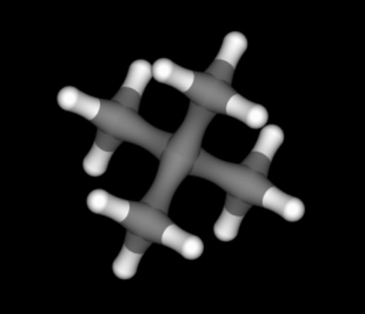
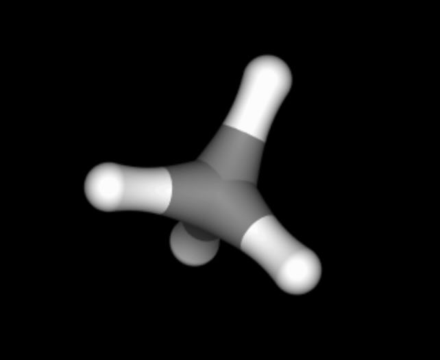
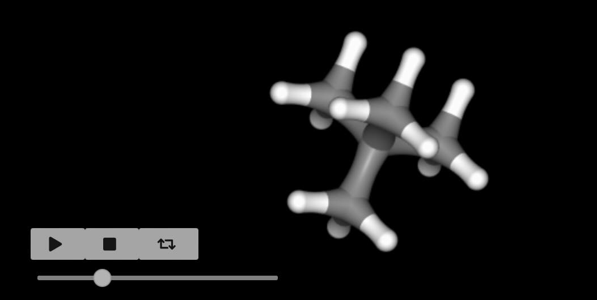

========================
Creating merge molecules
========================

Merged molecules are used in free energy calculations to represent the
perturbation between two molecules; the reference molecule (at λ=0)
and the perturbed molecule (at λ=1).

To start, let's load up two molecules, neopentane and methane, which we
will use to create a merged molecule to calculate the relative hydration
free energy.

>>> neopentane = sr.load_test_files("neopentane.prm7", "neopentane.rst")[0]
>>> neopentane.view()

>>> methane = sr.load_test_files("methane.prm7", "methane.rst")[0]
>>> methane.view()

Matching atoms
--------------

The first step to creating a merged molecule is to decide how atoms
should relate between the two end states. This is done by matching atoms
from the reference molecule (in this case neopentane) to the perturbed
molecule (in this case methane).

For example, let's say that we want the central carbon of neopentane to
perturb into the central carbon of methane. We could specify this by
creating a dictionary that says that the name of this atom in neopentane
should map to the name of the equivalent atom in methane.

We can get the name of these atoms using the 3D viewer, as shown above.
The central carbon of neopentane is called ``C1``, while the central
carbon of methane is also called ``C1``.

>>> matching = {"C1": "C1"}

Next, we would match each of the other carbon atoms in neopentane to
the hydrogen atoms in methane.

>>> matching["C2"] = "H2"
>>> matching["C3"] = "H3"
>>> matching["C4"] = "H4"
>>> matching["C5"] = "H5"
>>> print(matching)
{'C1': 'C1', 'C2': 'H2', 'C3': 'H3', 'C4': 'H4', 'C5': 'H5'}

Merging molecules
-----------------

We use the :func:`sire.morph.merge` function to create merged molecules.
This takes in the two molecules you want to merge, and the matching
dictionary you have created.

>>> merged = sr.morph.merge(mol0=neopentane, mol1=methane, match=matching)
>>> merged.perturbation().view_reference()

.. note::

   The reference state is numbered ``0`` (i.e. ``mol0``) while the
   perturbed state is numbered ``1`` (i.e. ``mol1``). This is used to
   remind us what λ-value each state corresponds to.

We can see how the underlying OpenMM parameters will be perturbed by
checking the :class:`~sire.legacy.Convert.PerturbableOpenMMMolecule`
that would be created from the merged molecule.

>>> p = merged.perturbation().to_openmm()
>>> print(p.changed_atoms())
      atom   charge0  charge1    sigma0    sigma1  epsilon0  epsilon1  alpha0  alpha1  kappa0  kappa1
0     C2:1 -0.085335   0.0271  0.339967  0.264953  0.457730  0.065689     0.0     0.0     0.0     0.0
1     C1:2 -0.060235  -0.1084  0.339967  0.339967  0.457730  0.457730     0.0     0.0     0.0     0.0
2     C3:3 -0.085335   0.0271  0.339967  0.264953  0.457730  0.065689     0.0     0.0     0.0     0.0
3     C4:4 -0.085335   0.0271  0.339967  0.264953  0.457730  0.065689     0.0     0.0     0.0     0.0
4     C5:5 -0.085335   0.0271  0.339967  0.264953  0.457730  0.065689     0.0     0.0     0.0     0.0
5     H6:6  0.033465   0.0000  0.264953  0.264953  0.065689  0.000000     0.0     1.0     1.0     1.0
6     H7:7  0.033465   0.0000  0.264953  0.264953  0.065689  0.000000     0.0     1.0     1.0     1.0
7     H8:8  0.033465   0.0000  0.264953  0.264953  0.065689  0.000000     0.0     1.0     1.0     1.0
8     H9:9  0.033465   0.0000  0.264953  0.264953  0.065689  0.000000     0.0     1.0     1.0     1.0
9   H10:10  0.033465   0.0000  0.264953  0.264953  0.065689  0.000000     0.0     1.0     1.0     1.0
10  H11:11  0.033465   0.0000  0.264953  0.264953  0.065689  0.000000     0.0     1.0     1.0     1.0
11  H12:12  0.033465   0.0000  0.264953  0.264953  0.065689  0.000000     0.0     1.0     1.0     1.0
12  H13:13  0.033465   0.0000  0.264953  0.264953  0.065689  0.000000     0.0     1.0     1.0     1.0
13  H14:14  0.033465   0.0000  0.264953  0.264953  0.065689  0.000000     0.0     1.0     1.0     1.0
14  H15:15  0.033465   0.0000  0.264953  0.264953  0.065689  0.000000     0.0     1.0     1.0     1.0
15  H16:16  0.033465   0.0000  0.264953  0.264953  0.065689  0.000000     0.0     1.0     1.0     1.0
16  H17:17  0.033465   0.0000  0.264953  0.264953  0.065689  0.000000     0.0     1.0     1.0     1.0

We can see here that the five carbons in neopentane have their charge
and LJ parameters perturbed from the neopentane values to the methane
values.

We can also see that the hydrogens in neopentane are converted to ghost
atoms, as they have no match in methane. The conversion to ghost atoms
involves setting their charge to zero, and setting the LJ epsilon parameter
of the atoms to zero (keeping the sigma parameter the same, as suggested
as best practice in the :doc:`last tutorial <03_ghosts>`).

Note also how the alpha parameters of the hydrogens changes from 0 to 1
as those atoms become ghosts.

We can also look at the changes in internal parameters.

>>> print(p.changed_bonds())
        bond  length0  length1         k0         k1
0  C2:1-C1:2  0.15375  0.10969  251793.12  276646.08
1  C1:2-C3:3  0.15375  0.10969  251793.12  276646.08
2  C1:2-C4:4  0.15375  0.10969  251793.12  276646.08
3  C1:2-C5:5  0.15375  0.10969  251793.12  276646.08
>>> print(p.changed_angles())
            angle     size0     size1        k0        k1
0  C4:4-C1:2-C5:5  1.946217  1.877626  526.3472  329.6992
1  C3:3-C1:2-C4:4  1.946217  1.877626  526.3472  329.6992
2  C3:3-C1:2-C5:5  1.946217  1.877626  526.3472  329.6992
3  C2:1-C1:2-C3:3  1.946217  1.877626  526.3472  329.6992
4  C2:1-C1:2-C4:4  1.946217  1.877626  526.3472  329.6992
5  C2:1-C1:2-C5:5  1.946217  1.877626  526.3472  329.6992
>>> print(p.changed_torsions())
Empty DataFrame
Columns: [torsion, k0, k1, periodicity0, periodicity1, phase0, phase1]
Index: []

We can see that the bond lengths and angles are perturbed from their values
in neopentane (representing C-C bonds and C-C-C angles) to their values
in methane (representing C-H bonds and H-C-H angles). Note that the
bonds, angles and torsions for the hydrogens in neopentane are not
perturbed. This is because all of these atoms are converted to ghost atoms,
and the default is that internals involving ghost atoms keep the parameters
from the end state where they are not ghosts (i.e. the reference state
values in this case).

Implementation - AtomMapping
----------------------------

Under the hood, the above merge was implemented via the
:class:`sire.mol.AtomMapping` class. This class holds all of the information
about how atoms are mapped between end states, and an object of this
class was created automatically by the :func:`~sire.morph.merge` function.

We can create the mapping object directly using the
:func:`sire.morph.match` function.

>>> m = sr.morph.match(mol0=neopentane, mol1=methane, match=matching)
>>> print(m)
AtomMapping( size=5, unmapped0=12, unmapped1=0
0: MolNum(3) Atom( C1:2 ) <=> MolNum(2) Atom( C1:2 )
1: MolNum(3) Atom( C2:1 ) <=> MolNum(2) Atom( H2:1 )
2: MolNum(3) Atom( C4:4 ) <=> MolNum(2) Atom( H4:4 )
3: MolNum(3) Atom( C3:3 ) <=> MolNum(2) Atom( H3:3 )
4: MolNum(3) Atom( C5:5 ) <=> MolNum(2) Atom( H5:5 )
)

This shows how the five carbon atoms in neopentane are mapped to the
carbon and four hydrogens of methane. It also shows how 12 atoms in the
reference state are unmapped (``unmapped0=12``) and how no atoms in the
perturbed state are unmapped (``unmapped1=0``).

This class has some useful functions. One is
:func:`~sire.mol.AtomMapping.align`, which aligns the perturbed state
against the reference state, using an algorithm that minimises the
RMSD of the mapped atoms.

>>> m = m.align()

Another useful function is :func:`~sire.mol.AtomMapping.merge`, which
actually performs the merge, returning the merged molecule, with
perturbable properties linked to the reference state.

>>> merged = m.merge()
>>> print(merged)
Molecule( NEO:7   num_atoms=17 num_residues=1 )

The :func:`~sire.morph.merge` function is really a wrapper that create
this :class:`~sire.mol.AtomMapping` object, calls align, and then
calls the :func:`~sire.mol.AtomMapping.merge` function.

Automatic matching
------------------

Creating the matching dictionary by hand can be a bit tedious! Fortunately,
there are lots of tools that can help automate this process.

One such tool is the above :func:`~sire.morph.match` function. If you don't
pass in a ``match`` argument, then an internal maximum common substructure
algorithm will be used to try to infer the matching.

>>> m = sr.morph.match(mol0=neopentane, mol1=methane)
>>> print(m)
AtomMapping( size=1, unmapped0=16, unmapped1=4
0: MolNum(3) Atom( C2:1 ) <=> MolNum(2) Atom( C1:2 )
)

.. warning::

   The maximum common substructure algorithm is not supported on Windows.
   This will only work on MacOS and Linux.

By default, this algorithm ignores hydrogens. This is why only a single
atom was matched above. You can change this by passing in the
``ignore_light_atoms=True`` argument.

>>> m = sr.morph.match(mol0=neopentane, mol1=methane, match_light_atoms=True)
>>> print(m)
AtomMapping( size=4, unmapped0=13, unmapped1=1
0: MolNum(3) Atom( C2:1 ) <=> MolNum(2) Atom( C1:2 )
1: MolNum(3) Atom( H6:6 ) <=> MolNum(2) Atom( H2:1 )
2: MolNum(3) Atom( H8:8 ) <=> MolNum(2) Atom( H4:4 )
3: MolNum(3) Atom( H7:7 ) <=> MolNum(2) Atom( H3:3 )
)

Note how this has come up with a different mapping than the one we created
manually.

The internal algorithm is quite slow, especially for large molecules.
It is also not aware of stereochemistry, and generally not recommended
if other tools are available.

Fortunately, because the funtion accepts a python dictionary, it is very
easy to use other tools to generate the mapping and pass to this function.

Using Kartograf mappings
------------------------

`Kartograf <https://kartograf.readthedocs.io/en/latest/>`__ is a package
for generating atom mappings which takes into account 3D geometries.
This means that mappings can account for stereochemistry. It is also
extremely fast and robust, with lots of active development. It is a very
good choice for generating atom mappings.

To use Kartograf, you may need to install it. You can do this with conda.

.. code-block:: bash

   conda install -c conda-forge kartograf

Next, we will import the components of Kartograf that we need.

>>> from kartograf.atom_aligner import align_mol_shape
>>> from kartograf import KartografAtomMapper, SmallMoleculeComponent

Kartograf can work from RDKit molecules, so we'll now convert our sire
molecules to RDKit.

>>> rd_neopentane = sr.convert.to(neopentane, "rdkit")
>>> rd_methane = sr.convert.to(methane, "rdkit")

Next, we will create two Kartograf molecules from these RDKit molecules.

>>> k_neopentane, k_methane = [
...   SmallMoleculeComponent.from_rdkit(m) for m in [rd_neopentane, rd_methane]
... ]

Now, we align the molecules based on their shape, aligning methane on top
of neopentane.

>>> k_aligned_methane = align_mol_shape(k_methane, ref_mol=k_neopentane)

To generate the mappings, we will create a KartografAtomMapper object
which is allowed to match light atoms.

>>> mapper = KartografAtomMapper(atom_map_hydrogens=True)

This can be used to generate the mappings.

>>> mappings = mapper.suggest_mappings(k_neopentane, k_aligned_methane)

We will now get the first mapping...

>>> mapping = next(mappings)
>>> print(mapping)
LigandAtomMapping(componentA=SmallMoleculeComponent(name=NEO),
                  componentB=SmallMoleculeComponent(name=CH4),
                  componentA_to_componentB={1: 0, 11: 2, 12: 3, 13: 4, 3: 1},
                  annotations={})

The mappings are atom indexes. We can collect these and create a
dictionary that maps from atom index to atom index using this code.

>>> matching = {}
>>> for atom0, atom1 in mapping.componentA_to_componentB.items():
...     matching[sr.atomid(idx=atom0)] = sr.atomid(idx=atom1)
>>> print(matching)
{AtomIdx(1): AtomIdx(0), AtomIdx(11): AtomIdx(2), AtomIdx(12): AtomIdx(3),
 AtomIdx(13): AtomIdx(4), AtomIdx(3): AtomIdx(1)}

Finally, we can pass this into the :func:`~sire.morph.match` function
to create the :class:`~sire.mol.AtomMapping` object.

>>> mapping = sr.morph.match(mol0=neopentane, mol1=methane, match=matching)
>>> print(mapping)
AtomMapping( size=5, unmapped0=12, unmapped1=0
0: MolNum(3) Atom( H12:12 ) <=> MolNum(2) Atom( H3:3 )
1: MolNum(3) Atom( H14:14 ) <=> MolNum(2) Atom( H5:5 )
2: MolNum(3) Atom( H13:13 ) <=> MolNum(2) Atom( H4:4 )
3: MolNum(3) Atom( C1:2 ) <=> MolNum(2) Atom( H2:1 )
4: MolNum(3) Atom( C4:4 ) <=> MolNum(2) Atom( C1:2 )
)

Automatic Kartograf mapping
---------------------------

The above code can be quite tedious to write, so we have created the
ability to pass in a ``KartografAtomMapper`` object as the ``match``
argument to the :func:`~sire.morph.match` and :func:`~sire.morph.merge`
functions, which then does all of the above automatically.

>>> mapper = KartografAtomMapper(atom_map_hydrogens=True)
>>> mapping = sr.morph.match(mol0=neopentane, mol1=methane, match=mapper)
>>> print(mapping)
AtomMapping( size=5, unmapped0=12, unmapped1=0
0: MolNum(3) Atom( H12:12 ) <=> MolNum(2) Atom( H3:3 )
1: MolNum(3) Atom( H14:14 ) <=> MolNum(2) Atom( H5:5 )
2: MolNum(3) Atom( H13:13 ) <=> MolNum(2) Atom( H4:4 )
3: MolNum(3) Atom( C1:2 ) <=> MolNum(2) Atom( H2:1 )
4: MolNum(3) Atom( C4:4 ) <=> MolNum(2) Atom( C1:2 )
)
>>> merged = sr.morph.merge(mol0=neopentane, mol1=methane, match=mapper)
>>> print(merged)
Molecule( NEO:8   num_atoms=17 num_residues=1 )
>>> m = merged.perturbation().to_openmm()
>>> print(m.changed_atoms())
      atom   charge0  charge1    sigma0    sigma1  epsilon0  epsilon1  alpha0  alpha1  kappa0  kappa1
0     C2:1 -0.085335   0.0000  0.339967  0.339967  0.457730  0.000000     0.0     1.0     1.0     1.0
1     C1:2 -0.060235   0.0271  0.339967  0.264953  0.457730  0.065689     0.0     0.0     0.0     0.0
2     C3:3 -0.085335   0.0000  0.339967  0.339967  0.457730  0.000000     0.0     1.0     1.0     1.0
3     C4:4 -0.085335  -0.1084  0.339967  0.339967  0.457730  0.457730     0.0     0.0     0.0     0.0
4     C5:5 -0.085335   0.0000  0.339967  0.339967  0.457730  0.000000     0.0     1.0     1.0     1.0
5     H6:6  0.033465   0.0000  0.264953  0.264953  0.065689  0.000000     0.0     1.0     1.0     1.0
6     H7:7  0.033465   0.0000  0.264953  0.264953  0.065689  0.000000     0.0     1.0     1.0     1.0
7     H8:8  0.033465   0.0000  0.264953  0.264953  0.065689  0.000000     0.0     1.0     1.0     1.0
8     H9:9  0.033465   0.0000  0.264953  0.264953  0.065689  0.000000     0.0     1.0     1.0     1.0
9   H10:10  0.033465   0.0000  0.264953  0.264953  0.065689  0.000000     0.0     1.0     1.0     1.0
10  H11:11  0.033465   0.0000  0.264953  0.264953  0.065689  0.000000     0.0     1.0     1.0     1.0
11  H12:12  0.033465   0.0271  0.264953  0.264953  0.065689  0.065689     0.0     0.0     0.0     0.0
12  H13:13  0.033465   0.0271  0.264953  0.264953  0.065689  0.065689     0.0     0.0     0.0     0.0
13  H14:14  0.033465   0.0271  0.264953  0.264953  0.065689  0.065689     0.0     0.0     0.0     0.0
14  H15:15  0.033465   0.0000  0.264953  0.264953  0.065689  0.000000     0.0     1.0     1.0     1.0
15  H16:16  0.033465   0.0000  0.264953  0.264953  0.065689  0.000000     0.0     1.0     1.0     1.0
16  H17:17  0.033465   0.0000  0.264953  0.264953  0.065689  0.000000     0.0     1.0     1.0     1.0

This is a much easier way to create merged molecules!

Extracting the end states
-------------------------

As with all merged molecules, we can extract the end states via the
:func:`sire.morph.extract_reference` and :func:`sire.morph.extract_perturbed`
functions.

>>> neopentane = sr.morph.extract_reference(merged)
>>> print(neopentane.atoms())
Selector<SireMol::Atom>( size=17
0:  Atom( C2:1    [   2.24,    1.01,    0.00] )
1:  Atom( C1:2    [   1.26,    0.09,   -0.75] )
2:  Atom( C3:3    [   0.99,    0.66,   -2.15] )
3:  Atom( C4:4    [  -0.06,   -0.00,    0.04] )
4:  Atom( C5:5    [   1.88,   -1.32,   -0.88] )
...
12:  Atom( H13:13  [  -0.78,   -0.67,   -0.49] )
13:  Atom( H14:14  [   0.11,   -0.42,    1.05] )
14:  Atom( H15:15  [   2.83,   -1.27,   -1.44] )
15:  Atom( H16:16  [   2.08,   -1.75,    0.13] )
16:  Atom( H17:17  [   1.19,   -2.00,   -1.42] )
)
>>> methane = sr.morph.extract_perturbed(merged)
>>> print(methane.atoms())
Selector<SireMol::Atom>( size=5
0:  Atom( H2:2    [  -0.45,    1.01,    0.10] )
1:  Atom( C1:4    [  -0.00,    0.00,    0.00] )
2:  Atom( H3:12   [  -0.71,   -0.67,   -0.53] )
3:  Atom( H4:13   [   0.95,    0.07,   -0.57] )
4:  Atom( H5:14   [   0.21,   -0.41,    1.01] )
)

The names of the atoms and residues are preserved in the merged molecule,
meaning that they are correctly output for each end state. In the merged
molecule, the atom and residue names default to the reference state names.
The perturbed state names are held in the "alternate" names.

>>> print(merged.residues()[0].name(), merged.residues()[0].alternate_name())
ResName('NEO') ResName('CH4')
>>> print(merged[1].name(), merged[1].alternate_name())
AtomName('C1') AtomName('H2')

Atoms that are unmapped in an end state are called ``Xxx``, e.g.

>>> print(merged[0].name(), merged[0].alternate_name())
AtomName('C2') AtomName('Xxx')

You can switch between the standard and alternate names of a molecule
by calling the :func:`~sire.legacy.Mol.MolEditor.switch_to_alternate_names`
function.

>>> print(merged.atoms())
Selector<SireMol::Atom>( size=17
0:  Atom( C2:1    [   2.24,    1.01,    0.00] )
1:  Atom( C1:2    [   1.26,    0.09,   -0.75] )
2:  Atom( C3:3    [   0.99,    0.66,   -2.15] )
3:  Atom( C4:4    [  -0.06,   -0.00,    0.04] )
4:  Atom( C5:5    [   1.88,   -1.32,   -0.88] )
...
12:  Atom( H13:13  [  -0.78,   -0.67,   -0.49] )
13:  Atom( H14:14  [   0.11,   -0.42,    1.05] )
14:  Atom( H15:15  [   2.83,   -1.27,   -1.44] )
15:  Atom( H16:16  [   2.08,   -1.75,    0.13] )
16:  Atom( H17:17  [   1.19,   -2.00,   -1.42] )
)
>>> merged = merged.edit().switch_to_alternate_names().commit()
>>> print(merged.atoms())
Selector<SireMol::Atom>( size=17
0:  Atom( Xxx:1   [   2.24,    1.01,    0.00] )
1:  Atom( H2:2    [   1.26,    0.09,   -0.75] )
2:  Atom( Xxx:3   [   0.99,    0.66,   -2.15] )
3:  Atom( C1:4    [  -0.06,   -0.00,    0.04] )
4:  Atom( Xxx:5   [   1.88,   -1.32,   -0.88] )
...
12:  Atom( H4:13   [  -0.78,   -0.67,   -0.49] )
13:  Atom( H5:14   [   0.11,   -0.42,    1.05] )
14:  Atom( Xxx:15  [   2.83,   -1.27,   -1.44] )
15:  Atom( Xxx:16  [   2.08,   -1.75,    0.13] )
16:  Atom( Xxx:17  [   1.19,   -2.00,   -1.42] )
)
>>> merged = merged.edit().switch_to_alternate_names().commit()
>>> print(merged.atoms())
Selector<SireMol::Atom>( size=17
0:  Atom( C2:1    [   2.24,    1.01,    0.00] )
1:  Atom( C1:2    [   1.26,    0.09,   -0.75] )
2:  Atom( C3:3    [   0.99,    0.66,   -2.15] )
3:  Atom( C4:4    [  -0.06,   -0.00,    0.04] )
4:  Atom( C5:5    [   1.88,   -1.32,   -0.88] )
...
12:  Atom( H13:13  [  -0.78,   -0.67,   -0.49] )
13:  Atom( H14:14  [   0.11,   -0.42,    1.05] )
14:  Atom( H15:15  [   2.83,   -1.27,   -1.44] )
15:  Atom( H16:16  [   2.08,   -1.75,    0.13] )
16:  Atom( H17:17  [   1.19,   -2.00,   -1.42] )
)
