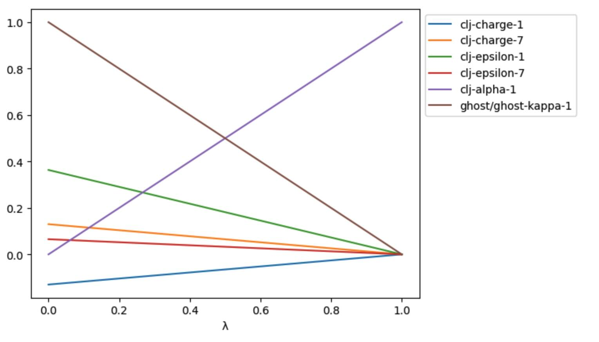

===========================
Annihilation and Decoupling
===========================

So far, we have discussed how to construct merge molecules that represent
perturbations from one molecule to another. These are useful for
relative free energy calculations.

Absolute free energy calculations require perturbations that decouple
or annihilate molecules. The :func:`sire.morph.decouple` and
:func:`sire.morph.annihilate` create merged molecules that represent
these perturbations.

Decoupling
----------

Decoupling is the process of turning off the interactions between the
molecule of interest, and all other molecules in the system.

For example, let's load up a system comprising benzene in a box of
water (with some ions).

>>> import sire as sr
>>> mols = sr.load_test_files("benzene.prm7", "benzene.rst")
>>> benzene = mols[0]
>>> print(benzene)
Molecule( BEN:2   num_atoms=12 num_residues=1 )

We can create a merged molecule that represents the decoupling of the
benzene via the :func:`sire.morph.decouple` function.

>>> benzene = sr.morph.decouple(benzene, as_new_molecule=False)
>>> print(benzene)
Molecule( BEN:2   num_atoms=12 num_residues=1 )

.. note::

   We pass in ``as_new_molecule=False`` so that the resulting merged
   molecule keeps the same molecule number as the original benzene.
   If we had passed in ``as_new_molecule=True`` (which is the default)
   then the returned molecule would be a "new" molecule, with its
   own, unique molecule number.

The decoupled benzene molecule is a merged molecule where all of the
atoms are converted to ghost atoms.

>>> p = benzene.perturbation().to_openmm()
>>> print(p.changed_atoms())
     atom  charge0  charge1    sigma0    sigma1  epsilon0  epsilon1  alpha0  alpha1  kappa0  kappa1
0     C:1    -0.13      0.0  0.348065  0.348065  0.363503       0.0     0.0     1.0     1.0     1.0
1    C2:2    -0.13      0.0  0.348065  0.348065  0.363503       0.0     0.0     1.0     1.0     1.0
2    C3:3    -0.13      0.0  0.348065  0.348065  0.363503       0.0     0.0     1.0     1.0     1.0
3    C4:4    -0.13      0.0  0.348065  0.348065  0.363503       0.0     0.0     1.0     1.0     1.0
4    C5:5    -0.13      0.0  0.348065  0.348065  0.363503       0.0     0.0     1.0     1.0     1.0
5    C6:6    -0.13      0.0  0.348065  0.348065  0.363503       0.0     0.0     1.0     1.0     1.0
6    H1:7     0.13      0.0  0.257258  0.257258  0.065318       0.0     0.0     1.0     1.0     1.0
7    H2:8     0.13      0.0  0.257258  0.257258  0.065318       0.0     0.0     1.0     1.0     1.0
8    H3:9     0.13      0.0  0.257258  0.257258  0.065318       0.0     0.0     1.0     1.0     1.0
9   H4:10     0.13      0.0  0.257258  0.257258  0.065318       0.0     0.0     1.0     1.0     1.0
10  H5:11     0.13      0.0  0.257258  0.257258  0.065318       0.0     0.0     1.0     1.0     1.0
11  H6:12     0.13      0.0  0.257258  0.257258  0.065318       0.0     0.0     1.0     1.0     1.0

.. note::

   Note how the atoms are converted to ghosts by setting the charge and epsilon
   parameters to zero, and setting the alpha value to 1.0 in the end state,
   and the kappa values to 1.0 in both end states.

All of the internals (bonds, angles, torsions) are kept the same at both
end states.

>>> print(p.changed_bonds())
Empty DataFrame
Columns: [bond, length0, length1, k0, k1]
Index: []
>>> print(p.changed_angles())
Empty DataFrame
Columns: [angle, size0, size1, k0, k1
Index: []
>>> print(p.changed_torsions())
Empty DataFrame
Columns: [torsion, k0, k1, periodicity0, periodicity1, phase0, phase1]
Index: []

To decouple the benzene molecule correctly, a custom :class:`sire.cas.LambdaSchedule`
is needed. This schedule turns off intermolecular interactions involving the
benzene, while keeping the intramolecular interactions the same.

The :func:`sire.morph.decouple` function creates a suitable schedule by
default, and attaches it to the merged molecule via its ``schedule``
property.

>>> schedule = benzene.property("schedule")
>>> print(schedule)
LambdaSchedule(
  decouple: (-λ + 1) * initial + λ * final
    ghost-14::*: initial
    ghost-14::kappa: -λ + 1
    ghost/ghost::*: initial
    ghost/ghost::kappa: -λ + 1
)

This schedule has a single stage called ``decouple``. The default is that
all levers use the standard morphing equation to linearly interpolate
from the initial to final states. This has the effect of turning off
all charge and LJ interactions involving benzene.

However, we want to preserve the intramolecular charge and LJ interactions
of benzene. Since all atoms are ghost atoms, these are
all evaluated in the ghost/ghost and ghost-14 forces. We therefore set all
levers in the ghost/ghost and ghost-14 forces to use the parameters in the
initial state (i.e. the full charges and epsilon LJ parameters for benzene).

But, because the ghost/ghost force includes a correction to subtract
a double-counted electrostatic interaction from the NonbondedForce,
we also need to have a lever that scales kappa with 1-λ. In this way,
the kappa parameter will ensure that the correction is applied at
λ=0, when the electrostatic interactions of benzene are evaluated in both
the NonbondedForce and the ghost/ghost and ghost-14 forces, while it will
scale kappa to 0 at λ=1, when the electrostatic interactions of benzene are
only evaluated in the ghost/ghost and ghost-14 forces.

We can view exactly how a schedule will perturb the real parameters of
a merged molecule using the
:meth:`~sire.legacy.Convert.PerturbableOpenMMMolecule.get_lever_values`
function.

>>> df = p.get_lever_values(schedule=schedule)
>>> print(df)
      clj-charge-1  clj-charge-7  clj-epsilon-1  clj-epsilon-7  clj-alpha-1  ghost/ghost-kappa-1
λ
0.00       -0.1300        0.1300       0.363503       0.065318         0.00                 1.00
0.01       -0.1287        0.1287       0.359868       0.064665         0.01                 0.99
0.02       -0.1274        0.1274       0.356233       0.064012         0.02                 0.98
0.03       -0.1261        0.1261       0.352598       0.063358         0.03                 0.97
0.04       -0.1248        0.1248       0.348963       0.062705         0.04                 0.96
...            ...           ...            ...            ...          ...                  ...
0.96       -0.0052        0.0052       0.014540       0.002613         0.96                 0.04
0.97       -0.0039        0.0039       0.010905       0.001960         0.97                 0.03
0.98       -0.0026        0.0026       0.007270       0.001306         0.98                 0.02
0.99       -0.0013        0.0013       0.003635       0.000653         0.99                 0.01
1.00        0.0000        0.0000       0.000000       0.000000         1.00                 0.00
[101 rows x 6 columns]

>>> ax = df.plot()

Running a decoupling simulation
-------------------------------

We can run a decoupling simulation in the same way as any other
free energy simulation.

First, we will update the system to use the decoupled benzene molecule.

>>> mols.update(benzene)

This works because we used ``as_new_molecule=False`` when creating
the merged molecule, so it kept its original molecule number.

Next, we will create a simulation object.

>>> d = mols.dynamics(timestep="2fs", temperature="25oC",
...                   schedule=schedule, lambda_value=1.0)
>>> d.run("100ps", lambda_windows=[0.0, 0.5, 1.0])
>>> print(d.energy_trajectory())
EnergyTrajectory( size=4
time    lambda  0.0             0.5             1.0             kinetic potential
25      1.0     2.49529e+06     -8686.04        -8895.63        1583.95 -8895.63
50      1.0     1.54343e+06     -8750.01        -8914.34        1527.78 -8914.34
75      1.0     2.20708e+08     -8465.13        -8872.06        1624.18 -8872.06
100     1.0     1.02181e+11     -8534.06        -8949.38        1537.6  -8949.38
)

.. note::

   We expect the energies at λ=0 to be high in this case, as the simulation
   was run at λ=1, where the benzene is not interacting with the the rest
   of the system, and thus free to overlap with other atoms.
