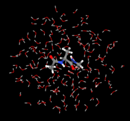

=========
Sire-EMLE
=========

In this section we will show how to use the `emle-engine <https://github.com/chemle/emle-engine>`_
package as a QM/MM engine within ``sire``. The ``emle-engine`` package provides
support for a wide range of backends and embedding models, importantly providing
a simple and efficient ML model for electrostatic embedding.

In order to use EMLE you will first need to create the following ``conda``
environment:

.. code-block:: bash

   $ git clone https://github.com/chemle/emle-engine.git
   $ cd emle-engine
   $ conda env create -f environment_sire.yaml
   $ conda activate emle-sire
   $ pip install -e .

In this tutorial, we will perform a short ML/MM simulation of alanine dipeptide
in water. First, let us load the molecular system:

>>> import sire as sr
>>> mols = sr.load_test_files("ala.crd", "ala.top")

Creating an EMLE calculator
---------------------------

Next we will create an ``emle-engine`` calculator to perform the QM (or ML) calculation
for the dipeptide along with the ML electrostatic embedding. Since this is a small molecule
it isn't beneficial to perform the calculation on a GPU, so we will use the CPU instead.

>>> from emle.calculator import EMLECalculator
>>> calculator = EMLECalculator(device="cpu")

By default, ``emle-engine`` will use `TorchANI <https://aiqm.github.io/torchani/>`_
as the backend for in vacuo calculation of energies and gradients. However,
it is possible to use a wide variety of other backends, including your own
as long as  it supports the standand `Atomic Simulation Environment (ASE) <https://wiki.fysik.dtu.dk/ase/>`_
`calculator <https://wiki.fysik.dtu.dk/ase/ase/calculators/calculators.html>`_ interface.
For details, see the `backends <https://github.com/chemle/emle-engine#backends>`_
section of the ``emle-engine`` documentation. At present, the default embedding
model provided with ``emle-engine`` supports only the elements H, C, N, O, and S.
We plan on adding support for other elements in the near future.

Creating a QM engine
--------------------

We now need to set up the molecular system for the QM/MM simulation and create
an engine to perform the calculation:

>>> qm_mols, engine = sr.qm.emle(
...     mols,
...     mols[0],
...     calculator,
...     cutoff="7.5A",
...     neighbour_list_frequency=20
... )

Here the first argument is the molecules that we are simulating, the second
selection coresponding to the QM region (here this is the first molecule), and
the third is calculator that was created above. The fourth and fifth arguments
are optional, and specify the QM cutoff distance and the neighbour list update
frequency respectively. (Shown are the default values.) The function returns a
modified version of the molecules containing a "merged" dipeptide that can be
interpolated between MM and QM levels of theory, along with an engine. The
engine registers a Python callback that uses ``emle-engine`` to perform the QM
calculation.

Running a QM/MM simulation
--------------------------

Next we need to create a dynamics object to perform the simulation. For QM/MM
simulations it is recommended to use a 1 femtosecond timestep and no constraints.
In this example we will use the ``lambda_interpolate`` keyword to  interpolate
the dipeptide potential between pure MM (λ=0) and QM (λ=1) over the course of
the simulation, which can be used for end-state correction of binding free
energy calculations.

>>> d = qm_mols.dynamics(
...     timestep="1fs",
...     constraint="none",
...     qm_engine=engine,
...     lambda_interpolate=[0, 1],
...     platform="cpu",
... )

We can now run the simulation. The options below specify the run time, the
frequency at which trajectory frames are saved, and the frequency at which
energies are recorded. The ``energy_frequency`` also specifies the frequency
at which the λ value is updated.

>>> d.run("1ps", frame_frequency="0.05ps", energy_frequency="0.05ps")

.. note::

    Updating λ requires the updating of force field parameters in the ``OpenMM``
    context. For large systems, this can be quite slow so it isn't recommended
    to set the ``energy_frequency`` to a value that is too small. We have a custom
    `fork <https://github.com/chryswoods/openmm>`_ of ``OpenMM`` that provides a
    significant speedup for this operation by only updating a subset of the parameters.
    Installation instructions can be provided on request.

.. note::

    If you don't require a trajectory file, then better performance can be achieved
    leaving the ``frame_frequency`` keyword argument unset.

.. note::

    ``emle-engine`` currently requires the use of `librascal <https://lab-cosmo.github.io/librascal/#/>`_
    for the calculation of SOAP (Smooth Overlap of Atomic Positions) descriptors.
    This is a serial code, so you may see better performance by restricting the
    number of ``OpenMP`` threads to 1, e.g. by setting the ``OMP_NUM_THREADS``
    environment variable.

Once the simulation has finished we can get back the trajectory of energy values.
This can be obtained as a `pandas <https://pandas.pydata.org/>`_ ``DataFrame``,
allowing for easy plotting and analysis. The table below shows the instantaneous
kinetic and potential energies as a function of λ, along with the accumulated
non-equilibrium work. (Times are in picoseconds and energies are in kcal/mol.)

>>> nrg_traj = d.energy_trajectory(to_pandas=True)
>>> print(nrg_traj)
           lambda      kinetic      potential          work
time
6000.05  0.000000  1004.360323   -6929.923522      0.000000
6000.10  0.052632   907.430686  -23199.383591   -856.287372
6000.15  0.105263  1103.734847  -39773.815961  -1728.625918
6000.20  0.157895   982.097859  -56012.557224  -2583.296511
6000.25  0.210526  1035.727824  -72437.484783  -3447.766382
6000.30  0.263158  1029.009153  -88803.629979  -4309.142445
6000.35  0.315789  1014.269847 -105159.643486  -5169.985261
6000.40  0.368421  1021.246476 -121532.624612  -6031.721110
6000.45  0.421053  1022.233858 -137904.993921  -6893.424758
6000.50  0.473684  1025.310039 -154284.677129  -7755.513348
6000.55  0.526316  1025.001630 -170655.548776  -8617.138171
6000.60  0.578947  1016.891585 -187011.341345  -9477.969359
6000.65  0.631579  1022.910901 -203389.408932 -10339.972916
6000.70  0.684211  1024.431575 -219765.627241 -11201.879143
6000.75  0.736842  1052.484710 -236168.647435 -12065.195995
6000.80  0.789474  1032.732604 -252520.971205 -12925.844615
6000.85  0.842105  1061.216013 -268919.903129 -13788.946295
6000.90  0.894737  1062.979311 -285305.108112 -14651.325505
6000.95  0.947368  1057.025646 -301673.184597 -15512.803215
6001.00  1.000000  1024.034371 -318006.345331 -16372.443253

.. note::

   In the table above, the time doesn't start from zero because the example
   molecular system was loaded from an existing trajectory restart file.

.. note::

   Unlike the ``sander`` interface of ``emle-engine``, the interpolated potential
   energy is non-linear with respect to λ, i.e. it is not precisely a linear
   combination of MM and QM energies. This is because the ``sire`` interface
   performs a *perturbation* of the system parameters from MM to QM as λ is
   changed, e.g. scaling down the force constants for bonded terms in the QM
   region and scaling down the charges. Perturbing charges linearly results in
   an energy change *between* charges that is quadratic in λ.

Interfacing with OpenMM-ML
--------------------------

In the example above we used a sire dynamics object ``d`` to run the simulation.
This is wrapper around a standard OpenMM context object, providing a simple
convenience functions to make it easier to run and analyse simulations. However,
if you are already familiar with OpenMM, then it is possible to use ``emle-engine``
with OpenMM directly. This allows for fully customised simulations, or the use
of `OpenMM-ML <https://github.com/openmm/openmm-ml>`_ as the backend for
calculation of the intramolecular force for the QM region.

To use ``OpenMM-ML`` as the backend for the QM calculation, you will first need
to install the package:

.. code-block:: bash

   $ conda install -c conda-forge openmm-ml

Next, you will need to create an ``MLPotential`` for desired backend. Here we
will use the ANI-2x, as was used for the ``EMLECalculator`` above. The

>>> import openmm
>>> from openmmml import MLPotential
>>> potential = MLPotential("ani2x")

Since we are now using the ``MLPotential`` for the QM calculation, we need to
create a new ``EMLECalculator`` object with no backend, i.e. one that only
computes the electrostatic embedding:

>>> calculator = EMLECalculator(backend=None, device="cpu")

Next we create a new engine bound to the calculator:

>>> _, engine = sr.qm.emle(
>>> ... mols, mols[0], calculator, cutoff="7.5A", neighbour_list_frequency=20
>>> ... )

.. note::

    ``qm_mols`` is not needed when using ``OpenMM-ML``, since it will perform
    its own internal modifications for performing interpolation.

Rather than using this engine with a ``sire`` dynamics object, we can instead
extract the underlying ``OpenMM`` force object and add it to an existing
``OpenMM`` system. The forces can be extracted from the engine as follows:

>>> emle_force, interpolation_force = engine.get_forces()

The ``emle_force`` object is the ``OpenMM`` force object that calculates the
electrostatic embedding interaction. The ``interpolation_force`` is a null
``CustomBondForce`` object that contains a ``lambda_emle`` global parameter
than can be used to scale the electrostatic embedding interaction. (By default,
this is set to 1, but can be set to any value between 0 and 1.)

.. note::

    The ``interpolation_force`` has no energy contribution. It is only required
    as there is currently no way to add global parameters to the ``EMLEForce``.

Next we need to save the original molecular system to disk so that we can load it
with ``OpenMM``. Here we will use AMBER format files, but any format supported by
``OpenMM`` can be used.

>>> sr.save(mols, "ala", ["prm7", "rst7"])

We can now read them back in with ``OpenMM``:

>>> prmtop = openmm.app.AmberPrmtopFile("ala.prm7")
>>> inpcrd = openmm.app.AmberInpcrdFile("ala.rst7")

Next we use the ``prmtop`` to create the MM system:

>>> mm_system = prmtop.createSystem(
...     nonbondedMethod=openmm.app.PME,
...     nonbondedCutoff=1 * openmm.unit.nanometer,
...     constraints=openmm.app.HBonds,
... )

In oder to create the ML system, we first define the ML region. This is a list
of atom indices that are to be treated with the ML model.

>>> ml_atoms = list(range(qm_mols[0].num_atoms()))

We can now create the ML system:

>>> ml_system = potential.createMixedSystem(
...     prmtop.topology, mm_system, ml_atoms, interpolate=True
... )

By setting ``interpolate=True`` we are telling the ``MLPotential`` to create
a *mixed* system that can be interpolated between MM and ML levels of theory
using the ``lambda_interpolate`` global parameter. (By default this is set to 1.)

.. note::

    If you choose not to add the ``emle`` interpolation force to the system, then
    the ``EMLEForce`` will also use the ``lambda_interpolate`` global parameter.
    This allows for the electrostatic embedding to be alongside or independent of
    the ML model.

We can now add the ``emle`` forces to the system:

>>> ml_system.addForce(emle_force)
>>> ml_system.addForce(interpolation_force)

In order to ensure that ``OpenMM-ML`` doesn't perform mechanical embedding, we
next need to zero the charges of the QM atoms in the MM system:

>>> for force in ml_system.getForces():
...     if isinstance(force, mm.NonbondedForce):
...         for i in ml_atoms:
...             _, sigma, epsilon = force.getParticleParameters(i)
...             force.setParticleParameters(i, 0, sigma, epsilon)

In order to run a simulation we need to create an integrator and context. First
we create the integrator:

>>> integrator = openmm.LangevinMiddleIntegrator(
...     300 * openmm.unit.kelvin,
...     1.0 / openmm.unit.picosecond,
...     0.002 * openmm.unit.picosecond,
... )

And finally the context:

>>> context = openmm.Context(ml_system, integrator)
>>> context.setPositions(inpcrd.positions)

Creating an EMLE torch module
-----------------------------

As well as the ``EMLECalculator``, the ``emle-engine`` package provides Torch
modules for the calculation of the electrostatic embedding. These can be used
to create derived modules for the calculation of in vacuo and electrostatic
embedding energies for different backends. For example, we provide an optimised
``ANI2xEMLE`` module that can be used to add electrostatic embedding to the
existing ``ANI2x`` model from `TorchANI <https://aiqm.github.io/torchani/>`_.

.. note::

    Torch support is currently not available for our Windows conda pacakge
    since ``pytorch`` is not available for Windows on the ``conda-forge``.
    It is possible to compile Sire from source using a local ``pytorch``
    installation, or using the pacakge from the official ``pytorch`` conda
    channel.

As an example for how to use the module, let's again use the example alanine
dipeptide system. First, let's reload the system and center the solute within
the simulation box:

>>> mols = sr.load_test_files("ala.crd", "ala.top")
>>> center = mols[0].coordinates()
>>> mols.make_whole(center=center)

To obtain the point charges around the QM region we can take advantage of
Sire's powerful search syntax, e.g:

>>> mols["mols within 7.5 of molidx 0"].view()

Next we will set the device and dtype for our Torch tensors:

>>> import torch
>>> device = torch.device("cuda")
>>> dtype = torch.float32

Now we can create the input tensors for our calculation. First the coordinates
of the QM region:

>>> coords_qm = torch.tensor(
...     sr.io.get_coords_array(mols[0]),
...     device=device,
...     dtype=dtype,
...     requires_grad=True,
... )

Next the coordinates of the MM region, which can be obtained using the search
term above:

>>> mm_atoms = mols["water within 7.5 of molidx 0"].atoms()
>>> coords_mm = torch.tensor(
...     sr.io.get_coords_array(mm_atoms),
...     device=device,
...     dtype=dtype,
...     requires_grad=True,
... )

Now the atomic numbers for the atoms within the QM region:

>>> atomic_numbers = torch.tensor(
...     [element.num_protons() for element in mols[0].property("element")],
...     device=device,
...     dtype=torch.int64,
... )

And finally the charges of the MM atoms:

>>> charges_mm = torch.tensor([atom.property("charge").value() for atom in mm_atoms],
...     device=device,
...     dtype=dtype
... )

In order to perform a calculation we need to create an instance of the
``ANI2xEMLE`` module:

>>> from emle.models import ANI2xEMLE
>>> model = ANI2xEMLE().to(device)

We can now calculate the in vacuo and electrostatic embedding energies:

>>> energies = model(atomic_numbers, charges_mm, coords_qm, coords_mm)
>>> print(energies)
tensor([-4.9570e+02, -4.2597e-02, -1.2952e-02], device='cuda:0',
       dtype=torch.float64, grad_fn=<StackBackward0>)

The first element of the tensor is the in vacuo energy of the QM region, the
second is the static electrostatic embedding energy, and the third is the
induced electrostatic embedding energy.

Then we can use ``autograd`` to compute the gradients of the energies with respect
to the QM and MM coordinates:

>>> grad_qm, grad_mm = torch.autograd.grad(energies.sum(), (coords_qm, coords_mm))
>>> print(grad_qm)
>>> print(grad_mm)
tensor([[-2.4745e-03, -1.2421e-02,  1.1079e-02],
        [-7.0100e-03, -2.9659e-02, -6.8182e-03],
        [-1.8393e-03,  1.1682e-02,  1.1509e-02],
        [-3.4777e-03,  1.5750e-03, -1.9650e-02],
        [-3.4737e-02,  7.3493e-02,  3.7996e-02],
        [-9.3575e-03, -3.7101e-02, -2.0774e-02],
        [ 9.2816e-02, -7.5343e-03, -5.0656e-02],
        [ 4.9443e-03,  1.1114e-02, -4.0737e-04],
        [-1.6362e-03,  3.0464e-03,  3.0192e-02],
        [-6.2813e-03, -1.3678e-02, -3.4606e-03],
        [ 4.5878e-03,  3.0234e-02, -2.9871e-02],
        [-3.8999e-03, -1.3376e-02, -2.6382e-03],
        [ 4.4184e-03, -7.4247e-03,  5.1742e-04],
        [ 8.8851e-05, -8.5786e-03,  1.2712e-02],
        [-5.9939e-02,  1.1648e-01,  1.6692e-01],
        [-6.4231e-03, -4.4771e-02,  3.0655e-03],
        [ 1.1274e-01, -6.4833e-02, -1.5494e-01],
        [ 1.8500e-03,  5.5206e-03, -7.0060e-03],
        [-6.3634e-02, -1.5340e-02, -2.7031e-03],
        [ 7.7061e-03,  3.7852e-02,  6.0927e-03],
        [-2.9915e-03, -3.5084e-02,  2.3909e-02],
        [-1.5018e-02,  8.6911e-03, -2.5789e-03]], device='cuda:0')
tensor([[ 1.8065e-03, -1.4048e-03, -6.0694e-04],
        [-9.0640e-04,  5.1307e-04,  9.6374e-06],
        [-8.4827e-04,  9.5815e-04,  1.7164e-04],
        ...,
        [-5.7833e-04, -1.9125e-04,  2.0395e-03],
        [ 3.2311e-04,  2.1525e-04, -7.8029e-04],
        [ 3.5424e-04,  4.0781e-04, -1.5014e-03]], device='cuda:0')

The model is serialisable, so can be saved and loaded using the standard
``torch.jit`` functions, e.g.:

>>> script_model = torch.jit.script(model)
>>> torch.jit.save(script_model, "ani2xemle.pt")

It is also possible to use the model with Sire when performing QM/MM dynamics:

>>> qm_mols, engine = sr.qm.emle(
...     mols, mols[0], model, cutoff="7.5A", neighbour_list_frequency=20
... )

The model will be serialised and loaded into a C++ ``TorchQMEngine`` object,
bypassing the need for a Python callback.
