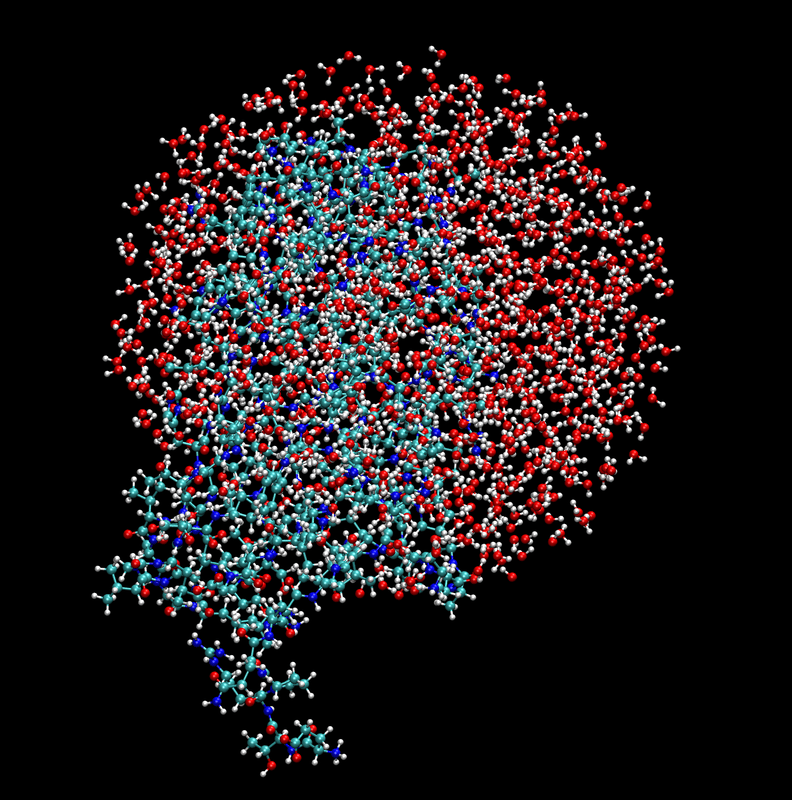
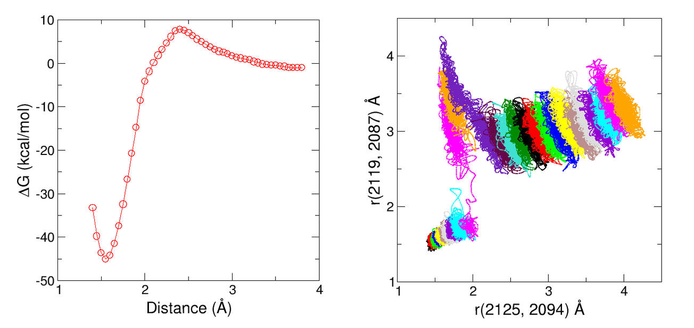

====================
Diels-Alder reaction
====================

In this section we will show how to use the ``sire-emle`` interface to set up
simulations of the Diels-Alder reaction catalsed by the
`AbyU <https://en.wikipedia.org/wiki/Spirotetronate_cyclase_AbyU>`_ enzyme.
This tutorial is intended to show how to set up a simulation in a similar
manner to how it would be performed with a standard QM/MM code, such as ``sander``
from the `AmberTools <https://ambermd.org/AmberTools.php>`_ suite.

Setting up the system
---------------------

Since the system is quite large it is convenient to restrict the simulation to
only consider solvent within a restricted region around the reaction site. In
``sander`` this can be performed by creating a solvent sphere and using an
``ibelly`` restraint to keep solvent molecules outside of this sphere fixed.
The same approach is easy to implement using ``sire`` and ``OpenMM``. First
let us load the full AbyU system:

>>> import sire as sr
>>> mols = sr.load_test_files("abyu.prm7", "abyu.rst7")

Next we use a ``sire`` `selection <https://sire.openbiosim.org/versions/devel/cheatsheet/search.html>`_
to create a sphere around the reaction site:

>>> water_sphere = mols["water within 22A of atomidx 3 in molidx 1"]

.. note::

    Here we choose a sphere of radius 22 Å around atom 3 in the second molecule.
    This is the reaction site in the AbyU system. In the simulation we will fix
    all atoms more than 20 Å from this site.

Next, we need to recreate the system by adding the water sphere to protein and
enzyme molecules:

>>> new_mols = mols[:2] + water_sphere
>>> system = sr.system.System()
>>> for mol in new_mols:
...     system.add(mol)

.. note::

    Here we add the molecules to the new system one-by-one to ensure that
    the order is preserved.

Now we'll add the original simulation box to the new system:

>>> system.set_property("space", mols.property("space"))

Next we'll minimise the system ready for simulation:

>>> m = system.minimisation()
>>> m.run()
>>> mols = m.commit()

Let's take a look at the system:

Finally, we will write the system to an AMBER topology file for later use:

>>> sr.save(mols, "abyu_sphere.prm7")

Setting up the EMLE engine
--------------------------

We can now create an ``EMLECalculator`` to compute the QM intramolecular
interaction and the electrostatic embedding interaction. Here we will use
`xtb <https://xtb-docs.readthedocs.io/en/latest/>`_ as the QM backend:

>>> from emle import EMLECalculator
>>> calculator = EMLECalculator(backend="xtb", device="cpu")

Next we will create an ``EMLEEngine`` that can be be used to perform QM/MM
calculation:

>>> qm_mols, engine = sr.qm.emle(
...     mols,
...     "atomnum 1804:1822,2083:2132",
...     calculator,
...     redistribute_charge=True
... )

Here the selection for the QM region includes tryptophan side-chain atoms
(1804-1822) and the substrate (2083-2132). The ``redistribute_charge`` keyword
ensures that the charge on atoms in the QM region is integer valued by
redistributing the remaining fractional charge over MM atoms within the
residues containing the QM atoms.

Creating a context
------------------

We can now create a dynamics object that will create an ``OpenMM`` context for
us.  In order to use the solvent sphere we will need to specify the ``fixed``
keyword argument. This specifies a selection for the atoms that should be
fixed during simulation. Here we will fix all atoms more than 20 Å from the
reaction site:

>>> d = mols.dynamics(
...     timestep="1fs",
...     constraint="none",
...     perturbable_constraint="none",
...     integrator="langevin_middle",
...     cutoff_type="rf",
...     qm_engine=engine,
...     platform="cpu",
...     fixed="not atoms within 20A of atomidx 3 in molidx 1",
)

.. note::

    In ``OpenMM``, fixed atoms are implemented by setting atomic masses to zero.
    This means that the atoms are still involved in interactions, but do not move.

Now we will extract the context from the dynamics object:

>>> context = d.context()

Creating a reaction coordinate
------------------------------

In order to study the Diels-Alder reaction we need to define a reaction coordinate.
With ``sander``, a typical choice is to use a generalised distance coordinate
restraint, using a weighted sum of distances between specific atom pairs involved
in the reaction. It is easy to implement this in ``OpenMM`` using a ``CustomBondForce``
combined with a ``CustomCVForce``.

First we will specify the the atom pairs involved in the bonds, along with the weights.

>> pairs = ((2125, 2094, 0.7), (2119, 2087, 0.3))

Here the first two values in each tuple are the atom indices of the atoms involved
in the bond, and the third value is the weight of the bond.

We will now define a force constant for our collective variable and an initial
equilibrium value:

>>> import openmm
>>> import openmm.app
>>> from openmm import unit as unit
>>> k0 = (200 * unit.kilocalorie_per_mole / unit.angstrom**2).value_in_unit(
...     unit.kilojoule_per_mole / unit.nanometer**2
... )
... r0 = 2.9 * unit.angstroms

Next we will create a ``CustomBondForce`` to calculate the distance between the
atom pairs:

>>> cv0 = openmm.CustomBondForce("weight*r")
>>> cv0.addPerBondParameter("weight")
>>> for atom1, atom2, weight in pairs:
...     cv0.addBond(atom1, atom2, [weight])

We will also create two null forces to monitor the individual bond distances:

>>> bond1 = openmm.CustomBondForce("r")
>>> bond1.addBond(2125, 2094)
>>> bond2 = openmm.CustomBondForce("r")
>>> bond2.addBond(2119, 2087)

We can now create our restraint force using the collective variables above.
First let us define the energy expression. This is a simple harmonic potential:

>>> energy_expression0 = "k0*(weighted_distance-r0)^2"

Next we will create the force:

>>> restraint_force0 = openmm.CustomCVForce(energy_expression0)
>>> restraint_force0.addCollectiveVariable("weighted_distance", cv0)
>>> restraint_force0.addCollectiveVariable("bond1", bond1)
>>> restraint_force0.addCollectiveVariable("bond2", bond2)
>>> restraint_force0.addGlobalParameter("k0", k0)
>>> restraint_force0.addGlobalParameter("r0", r0)

During simulation we might also wish to prevent the formation of a spurious bond
between atoms 2115 and 2084. We can do this by adding an additional ``CustomCVForce``:

>>> k1 = (100*unit.kilocalorie_per_mole/unit.angstrom**2).value_in_unit(
...     unit.kilojoule_per_mole/unit.nanometer**2
... )
... r1 = 3.2*unit.angstroms
... cv1 = CustomBondForce("r")
... cv1..addBond(2115, 2084)
... energy_expression1 =("k1*(dist-r1)^2")
... restraint_force1 = openmm.CustomCVForce(energy_expression1)
... restraint_force1.addCollectiveVariable("dist", cv1)
... restraint_force1.addGlobalParameter("k1", k1)
... restraint_force1.addGlobalParameter("r1", r1)

Setting up a new OpenMM context
-------------------------------

We can now create a new OpenMM context with the restraint force added to the
system from the original context. First let us extract copies of the original
system and integrator:

>>> from copy import deepcopy
>>> system = context.getSystem()
>>> integrator = deepcopy(context.getIntegrator())

Next we will add the restraint forces to the system:

>>> system.addForce(restraint_force0)
>>> system.addForce(restraint_force1)

Finally we will create a new context with the modified system and integrator,
setting the platform to the same as the original context:

>>> new_context = openmm.Context(system, integrator, context.getPlatform())
>>> new_context.setPositions(context.getState(getPositions=True).getPositions())

Running the simulation
----------------------

We can now run the simulation. Here we will run a short umbrella sampling
simpluation for a single window using 100 cycles of 100 integration steps.
After each cycle we will append to a trajectory file and print the current
values of the collective variables.

First we will create a trajectory file using the topology saved earlier as
a reference:

>>> prm = openmm.app.AmberPrmtopFile("abyu_sphere.prm7")
>>> file_handle = open("traj.dcd", "wb")
>>> dcd_file = openmm.app.DCDFile(file_handle, prm.topology, dt=integrator.getStepSize())

And now we will run the simulation:

>>> for x in range(100):
...     integrator.step(10)
...     state = new_context.getState(getPositions=True)
...     positions = state.getPositions()
...     dcd_file.writeModel(positions)
...     cv_vals = restraint_force0.getCollectiveVariableValues(new_context)
...     print(f"Step {x:>3} of 100: CVs = {cv_vals[0]:.3f}, {cv_vals[1]:.3f}, {cv_vals[2]:.3f}")
... file_handle.close()

In order to compute the free energy profile of the reaction we would need to
perform umbrella sampling simulations along the reaction coordinate. The resulting
free energy profile should looks similar to the one shown in the left panel of
the figure below. The right panel shows the two bond distances of interest
monitored within each sampling window.

